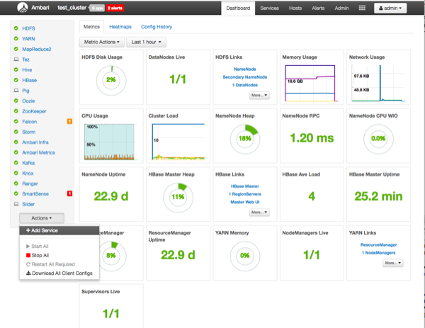
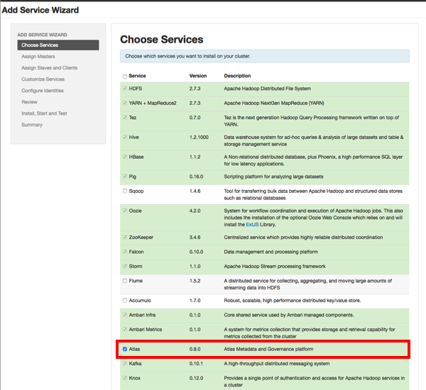
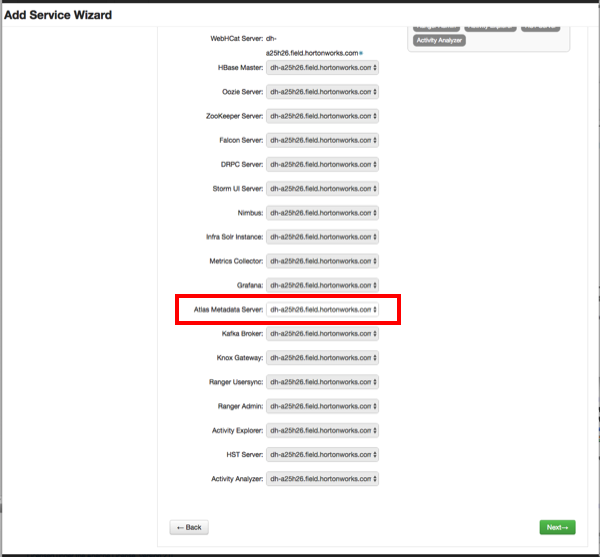
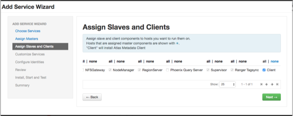
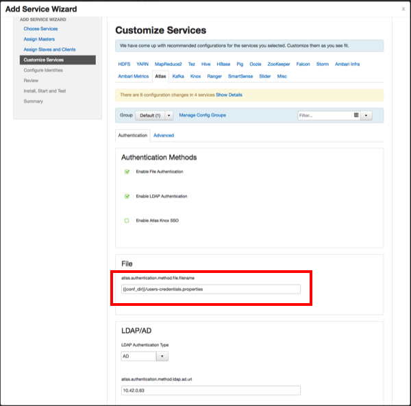
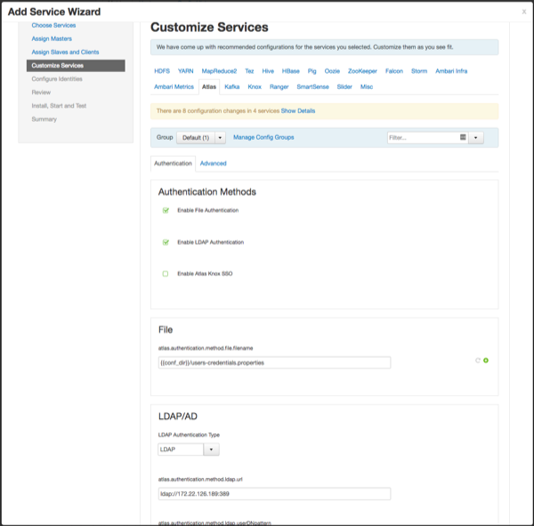
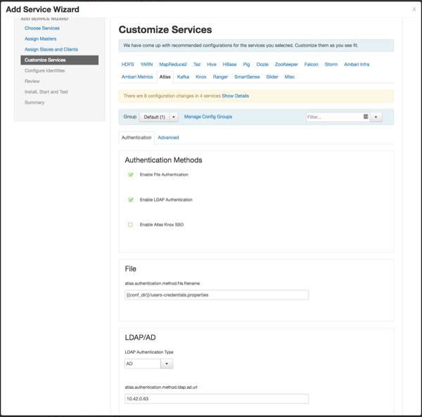

安装atlas
================================================================================
您可以使用Apache Atlas通过一组可扩展的核心 **数据治理服务** 有效地满足您的合规性要求。

在你开始之前：
+ `Ambari Infra`（包括内部`HDP Solr Cloud`实例）或外部管理的`Solr Cloud`实例
+ `Apache HBase`（用作Atlas Metastore）
+ `Apache Kafka`（提供持久的消息传递总线）

## 1.开始安装
使用以下步骤启动Apache Atlas安装。

### 1.1.步骤
1. 在Ambari仪表板上，单击“操作”，然后选择“添加服务”。

    

2. 在“选择服务”页面上，选择“Atlas”，然后单击“下一步”。

    

3. 将显示“Assign Master”页面。为`Atlas Metadata Server`指定主机，然后单击“下一步”。

    

4. 将显示“Assign Slaves和客户端”页面，其中选择了客户端（Atlas元数据客户端）。 单击“下一步”
继续。

    

5. 将出现“自定义服务”页面。这些设置将在下一节中介绍。

## 2.自定义服务
安装过程的下一步是在“自定义服务”页面上指定Atlas身份验证和授权设置。

### 2.1.验证设置
您可以将身份验证类型设置为文件，LDAP或AD。

#### 2.1.1.基于文件的身份验证
选择基于文件的身份验证时，`atlas.authentication.method.file.filename`属性将自动设置为
`{{conf_dir}}/users-credentials.properties`。



`users-credentials.properties`文件应具有以下格式：
```
username=group::sha256password
admin=ADMIN::e7cf3ef4f17c3999a94f2c6f612e8a888e5b1026878e4e19398b23bd38ec221a
```
用户组可以是`ADMIN`，`DATA_STEWARD`或`DATA_SCIENTIST`。

密码使用sha256编码方法编码，可以使用UNIX工具生成：
```shell
echo -n "Password" | sha256sum
e7cf3ef4f17c3999a94f2c6f612e8a888e5b1026878e4e19398b23bd38ec221a -
```
```
提示  

您还可以使用Ambari UI设置管理员密码：选择 `高级 > 高级atlas-env`，然后使用管理员密码和管理员用户名框设置管理员用户名
和密码。在安装后更新这些设置时，单击“保存”，然后重新启动Atlas以及需要重新启动的所有其他组件。
```

#### 2.1.2.LDAP身份验证
要启用LDAP身份验证，请选择LDAP，然后设置以下配置属性。

表1：Apache Atlas LDAP配置设置：

| 属性 | 示例值 |
| :------------- | :------------- |
| atlas.authentication.method.ldap.url | ldap://127.0.0.1:389 |
| atlas.authentication.method.ldap.userDNpattern | uid={0],ou=users,dc=example,dc=com |
| atlas.authentication.method.ldap.groupSearchBase | dc=example,dc=com |
| atlas.authentication.method.ldap.groupSearchFilter | (member=cn={0},ou=users,dc=example,dc=com |
| atlas.authentication.method.ldap.groupRoleAttribute | cn |
| atlas.authentication.method.ldap.base.dn | dc=example,dc=com |
| atlas.authentication.method.ldap.bind.dn | cn=Manager,dc=example,dc=com |
| atlas.authentication.method.ldap.bind.password | PassW0rd |
| atlas.authentication.method.ldap.referral | ignore |
| atlas.authentication.method.ldap.user.searchfilter | (uid={0}) |
| atlas.authentication.method.ldap.default.role | ROLE_USER |



#### 2.1.3.AD身份验证
要启用AD身份验证，请选择AD，然后设置以下配置属性：

| 属性 | 示例值 |
| :------------- | :------------- |
| atlas.authentication.method.ldap.ad.url | ldap://127.0.0.1:389 |
| Domain Name (Only for AD) | example.com |
| atlas.authentication.method.ldap.ad.base.dn | DC=example,DC=com |
| atlas.authentication.method.ldap.ad.bind.dn | CN=Administrator,CN=Users,DC=example,DC=com |
| atlas.authentication.method.ldap.ad.bind.password | PassW0rd |
| atlas.authentication.method.ldap.ad.referral | ignore |
| atlas.authentication.method.ldap.ad.user.searchfilter | (sAMAccountName={0}) |
| atlas.authentication.method.ldap.ad.default.role | ROLE_USER |



### 2.2.授权设置
Atlas有两种授权方法：**Simple** 和 **Ranger**。


dd
