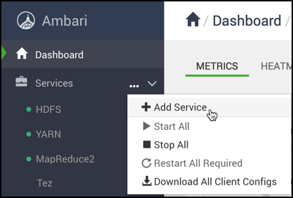
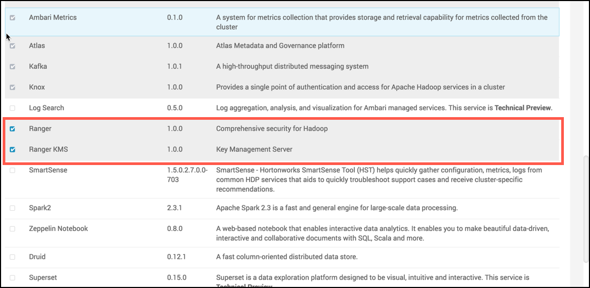

启动Ranger安装
================================================================================
如何通过Ambari开始安装Ranger。

## 在你开始之前
您必须已为Ranger配置了数据库实例。

## 步骤
1. 使用指定的用户凭据登录Ambari群集。将显示主Ambari仪表板页面。
2. 在左侧导航菜单中，单击“操作”，然后选择“添加服务”。

    

3. 在`Choose Services`页面上，选择Ranger，然后单击Next。

    

    将出现Ranger Requirements页面。

4. 如果您还没有这样做，请运行：
`ambari-server setup --jdbc-db=$database-type --jdbc-driver=$/jdbc/driver/path`。
    ```shell
    ambari-server setup --jdbc-db=mysql --jdbc-driver=/usr/share/java/mysql-connector-java.jar
    ```
5. 系统会提示您指定Masters。记下Ranger Admin主机，以便在后续安装步骤中使用。完成后单击“下一步”
继续安装。


dd
