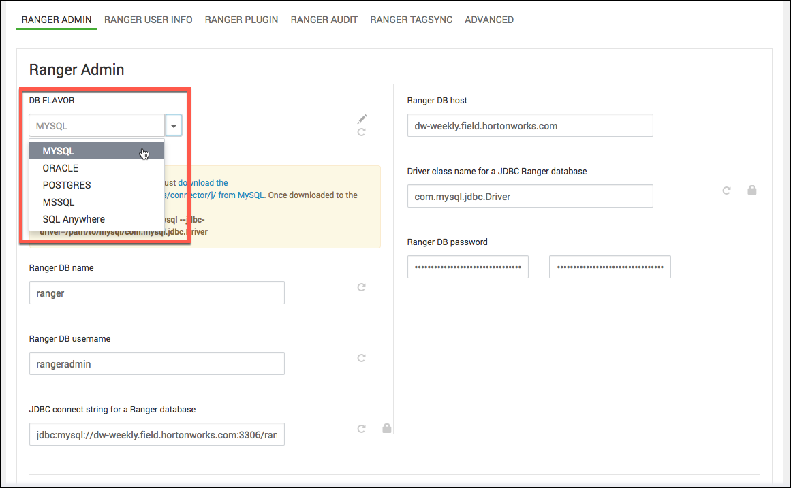

自定义服务：Admin
================================================================================
如何通过Ambari安装Ranger时自定义Ranger Admin服务。

## 步骤
1. 在“自定义服务”页面上，选择“Ranger Admin”选项卡，然后使用“DB Flavor”下拉列表选择与Ranger
一起使用的数据库类型。

    

2. 在Ranger DB Host框中输入数据库服务器地址：

    表1：Ranger数据库主机

    | DB Flavor | Host | Example |
    | :------------- | :------------- | :------------ |
    | MySQL | `<HOST[:PORT]>` | c6401.ambari.apache.org:3306 |
    | Oracle | `<HOST:PORT:SID>`或`<HOST:PORT/Service>` | c6401.ambari.apache.org:1521:ORCL 或 c6401.ambari.apache.org:1521/XE |
    | PostgreSQL | `<HOST[:PORT]>` | c6401.ambari.apache.org |
    | MS SQL | `<HOST[:PORT]>` | c6401.ambari.apache.org:1433 |
    | SQLA | `<HOST[:PORT]>` | c6401.ambari.apache.org |

3. `Ranger DB name`：Ranger Policy数据库的名称，例如 ranger_db或ranger。请注意，如果您
使用的是Oracle，则必须在此处指定Oracle表空间名称。
4. JDBC Ranger数据库的驱动程序类名称：驱动程序类名称是根据选定的DB Flavor自动生成的。下表列出
了默认的驱动程序类设置。目前Ranger不支持任何第三方JDBC驱动程序。

    表2：驱动程序类名称

    | DB Flavor | JDBC Ranger数据库的驱动程序类名称 |
    | :------------- | :------------- |
    | MySQL | com.mysql.jdbc.Driver |
    | Oracle | oracle.jdbc.driver.OracleDriver |
    | PostgreSQL | org.postgresql.Driver |
    | MS SQL | com.microsoft.sqlserver.jdbc.SQLServerDriver |
    | SQLA | sap.jdbc4.sqlanywhere.IDriver |

dd
