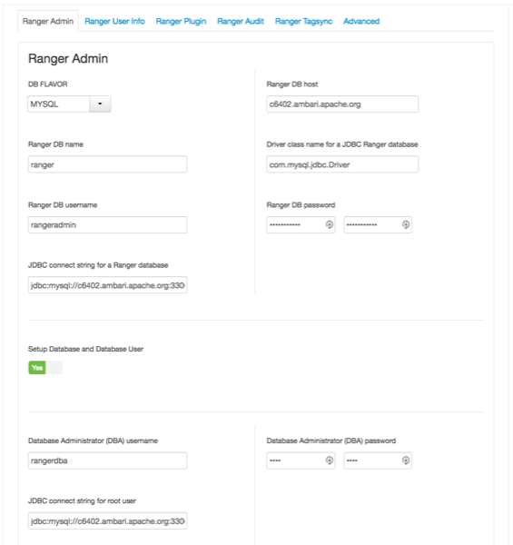
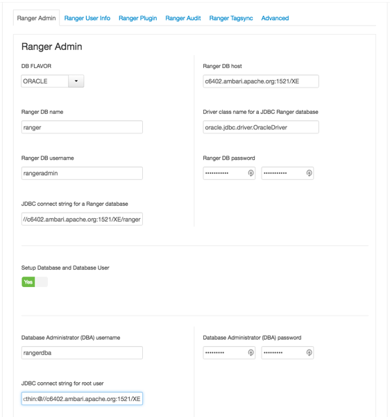
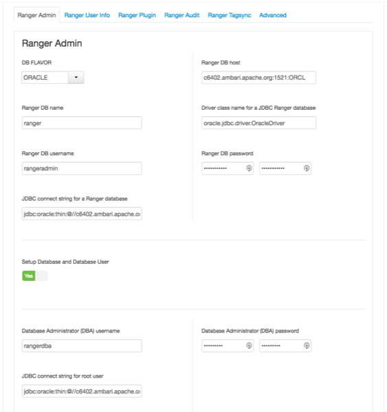
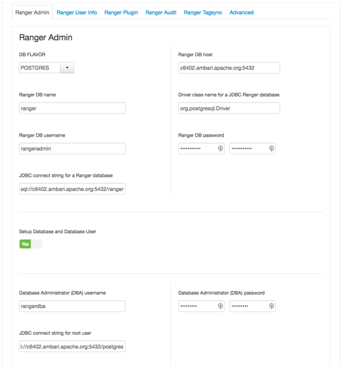
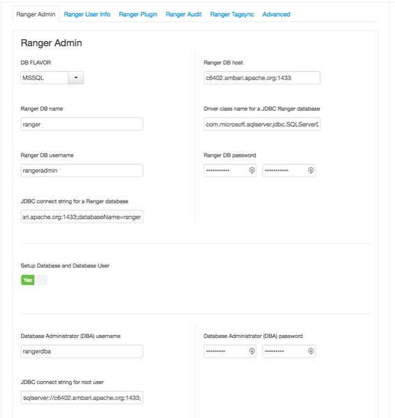

自定义服务：Admin
================================================================================
如何通过Ambari安装Ranger时自定义Ranger Admin服务。

## 步骤
1. 在“自定义服务”页面上，选择“Ranger Admin”选项卡，然后使用“DB Flavor”下拉列表选择与Ranger
一起使用的数据库类型。

    

2. 在Ranger DB Host框中输入数据库服务器地址：

    表1：Ranger数据库主机

    | DB Flavor | Host | Example |
    | :------------- | :------------- | :------------ |
    | MySQL | `<HOST[:PORT]>` | c6401.ambari.apache.org:3306 |
    | Oracle | `<HOST:PORT:SID>`或`<HOST:PORT/Service>` | c6401.ambari.apache.org:1521:ORCL 或 c6401.ambari.apache.org:1521/XE |
    | PostgreSQL | `<HOST[:PORT]>` | c6401.ambari.apache.org |
    | MS SQL | `<HOST[:PORT]>` | c6401.ambari.apache.org:1433 |
    | SQLA | `<HOST[:PORT]>` | c6401.ambari.apache.org |

3. `Ranger DB name`：Ranger Policy数据库的名称，例如 ranger_db或ranger。请注意，如果您
使用的是Oracle，则必须在此处指定Oracle表空间名称。
4. JDBC Ranger数据库的驱动程序类名称：驱动程序类名称是根据选定的DB Flavor自动生成的。下表列出
了默认的驱动程序类设置。目前Ranger不支持任何第三方JDBC驱动程序。

    表2：驱动程序类名称

    | DB Flavor | JDBC Ranger数据库的驱动程序类名称 |
    | :------------- | :------------- |
    | MySQL | com.mysql.jdbc.Driver |
    | Oracle | oracle.jdbc.driver.OracleDriver |
    | PostgreSQL | org.postgresql.Driver |
    | MS SQL | com.microsoft.sqlserver.jdbc.SQLServerDriver |
    | SQLA | sap.jdbc4.sqlanywhere.IDriver |

5. Ranger DB用户名和Ranger数据库密码：输入Ranger数据库服务器的用户名和密码。下表更详细地介绍
了这些设置。您可以使用随Ambari安装的MySQL数据库，或外部MySQL、Oracle、PostgreSQL、MS SQL或
SQL Anywhere数据库。

    表3：Ranger数据库用户名设置

    | 属性 | 描述 | 默认值 | 示例值 | 必要? |
    | :-------- | :------- | :------ | :------ | :------ |
    | Ranger DB用户名 | Policy数据库的用户名。 | rangeradmin | rangeradmin | 是 |
    | Ranger DB密码 | Ranger Policy数据库用户的密码。 |  | PassWORd! | 是 |

6. JDBC连接字符串

    ```
    提示  

    目前，Ambari安装程序使用jdbc:oracle:thin:@//host:port/db_name格式生成JDBC连接字符串。您必须按照下表中的说明
    替换连接字符串：
    ```
    表4：JDBC Connect字符串

    | DB Flavor | 句法 | Example Value |
    | :------------- | :------------- | :------------ |
    | MySQL | jdbc:mysql://DB_HOST:PORT/db_name | jdbc:mysql://c6401.ambari.apache.org:3306/ranger_db |
    | Oracle | 对于Oracle SID：dbc:oracle:thin:@DB_HOST:PORT:SID 或 对于Oracle服务名称：jdbc:oracle:thin:@//DB_HOST[:PORT][/ServiceName] | jdbc:oracle:thin:@c6401.ambari.apache.org:1521:ORCL 或 jdbc:oracle:thin:@//c6401.ambari.apache.org:1521/XE |
    | PostgreSQL | jdbc:postgresql://DB_HOST/db_name | jdbc:postgresql://c6401.ambari.apache.org:5432/ranger_db |
    | MS SQL | jdbc:sqlserver://DB_HOST;databaseName=db_name | jdbc:sqlserver://c6401.ambari.apache.org:1433;databaseName=ranger_db |
    | SQLA | jdbc:sqlanywhere:host=DB_HOST;database=db_name | jdbc:sqlanywhere:host=c6401.ambari.apache.org:2638;database |

7. 设置数据库和数据库用户：

    | 选项 |  |
    | :------------- | :------------- |
    | Yes | 如果设置为“是” - 将需要按照下一步中的说明提供数据库管理员（DBA）用户名和密码。注意：设置后Ranger不存储DBA用户名和密码。因此，您可以在Ranger设置完成后在Ambari UI中清除这些值。 |
    | No | 如果设置为“否” - 表示您不希望向Ambari Ranger安装程序提供数据库管理员（DBA）帐户详细信息。将此项设置为“否”将继续Ranger安装过程，而不提供DBA帐户详细信息。在这种情况下，您必须按照“设置数据库用户而不共享DBA凭据”中的说明执行系统数据库用户设置，然后继续安装。注意：如果选择否，则UI仍然要求您输入用户名和密码，为了继续，您可以输入任何值 - 这些值不需要是实际的DBA用户名和密码。 |

8. 数据库管理员（DBA）用户名与密码：安装数据库服务器时设置DBA用户名和密码。如果您没有此信息，请
与安装数据库服务器的数据库管理员联系。

    表5：DBA凭据设置：

    | 属性 | 描述 | 默认值 | 示例值 | 必要？ |
    | :----- | :----- | :----- | :----- | :----- |
    | 数据库管理员（DBA）用户名 | Ranger数据库用户，具有创建数据库模式和用户的管理权限。 | root | root | 是 |
    | 数据库管理员（DBA）密码 | Ranger数据库用户的root密码。 |  | root | 是 |

    如果Oracle DB root用户角色是SYSDBA，则还必须在Database Administrator（DBA）username
    参数中指定该角色。例如，如果DBA用户名是orcl_root，则必须指定orcl_root AS SYSDBA。
    ```
    提示

    如上一步中的说明所述，如果“设置数据库”和“数据库用户”设置为“否”，则可能仍需要占位符DBA用户名和密码才能继续安装Ranger。
    ```
    以下图像显示了每种Ranger数据库类型的数据库设置示例：

    

    

    

    

    

    


dd
