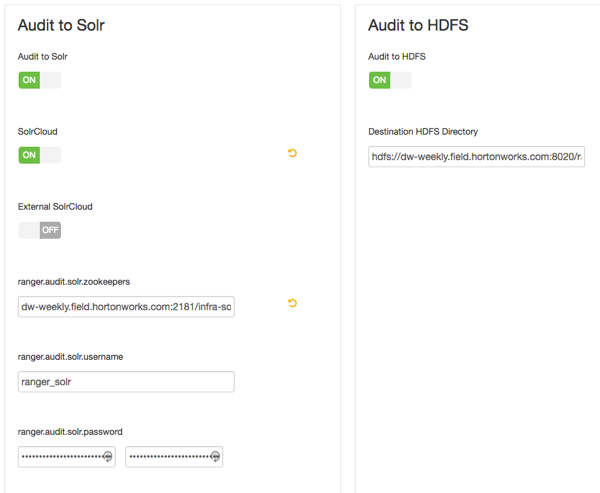

自定义服务：审计
================================================================================
如何通过Ambari安装Ranger时自定义Ranger Audit服务。

## 关于这个任务
Apache Ranger使用Apache Solr存储审计日志，并通过审计日志提供UI搜索。必须先安装并配置Solr，
然后再安装Ranger Admin或任何Ranger组件插件。Ranger Audits to Solr的默认配置使用Ambari
Infra服务下提供的共享Solr实例。Solr是内存和CPU密集型的。如果生产系统具有大量访问请求，请确保
Solr主机具有足够的内存，CPU和磁盘空间。

SolrCloud是Ranger生产使用的首选设置。SolrCloud与Ambari Infra服务一起部署，是一种可扩展的体
系结构，可以作为单节点或多节点集群运行。它具有复制和分片等附加功能，这对高可用性（HA）和可伸缩性
非常有用。您应该根据群集大小来规划部署。由于审计记录可能会急剧增长，因此计划在Solr将存储索引数据
的卷中至少有1TB的可用空间。Solr适用于至少32GB的RAM。您应该为Solr进程提供尽可能多的内存。强烈建
议使用SolrCloud，并在启用了复制（CCDR）的不同服务器上运行至少两个Solr节点。SolrCloud还需要
Apache ZooKeeper。

建议您在HDFS和Solr中存储审核。Ranger Audits to Solr的默认配置使用Ambari Infra服务下提供的
共享Solr实例。有关到Solr的审核的更多信息，请参阅和使用Apache Solr进行Ranger审核。

## 步骤
1. 在“自定义服务”页面上，选择“Ranger Audit”选项卡。建议您在Solr和HDFS中存储审核。默认情况下，
这两个选项都设置为ON。Solr提供索引和搜索最新日志的功能，而HDFS用作更永久或更长期的存储。默认情
况下，Solr用于索引前30天的审核日志。
2. 在Audit to Solr下，打开SolrCloud。SolrCloud配置设置将自动加载。

    
