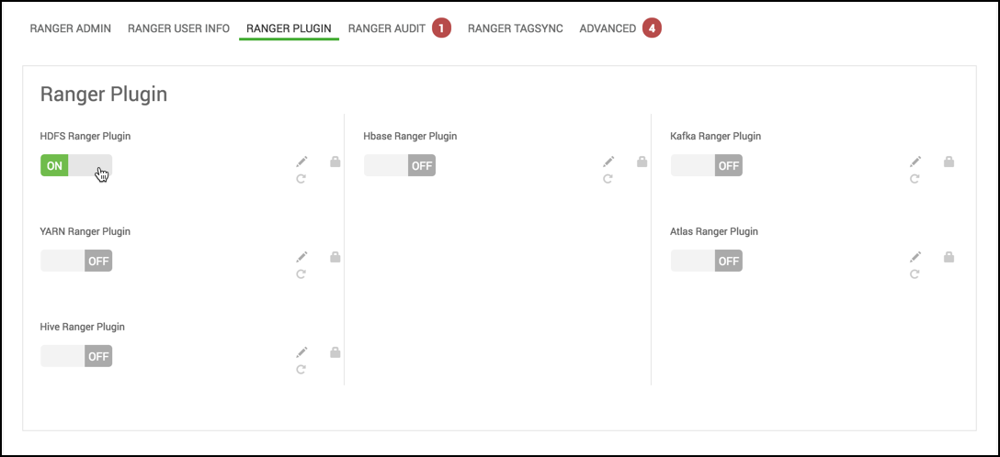

自定义服务：插件
================================================================================
如何在通过Ambari安装Ranger时启用Ranger插件。

## 关于这个任务
如果您使用的是启用Kerberos的群集，则必须执行许多其他步骤，以确保可以在Kerberos群集上使用Ranger
插件。

以下Ranger插件可用：
+ HDFS
+ Hive
+ HBase
+ Kafka
+ Knox
+ YARN
+ Storm
+ Atlas
+ Solr

## 步骤
1. 在Ranger Plugin选项卡中，打开所需的插件。

    

    对于您启用的每个插件，您必须重新启动相关组件。如果启用HDFS Ranger插件，则必须重新启动HDFS。

2. 点击下一步。

