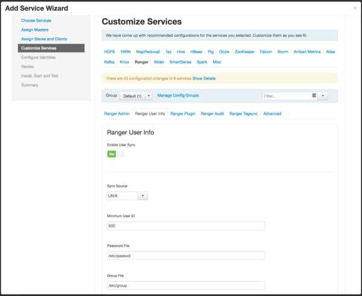
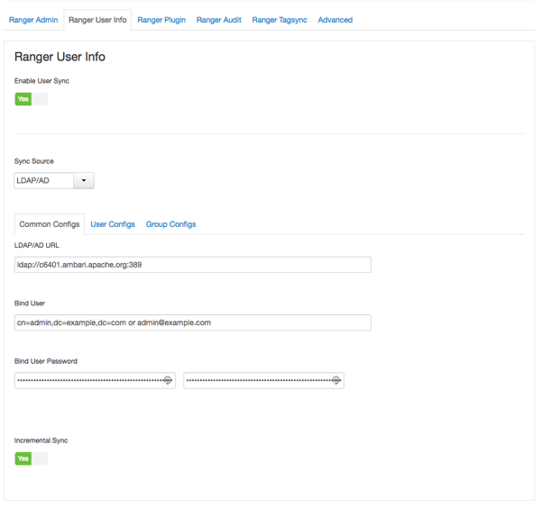
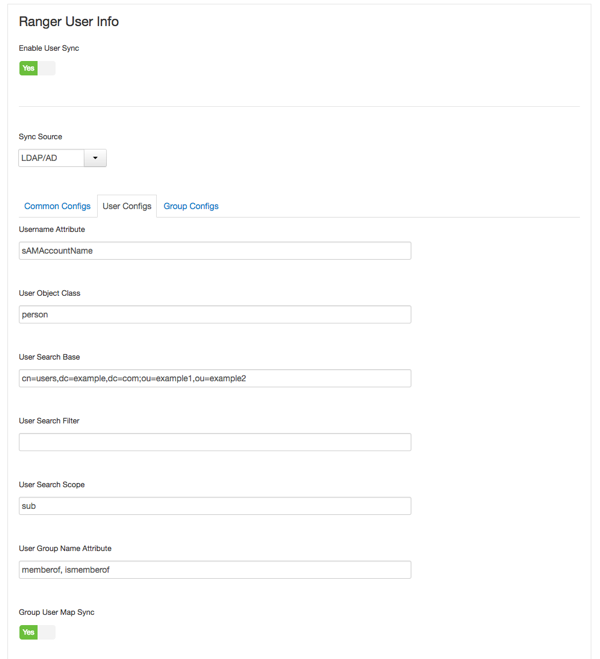

自定义服务：用户同步
================================================================================
如何在通过Ambari安装Ranger时为UNIX或LDAP/AD自定义Ranger用户同步。

## 关于这个任务
您可以为Unix或LDAP/AD自定义用户同步。

## 在你开始之前
测试运行用户同步。在提交用户同步更改之前，建议您测试运行正在检索的用户和组如预期。

在提交更改之前，测试运行将用户和组数据加载到Ranger：
1. 设置`ranger.usersync.policymanager.mockrun=true`。此参数可在 *Ambari > Ranger > 
Configs > Advanced > Advanced ranger-ugsync-site* 中找到。
2. 查看将加载到Ranger的用户和组：`tail -f /var/log/ranger/usersync/usersync.log`。
3. 确认按预期检索用户和组后，设置`ranger.usersync.policymanager.mockrun=false`并重新启动
Ranger Usersync。这会将usersync日志中显示的用户同步到Ranger数据库。

## 步骤
+ 自定义UNIX的用户同步：
    1. 在“自定义服务”页面上，选择“Ranger用户信息”选项卡。
    2. 单击启用用户同步下的“是”。
    3. 使用“同步源”下拉列表选择“UNIX”，然后设置以下属性。

        表6：UNIX用户同步属性：

        | 属性 | 描述 | 默认值 |
        |:----- | :----- | :----- |
        | Sync Source | 仅同步超过此用户ID的用户。 | 500 |
        | Password File | 密码文件在Linux服务器上的位置。| /etc/passwd |
        | Group File | 组文件在Linux服务器上的位置。| /etc/group |

        
    
    4. `/etc/shadow`的权限必须设置为444。

+ 自定义LDAP/AD的用户同步：
    1. 在“自定义服务”页面上，选择“Ranger用户信息”选项卡。
    2. 单击启用用户同步下的“是”。
    3. 使用“同步源”下拉列表选择“LDAP/AD”。
    4. 在Common Configs选项卡上设置以下属性。

        表7：LDAP/AD公共配置：

        | 属性 | 描述 | 默认值 | 样本值 |
        |:----- |:----- |:----- |:----- |
        | LDAP/AD URL | 根据LDAP/AD同步源添加URL | ldap://{host}:{port} | ldap://ldap.example.com:389 |
        | Bind Anonymous | 如果选择是，则不需要绑定用户和绑定用户密码。 | NO |  |
        | Bind User | 组文件在Linux服务器上的位置。 | 具有搜索用户权限的LDAP/AD用户帐户的完整可分辨名称（DN），包括公用名（CN）。LDAP绑定DN用于连接LDAP并查询用户和组。 | cn=admin，dc=example，dc=com或admin@example.com |
        | Bind User Password | 绑定用户的密码。 |  |  |
        | Incremental Sync | 如果选择“是”，Ranger Usersync将保存先前同步的所有对象的最新时间戳，并使用该时间戳执行下一次同步。然后，Usersync使用轮询机制通过使用LDAP属性uSNChanged（对于AD）或modifytimestamp（对于LDAP）执行增量同步。首次启用增量同步将启动完全同步; 后续同步操作将是增量的。启用增量同步时，组同步（在“组配置”选项卡下）是必需的。建议用于大型部署。 | 对于升级安装：否；对于新安装：是的 | Yes |

        

    5. 在“用户配置”选项卡上设置以下属性。

        表8：LDAP/AD用户配置：

        | 属性 | 描述-----------------------------------| 默认值 | 样例值 |
        |:----- |:----- |:----- |:----- |
        | Group User Map Sync | 为用户同步特定组。 | YES | YES |
        | Username Attribute | LDAP用户名属性。 |  | 用于AD的sAMAccountName，用于OpenLDAP的uid或cn |
        | User Object Class | 用于标识用户条目的对象类。 | person | top，person，organizationalPerson，user或posixAccount |
        | User Search Base | 搜索用户群。Ranger可以在AD中搜索多个OU。Ranger UserSync模块对每个配置的OU执行用户搜索，并将所有用户添加到单个列表中。处理完所有OU后，将根据组搜索计算用户的组成员资格。|  | cn=users,dc=example,dc=com;ou=example1,ou=example2 |
        | User Search Filter | 可选的附加过滤器约束所选用于同步的用户。 |  | 样本过滤器检索所有用户：cn = *,样本过滤器检索所有作为成员的用户groupA或者groupB:(memberof=CN=GroupA,OU=groups,DC=example）(memberof=CN=GroupB,OU=groups,DC=example）  |
        | User Search Scope | 此值用于将用户搜索限制为搜索库的深度。 | sub | base，one或sub |
        | User Group Name Attribute | 来自用户条目的属性，其值将被视为要推送到Access Manager数据库的组值。您可以提供以逗号分隔的多个属性名称。 | memberof,ismemberof | memberof，ismemberof或gidNumber |
        | Enable User Search | 仅当选择“启用组搜索优先”选项时，此选项才可用。 | NO | YES |

        

    6. 在“组配置”选项卡上设置以下属性。

