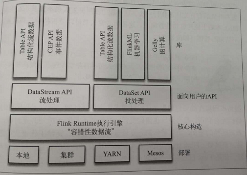

初探Flink
================================================================================
Flink的主页在其顶部展示了该项目的理念：“**Apache Flink是为分布式、高性能、随时可用以及准确的
流处理应用程序打造的开源流处理框架。**” Flink不仅能提供 **同时支持高吞吐和`exactly-once`语
义的实时计算，还能提供批量数据处理。Flink用同一种技术实现了两种功能**。

这个顶级的Apache项目是怎么诞生的呢？**Flink起源于Stratosphere项目**，Stratosphere是在
`2010~2014`年由3所地处柏林的大学和欧洲的一些其他的大学共同进行的研究项目。当时，这个项目已经吸
引了一个较大的社区，一部分原因是它出现在了若干公共开发者研讨会上，比如在柏林举办的
Berlin Buzzwords，以及在科隆举办的NoSQL Matters，等等。强大的社区基础是这个项目适合在Apache
软件基金会中孵化的一个原因。

**2014年4月，Stratosphere的代码被复制并捐献给了Apache软件基金会，参与这个孵化项目的初始成员
均是Stratosphere系统的核心开发人员**。不久之后，创始团队中的许多成员离开大学并创办了一个公司来
实现Flink的商业化，他们为这个公司取名为`data_Artisans`。在孵化期间，为了避免与另一个不相关的
项目重名，项目的名称也发生了改变。**Flink这个名字被挑选出来，以彰显这种流处理器的独特性：在德语
中，Flink一词表示快速和灵巧**。项目采用一只 **松鼠** 的彩色图案作为 **logo**，这不仅因为松鼠
具有快速和灵巧的特点，还因为柏林的松鼠有一种迷人的红棕色。

这个项目很快完成了孵化，并在2014年12月一跃成为Apache软件基金会的顶级项目。作为Apache软件基金会
的5个最大的大数据项目之一，Flink在全球范围内拥有200多位开发人员，以及若干公司中的诸多上线场景。

## 批处理与流处理
**Flink是如何同时实现批处理与流处理的呢？答案是，Flink将批处理（即处理有限的静态数据）视作一种
特殊的流处理**。
**Flink的核心** 计算构造是下图中的 **Flink Runtime执行引擎**，它是一个分布式系统，能够接受
数据流程序并在一台或多台机器上以容错方式执行。Flink Runtime执行引擎可以作为 **YARN**
（Yet Another Resource Negotiator）的应用程序在集群上运行，也可以在 **Mesos** 集群上运行，
还可以在单机上运行（这对于调度Flink应用程序来说非常有用。)



```
说明：

Flink技术栈的核心组成部分。值得一提的是，Flink分别提供了面向流处理的接口（DataStream API）和面向批处理的接口
（DataSetAPI）。因此，Flink既可以完成流处理，也可以完成批处理。Flink支持的拓展库涉及机器学习（FlinkML）、复杂事件处
理（CEP），以及图计算（Gelly），还有分别针对流处理和批处理的Table API。
```
能被Flink Runtime执行引擎接受的程序很强大，但是这样的程序有着冗长的代码，编写起来也很费力。基
于这个原因，**Flink提供了封装在Runtime执行引擎之上的API，以帮助用户更方便地生成流式计算程序**。
**Flink提供了用于流处理的DataStream API和用于批处理的DataSet API**。值得注意的是，尽管Flink
Runtime执行引擎是基于流处理的，**但是DataSet API先于DataStream API被开发出来，这是因为工业
界对无限流处理的需求在Flink诞生之初并不大**。

DataStream API可以流畅地分析无限数据流，**并且可以用Java或者Scala来实现**。开发人员需要基于
一个叫DataStream的数据结构来开发，这个数据结构用于表示永不停止的分布式数据流。

Flink的分布式特点体现在它能够在成百上千台机器上运行，它将大型的计算任务分成许多小的部分，分个机
器执行一个部分。**Flink能够自动地确保在发生机器故障或者其他错误时计算能持续进行，或者在修复bug
或进行版本升级后有计划地再执行一次**。这种能力使得开发人员不需要担心失败。**Flink本质上使用容错
性数据流，这使得开发人员可以分析持续生成且永远不结束的数据（即流处理）**。


dd
