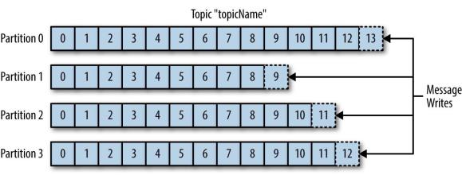
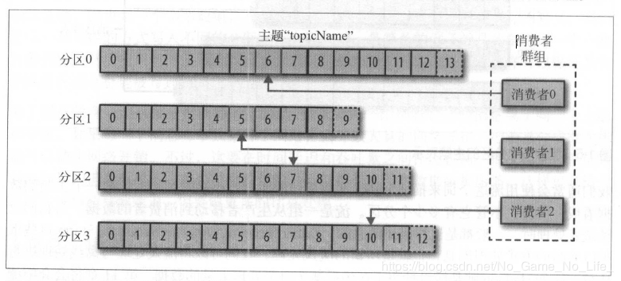

Kafka登场
================================================================================
Kafka就是为了解决上述问题而设计的一款基于发布与订阅的消息系统。它一般被称为“**分布式提交日志**“
或者”**分布式流平台**“。Kafka的数据分布在整个系统里，**具备数据故障保护和性能伸缩能力**。

## 1.消息和批次
Kafka的数据单元被称为消息。**消息由字节数组组成**，所以对于Kafka来说，**消息里的数据没有特别的
格式或含义。消息可以有一个可选的元数据，也就是键。键也是一个字节数组，与消息一样，对于Kafka来说
也没有特殊的含义。当消息以一种可控的方式写入不同的分区时，会用到键。最简单的例子就是为键生成一个一
致性散列值，然后使用散列值对主题分区数进行取模，为消息选取分区。这样可以保证具有相同键的消息总是
被写到相同的分区上**。

为了提高效率，消息被分批次写入Kafka。**批次就是一组消息，这些消息属于同一个主题和分区**。如果每
一个消息都单独穿行于网络，会导致大量的网络开销，**把消息分成批次传输可以减少网各开销**。不过，这
要在时间延迟和吞吐量之间作出权衡：批次越大，单位时间内处理的消息就越多，单个消息的传输时间就越长。
**批次数据会被压缩，这样可以提升数据的传输和存储能力，但要做更多的计算处理**。

## 2.模式 
对于Kafka来说，**消息不过是晦涩难懂的字节数组，所以有人建议用一些额外的结构来定义消息内容**，让
它们更易于理解。根据应用程序的需求，**消息模式（`schema`）有许多可用的选项**。像JSON和XML这些
简单的系统，不仅易用，而且可读性好。不过，它们缺乏强类型处理能力，不同版本之间的兼容性也不是很好。
**Kafka的许多开发者喜欢使用Apache Avro，它最初是为Hadoop开发的一款序列化框架。Avro提供了一种
紧凑的序列化格式，模式和消息体是分开的，当模式发生变化时，不需要重新生成代码：它还支持强类型和模
式进化，其版本既向前兼容，也向后兼容**。

**数据格式的一致性对于Kafka来说很重要，它消除了消息读写操作之间的耦合性**。如果读写操作紧密地耦
合在一起，消息订阅者需要升级应用程序才能同时处理新旧两种数据格式。在消息订阅者升级了之后，消息发
布者才能跟着升级，以便使用新的数据格式，新的应用程序如果要使用数据，就要与消息发布者发生耦合，导
致开发者需要做很多繁杂的工作。定义良好的模式，并把它们存放在公共仓库，可以方便我们理解Kafka的消息
结构。

## 3.主题和分区
**Kafka的消息通过主题进行分类**。主题就好比数据库的表，或者文件系统里的文件夹。**主题可以被分为
若干个分区，一个分区就是一个提交日志。消息以追加的方式写入分区，然后以先入先出的顺序读取。要注意，
由于一个主题一般包含几个分区，因此无法在整个主题范围内保证消息的顺序，但可以保证消息在单个分区内
的顺序**。下图所示的主题有4个分区，消息被追加写入每个分区的尾部。**Kafka通过分区来实现数据冗余
和伸缩性。分区可以分布在不同的服务器上，也就是说，一个主题可以横跨多个服务器，以此来提供比单个服务
器更强大的性能**。

**我们通常会使用流这个词来描述Kafka这类系统的数据**。很多时候，**人们把一个主题的数据看成一个流，
不管它有多少个分区**。流是一组从生产者移动到消费者的数据。当我们讨论流式处理时，一般都是这样描述
消息的。**Kafka Streams、Apache Samza和Storm这些框架以实时的方式处理消息，也就是所谓的流式
处理**。

## 4.生产者和消费者 
**Kafka的客户端就是Kafka系统的用户，它们被分为两种基本类型：生产者和消费者**。除此之外，还有其
他 **高级客户端API**————**用于数据集成的Kafka Connect API和用于流式处理的Kafka Streams。
这些高级客户端API使用生产者和消费者作为内部组件，提供了高级的功能**。

**生产者创建消息。一般情况下，一个消息会被发布到一个特定的主题上。生产者在默认情况下把消息均衡地
分布到主题的所有分区上，而并不关心特定消息会被写到哪个分区。不过，在某些情况下，生产者会把消息直
接写到指定的分区。这通常是通过消息键和分区器来实现的，分区器为键生成一个散列值，并将其映射到指定
的分区上。这样可以保证包含同一个键的消息会被写到同一个分区上。生产者可以使用自定义的分区器，根据
不同的业务规则将消息映射到分区**。第3章将详细介绍生产者。

**消费者读取消息。消费者订阅一个或多个主题，并按照消息生成的顺序读取它们。消费者通过检查消息的偏
移量来区分已经读取过的消息。偏移量是另一种元数据，它是一个不断递增的整数值，在创建消息时，Kafka
会把它添加到消息里。在给定的分区里，每个消息的偏移量都是唯一的。消费者把每个分区最后读取的消息偏
移量保存在Zookeeper或Kafka上，如果消费者关闭或重启，它的读取状态不会丢失**。 

**消费者是消费者群组的一部分，也就是说，会有一个或多个消费者共同读取一个主题。群组保证每个分区只
能被一个消费者使用**。上图中所示的群组，有3个消费者同时读取一个主题。其中的两个消费者各自读取一
个分区，另外一个消费者读取其他两个分区。**消费者与分区之间的映射通常被称为消费者对分区的所有权关
系**。

通过这种方式，消费者可以消费包含大量消息的主题。而且，**如果一个消费者失效，群组里的其他消费者可
以接管失效消费者的工作**。

## 5.broker和集群

