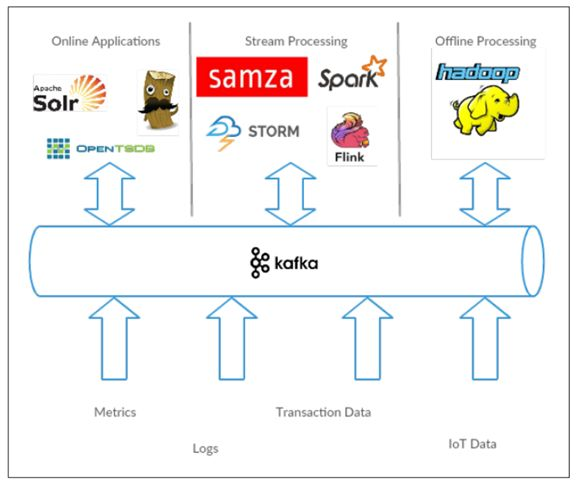

数据生态系统
===================================================================================
**Kafka为数据生态系统带来了循环系统**，如下图所示。它在基础设施的各个组件之间传递消息，为所有客户
端提供一致的接口。当与提供消息模式的系统集成时，**生产者和消费者之间不再有紧密的耦合**，也不需要在
它们之间建立任何类型的直连。我们可以根据业务需要添加或移除组件，因为生产者不再关心谁在使用数据，也
不关心有多少个消费者。

## 使用场景

### 1.活动跟踪
**Kafka最初的使用场景是跟踪用户的活动**。网站用户与前端应用程序发生交互，前端应用程序生成用户活动
相关的消息。这些消息可以是一些静态的信息，比如页面访问次数和点击量，也可以是一些复杂的操作，比如添
加用户资料。这些消息被发布到一个或多个主题上，由后端应用程序负责读取。这样，我们就可以生成报告，为
机器学习系统提供数据，更新搜索结果，或者实现其他更多的功能。

### 2.传递消息 
**Kafka的另一个基本用途是传递消息**。应用程序向用户发送通知（比如邮件）就是通过传递消息来实现的。
这些应用程序组件可以生成消息，而不需要关心消息的格式，也不需要关心消息是如何被发送的。一个公共应用
程序会读取这些消息，对它们进行处理：
+ 格式化消息（也就是所谓的装饰）。
+ 将多个消息放在同一个通知里发送。
+ 根据用户配置的首选项来发送数据。 

使用公共组件的好处在于，不需要在多个应用程序上开发重复的功能，而且可以在公共组件上做一些有趣的转换，
比如把多个消息聚合成一个单独的通知，而这些工作是无法在其他地方完成的。

### 3.度量指标和日志记录
**Kafka也可以用于收集应用程序和系统度量指标以及日志**。Kafka支持多个生产者的特性在这个时候就可以派
上用场。应用程序定期把度量指标发布到Kafka主题上，监控系统或告警系统读取这些消息。**Kafka也可以用在
像Hadoop这样的离线系统上，进行较长时间片段的数据分析**，比如年度增长走势预测。日志消息也可以被发布
到Kafka主题上，然后被路由到专门的日志搜索系统（比如Elasticsearch）或安全分析应用程序。更改目标系统
（比如日志存储系统）不会影响到前端应用或聚合方法，这是Kafka的另一个优点。

### 4.提交日志
**Kafka的基本概念来源于提交日志**，所以使用Kafka来提交日志是件顺理成章的事。**我们可以把数据库的更
新发布到Kafka上，应用程序通过监控事件流来接收数据库的实时更新**。这种变更日志流也可以用于把数据库的
更新复制到远程系统上，或者合并多个应用程序的更新到一个单独的数据库视图上。数据持久化为变更日志提供
了缓冲区，也就是说，如果消费者应用程序发生故障，可以通过重放这些日志来恢复系统状态。另外，紧凑型日
志主题只为每个键保留一个变更数据，所以可以长时间使用，不需要担心消息过期问题。

### 5.流处理
**流处理是又一个能提供多种类型应用程序的领域**。可以说，它们提供的功能与Hadoop里的map和reduce有
点类似，只不过 **它们操作的是实时数据流**，而Hadoop则处理更长时间片段的数据，可能是几个小时或者几
天，Hadoop会对这些数据进行批处理。**通过使用流式处理框架，用户可以编写小型应用程序来操作Kafka消息**，
比如计算度量指标，为其他应用程序有效地处理消息分区，或者对来自多个数据源的消息进行转换。

