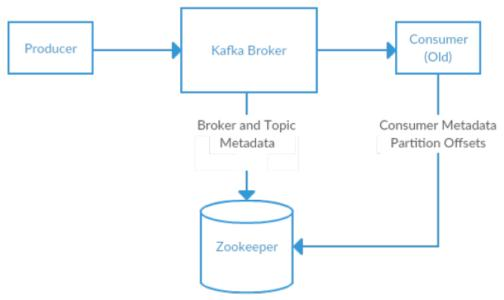

要事先行
================================================================================
## 1.选择操作系统
Kafka是使用 **Scala** 开发的应用程序，所以它可以运行在Windows、MacOS和Linux等多种操作系统
上。**本章将着重介绍如何在Linux上安装和使用Kafka**，因为把Kafka安装在Linux系统是最为常见的。

## 2.安装Java
**在安装Zookeeper和Kafka之前，需要先安装Java环境**。这里推荐安装Java8，可以使用系统自带的安
装包，也可以直接`java.com`网站下载。虽然运行Zookeeper和Kafka只需要Java运行时版本，但也可以
安装完整的JDK，以备不时之需。假设`JDK 8 update51`已经安装在`/usr/java/jdk1.8.0_51`目录下，
其他软件的安装都是基于这个前提进行的。

## 3.安装Zookeeper
**Kafka使用Zookeeper保存集群的元数据信息和消费者信息**。Kafka发行版自带了Zookeeper，可以直
接从脚本启动，不过安装一个完整版的Zookeeper也并不费劲。



可以从：`https://www.apache.org/dyn/closer.cgi/zookeeper/`下载最新的稳定版。

### 3.1.单机服务
下面的例子演示了如何使用基本的配置安装Zookeeper，安装目录为：`usr/local/zookeeper`，数据目
录为：`/var/lib/zookeeper`。
```shell
tar -xzvf zookeeper-3.4.14.tar.gz
mv zookeeper-3.4.14 /usr/local/zookeeper
mkdir -p /var/lib/zookeeper

cat > /usr/local/zookeeper/conf/zoo.cfg << EOF
> tickTime=2000
> dataDir=/var/lib/zookeeper
> clientPort=2181
> EOF
```
```shell
/usr/localzookeeper/bin/zkServer.sh start

ZooKeeper JMX enabled by default
Using config: /usr/local/zookeeper/bin/../conf/zoo.cfg
Starting zookeeper ... STARTED
```


