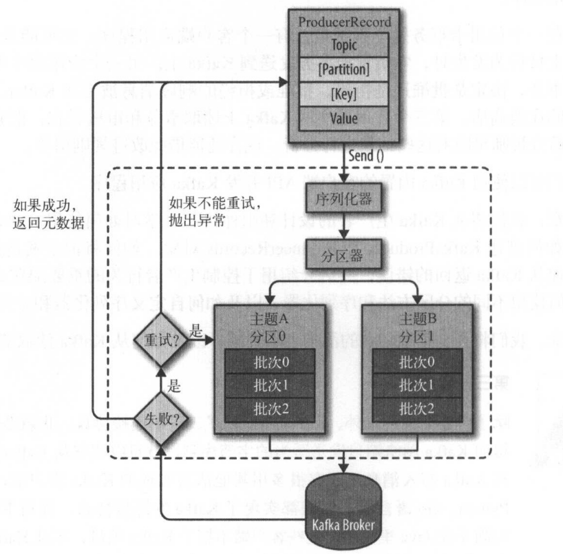

Kafka生产者——向Kafka写入数据
===================================================================================
## 1.生产者概览

Kafka发消息的主要步骤：



我们从创建一个ProducerRecord对象开始，**ProducerRecord对象** 需要包含 **目标主题** 和 **要发送的
内容**。我们还可以指定 **键** 或 **分区**。在发送ProducerRecord对象时，**生产者要先把键和值对象序列
化成字节数组**，这样它们才能够在网络上传输。

接下来，数据被传给 **分区器**。如果之前在 **ProducerRecord对象里指定了分区，那么分区器就不会再做任
何事情**，直接把指定的分区返回。**如果没有指定分区，那么分区器会根据ProducerRecord对象的键来选择一
个分区**。选好分区以后，生产者就知道该往 **哪个主题和分区** 发送这条记录了。紧接着，这条记录被添加到
一个 **记录批次** 里，这个批次里的所有消息会被发送到相同的主题和分区上。 有一个 **独立的线程** 负责把
这些记录批次发送到相应的broker上。

服务器在收到这些消息时会 **返回一个响应**。如果消息成功写入Kafka，就返回一个 **RecordMetaData对象**，
它包含了 **主题和分区信息**，以及记录在分区里的 **偏移量**。如果写入失败，则会返回一个错误。**生产者
在收到错误之后会尝试重新发送消息，几次之后如果还是失败，就返回错误信息**。

## 2.创建Kafka生产者
Kafka生产者有3个必选的属性：
+ **bootstrap.servers** ：该属性指定 **broker的地址清单**，地址的格式为：`host:port`。清单里 **不需
要包含所有的broker地址**，生产者会从给定的broker里查找到其他broker的信息，一旦其中一个宕机，生产者
仍然能够连接到集群上。

+ **key.serializer**：broker希望接收到的消息的 **键** 和 **值** 都是 **字节数组**。生产者接口允许使用参
数化类型，**因此可以把Java对象作为键和值发送给broker**。这样的代码具有良好的可读性，不过生产者需要
知道如何把这些Java对象转换成字节数组。**`key.serializer`必须被设置为一个实现了
`org.apache.kafka.common.serialization.Serializer`接口的类**，生产者会使用这个类把键对象序列化成字节
数组。**Kafka客户端默认提供了`ByteArraySerializer`、`StringSerializer`和`IntegerSerializer`**。

+ **value.serializer**：`value.serializer`指定的类会将值序列化。

演示如何创建一个新的生产者（这里只指定了必要的属性，其他使用默认配置）：
```java
private Properties kafkaProps = new Properties();
kafkaProps.put("bootstrap.servers", "broker1:9092,broker2:9092");
kafkaProps.put("key.serializer", "org.apache.kafka.common.serialization.StringSerializer");
kafkaProps.put("value.serializer", "org.apache.kafka.common.serialization.StringSerializer");
producer = new KafkaProducer<String, String>(kafkaProps);
```

实例化生产者对象后，接下来就可以 **开始发送消息** 了。发送消息主要有以下3种方式：
+ **发送并忘记（fire-and-forget）**：我们把消息发送给服务器，**但并不关心它是否正常到达**。大多数情
况下，消息会正常到达，因为Kafka是高可用的，而且生产者会自动尝试重发。不过，使用这种方式有时候也会
丢失一些消息。
+ **同步发送**：我们使用`send()`方法发送消息，它会 **返回一个Future对象，调用`get()`方法进行等待**，
就可以知道消息是否发送成功。
+ **异步发送**：我们调用`send()`方法，并指定一个 **回调函数**，服务器在返回响应时调用该函数。

本章所有例子都使用单线程，但其实 **生产者是可以使用多线程来发送消息的**。如果需要更高的吞吐量，可以
在生产者数量不变的前提下 **增加线程数量**。如果这样还不够，可以 **增加生产者数量**。

## 3.发送消息到Kafka
最简单的消息发送方式如下：
```java
//构造函数，传入目标主题、键、值
ProducerRecord<String, String> record = new ProducerRecord<>("CustomerCountry", "Precision Products", "france");
try {
    //如果不关心发送结果，可以这样进行发送
    producer.send(record);
} catch(Exception e) {
    e.printStackTrace();
}
```

### 3.1.同步发送消息
同步发送消息方式如下：
```java
ProducerRecord<String, String> record = new ProducerRecord<>("CustomerCountry", "Precision Products", "France");
try {
    producer.send(record).get();
} catch (Exception e) {
    e.printStackTrace();
}
```
**`producer.send()`方法** 先返回一个 **Future对象**，然后调用Future对象的 **`get()`方法** 等待Kafka
响应。

KafkaProducer一般会发生两类错误。**其中一类是可重试错误**，这类错误可以通过重发消息来解决，比如对
于连接错误。**另一类错误无法通过重试解决**，比如“消息太大”异常。

### 3.2.异步发送消息
大多数时候，我们 **并不需要等待响应**———尽管Kafka会把目标主题、分区信息和消息的偏移量发送回来，但
对于发送端的应用程序来说不是必需的。

为了在 **异步发送消息** 的同时能够对 **异常** 情况进行处理。生产者提供了 **回调** 支持：
```java
private class DemoProducerCallback implements Callback {
    @Override
    public void onCompletion(RecordMetadata recordMetadata, Exception e) {
        //如果Kafka返回一个错误，onCompletion方法会抛出一个非空异常
        if(e != null) {
            e.printStackTrace();
        }
    }
}

ProducerRecord<String, String> record = new ProducerRecord<>("CustomerCountry","Biomedical Materials", "USA");
producer.send(record, new DemoProducerCallback());
```

## 4.生产者配置
生产者还有很多可配置的参数，它们 **大部分都有合理的默认值**，所以没有必要去修改它们。不过有几个参数
在内存使用、性能和可靠性方面对生产者影响比较大。 

### 4.1.acks
acks参数指定了必须要 **有多少个分区副本收到消息，生产者才会认为消息写入是成功的**。这个参数对消息丢
失的可能性有重要影响。
+ 如果 **`acks=0`，生产者在成功写入消息之前不会等待任何来自服务器的响应**。也就是说，如果当中出现
了问题，导致服务器没有收到消息，那么生产者就无从得知，消息也就丢失了。不过，**因为生产者不需要等待
服务器的响应，所有它可以以网络能够支持的最大速度发送消息，从而达到很高的吞吐量**。
+ 如果 **`acks=1`，只要集群的首领节点收到消息，生产者就会收到一个来自服务器的成功响应**。如果消息
无法到达首领节点（比如首领节点崩溃，新的首领还没有被选举出来）。生产者会收到一个错误响应，**为了避
免数据丢失，生产者会重发消息**。不过，如果一个没有收到消息的节点成为新首领，消息还是会丢失。这个时
候的 **吞吐量** 取决于使用的是 **同步发送** 还是 **异步发送**。如果让发送客户端 **等待服务器响应**（通
过调用Future对象的`get()`方法），显然会 **增加延迟**（在网络上传输一个来回的延迟）。如果客户端使用
**回调，延迟问题就可以得到缓解**，不过吞吐量还是会受发送中消息数量的限制。
+ 如果 **`acks=all`，只有当所有参与复制的节点全部收到消息时，生产者才会收到一个来自服务器的成功响应**。
这种模式是最安全的，它可以保证一个服务器收到消息，就算有服务器发生崩溃，整个集群仍然可以运行。不过，
**它的延迟比`acks=1`时更高**。

