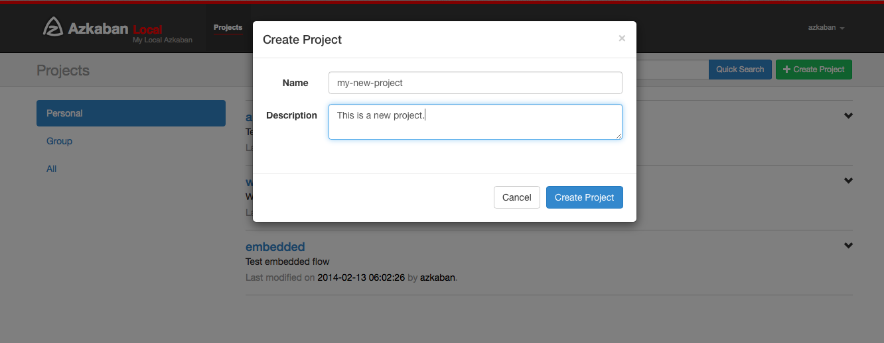
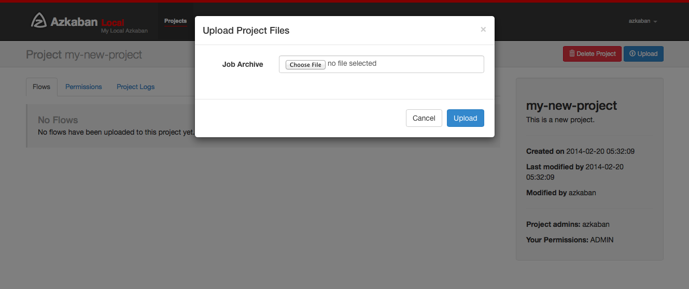
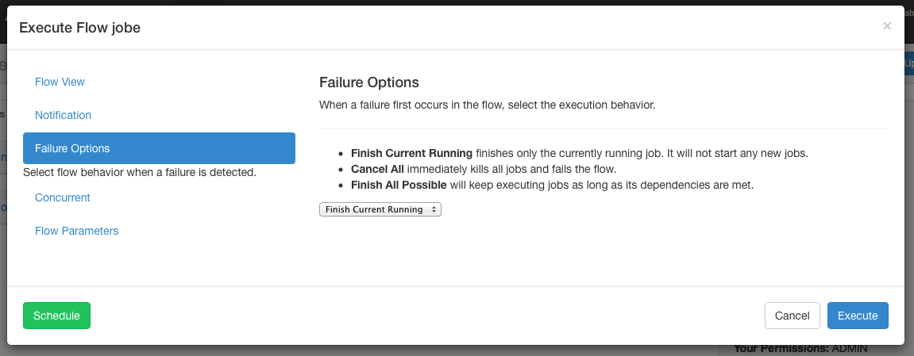

使用Azkaban
================================================================================
本节介绍如何使用Azkaban Web UI创建，查看和执行流程。

## 1.创建项目
登录Azkaban后，您将看到“Projects”页面。此页面将显示您具有 **读取权限** 的所有项目的列表。仅
显示 **组权限** 的项目或具有 **READ或ADMIN角色** 的项目。


如果刚刚开始，项目页面可能为空。但是，您可以通过单击“All Projects”来查看所有现有项目。

单击“Create Projects”将弹出一个对话框。输入项目的唯一项目名称和描述。**将来可以更改说明，但项
目名称不能更改**。如果您没有看到此按钮，则除了具有适当权限的用户之外，可能已锁定创建新项目的能力。


```
好像不能使用中文描述？？！！！
```

创建项目后，将显示一个空项目页面。您将自动获得此项目的 **ADMIN** 状态。单击“权限”按钮添加和删除
权限。


如果您具有适当的权限（创建项目时应该具有该权限），则可以从此页面删除项目，更新描述，上载文件和查看
项目日志。

## 2.上传项目
单击“上传”按钮。您将看到以下对话框。



选择要上传的工作流文件的压缩文件。目前Azkaban仅支持`*.zip`文件。该zip应包含`*.job`文件和运行
Job所需的任何文件。Job名称在项目中必须是唯一的。

Azkaban将验证zip的内容，以确保满足依赖性并且没有检测到循环依赖性。如果发现任何无效Flow，则上传
将失败。

上传会覆盖项目中的所有文件。上传新的zip文件后，对Job所做的任何更改都将被删除。

成功上传后，您应该会在屏幕上看到所有Flow列表。

## 3.Flow视图
通过单击Flow链接，您可以转到Flow View页面。从这里，您将看到流程的图形表示。左侧面板包含Flow中
的Job列表。

右键单击右侧面板中的Job或图形中的节点将允许您打开单个Job。您还可以从此页面安排和执行Flow。


单击`Executions`选项卡将显示此流程的所有以前的执行。


## 4.项目权限
创建项目时，创建者将自动获得项目的`ADMIN`状态。这允许创建者查看、上载、更改作业、运行Flow、删除
和向项目添加用户权限。管理员可以删除其他管理员，但无法删除自己。这可以防止项目无管理，除非具有管
理员角色的用户删除管理员。

可以从项目页面访问权限页面。在权限页面上，管理员可以将其他用户、组或代理用户添加到项目中。


+ 添加用户权限可为这些用户提供项目的指定权限。通过取消选中所有权限来删除用户权限。
+ 组权限允许特定组中的每个人具有指定的权限。通过取消选中所有组权限来删除组权限。
+ 如果启用了代理用户，则代理用户允许项目Flow作为这些用户运行。这对于锁定Job可以代理的无头帐户非
常有用。一旦添加，单击“删除”按钮即可删除它们。

通过`UserManager`验证每个用户，以防止添加无效用户。还检查组和代理用户以确保它们有效并查看是否允
许管理员将它们添加到项目中。

可以为用户和组设置以下权限：

| 权限 | 描述 |
|:---- |:---- |
| ADMIN | 允许用户对此项目执行任何操作，以及添加权限和删除项目。 |
| READ | 用户可以查看作业、流程、执行日志。|
| WRITE | 可以上传项目文件，并可以修改Job文件。|
| EXECUTE | 允许用户执行、暂停、取消Job。|
| SCHEDULE | 允许用户添加、修改和删除计划中的Flow。|

## 5.执行Flow
从`Flow View`或`Project Page`，您可以触发要执行的Job。您将看到一个执行面板弹出窗口。

### 5.1.执行Flow视图
在“Flow视图”面板中，您可以右键单击图形并禁用或启用Job。执行期间将禁用已禁用的Job，就像已满足其
依赖项一样。禁用的Job将显得半透明。


### 5.2.通知选项
通知选项允许用户更改Flow的成功或失败通知行为。

#### 5.2.1.失败通知
+ 首次失败：在检测到第一次失败后发送失败的电子邮件。
+ 完成Flow：如果Flow有失败的Job，它将在Flow中的所有Job完成后发送失败的电子邮件。

#### 5.2.2.电子邮件覆盖
Azkaban将使用Flow中最终Job中设置的默认通知电子邮件。如果被覆盖，则用户可以更改发送失败或成功电
子邮件的电子邮件地址。列表可以用逗号，空格或分号分隔。


### 5.3.失败选项
当Flow中的Job失败时，您可以控制Flow的其余部分将如何成功。

+ **完成当前运行**：将完成当前正在运行的Job，但不会启动Job。Flow将处于FAILED FINISHING状态，
并在一切完成后设置为FAILED。
+ **取消全部**：将立即终止所有正在运行的Job，并将执行Flow的状态设置为FAILED。
+ **完成所有可能**：只要满足其依赖性，就会继续在Flow中执行Job。Flow将处于`FAILED FINISHING`
状态，并在一切完成后设置为FAILED。



### 5.4.并发选项
