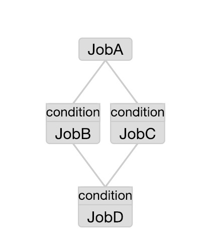
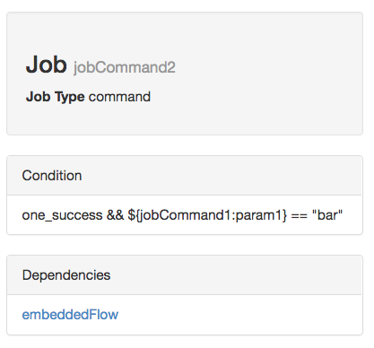
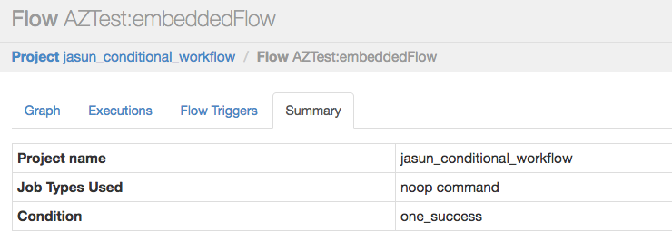

有条件的工㑅流程
================================================================================
## 1.什么是Azkaban条件工作流程？
条件工作流功能允许用户根据条件指定是否运行某些Job。

用户可以根据运行时参数（如先前Job的输出）运行或禁用某些Job。Azkaban为用户提供了一些预定义的宏，
以根据以前的Job状态指定条件。有了这些条件，用户可以在决定Job执行逻辑时获得更大的灵活性。例如，只
要其中一个父Job成功，它们就可以运行当前Job。他们可以在工作流程中实现分支逻辑。

条件工作流功能利用Azkaban Flow 2.0设计（请参阅 **创建流程**）。条件在流YAML文件中定义。

## 2.如何定义条件？
有效条件是Job运行时参数的多个条件和Job状态宏上的一个条件的组合。比较和逻辑运算符可用于连接各个条
件组件。

支持的运算符是：`==，!=，>，>=，<，<=，&&，||，！`。

### 2.1.Job运行时参数的条件
变量替换`${jobName:param}`可用于定义Job运行时参数的条件。`:`用于分隔jobName和参数。可以将运
行时参数与条件中的字符串或数字进行比较。用户需要将参数的值写入`$JOB_OUTPUT_PROP_FILE`（此输出
文件可用于大多数Azkaban作业）。

### 2.2.Job状态宏的条件
将在所有父Job（即YAML文件中的`dependsOn`部分）上评估此条件。

目前支持的宏：
+ `all_success` (默认)
+ `all_done`
+ `all_failed`
+ `one_success`（至少有一个父Job成功了）
+ `one_failed`（至少有一个父Job失败了）

每个宏的相应Job状态：
+ all_done: `FAILED`, `KILLED`, `SUCCEEDED`, `SKIPPED`, `FAILED_SUCCEEDED`, 
`CANCELLED`
+ all_success/one_success: `SUCCEEDED`, `SKIPPED`, `FAILED_SUCCEEDED`
+ all_failed/one_failed: `FAILED`, K`ILLED`, `CANCELLED`

不允许用户在一个条件中将Job状态宏上的多个条件组合在一起，因为它们可能彼此冲突。

### 2.3.一些有效的例子
```
${JobA:param1} == 1 && ${JobB:param2} > 5
one_success
all_done && ${JobC:param3} != "foo"
(!{JobD:param4} || !{JobE:parm5}) && all_success || ${JobF:parm6} == "bar"
```

### 2.4.示例条件Flow YAML文件
**sample.flow**：
```yaml
nodes:
 - name: JobA
   type: command
   config:
     command: bash ./write_to_props.sh

 - name: JobB
   type: command
   dependsOn:
     - JobA
   config:
     command: echo “This is JobB.”
   condition: ${JobA:param1} == 1

 - name: JobC
   type: command
   dependsOn:
     - JobA
   config:
     command: echo “This is JobC.”
   condition: ${JobA:param1} == 2

 - name: JobD
   type: command
   dependsOn:
     - JobB
     - JobC
   config:
     command: pwd
   condition: one_success
```
**write_to_props.sh**：
```shell
echo '{"param1":"1"}' > $JOB_OUTPUT_PROP_FILE
```
在此示例条件工作流中，JobA首先将param1的值写入`$JOB_OUTPUT_PROP_FILE`。然后JobB和JobC评估
他们自己的条件，看看JobA的param1是否等于他们的预期值。JobB的条件满足，但JobC的条件失败。所以
JobB将开始运行，但JobC将被取消。一旦JobB完成，JobD将开始评估其状态，即`one_success`，这意味
着只要JobB或JobC成功，它就会开始运行。

您可以定义Job和子Flow的条件。

## 3.查看Azkaban web UI的条件
具有条件的Job或嵌入Flow将显示流程图页面中的条件标记。



您可以在Job页面中查看Job条件：



此外，您还可以在`Flow summary`页面中查看嵌入Flow的条件：



## 4.下载示例
您可以下载简单的条件工作流项目zip示例来试用此功能：
+ [conditionalFlowProject.zip](https://github.com/azkaban/azkaban/blob/master/az-examples/conditional-flow/conditionalFlowProject.zip)


