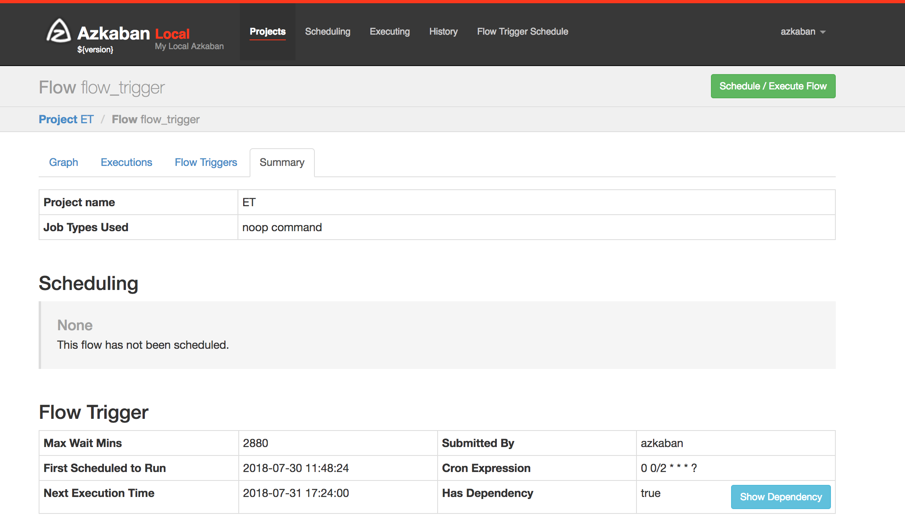
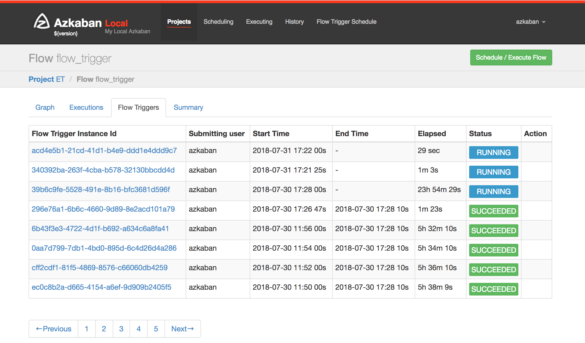
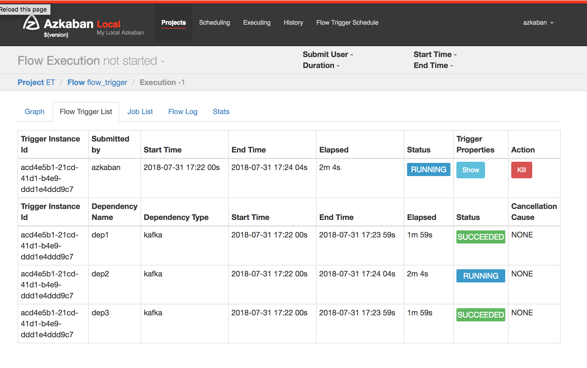
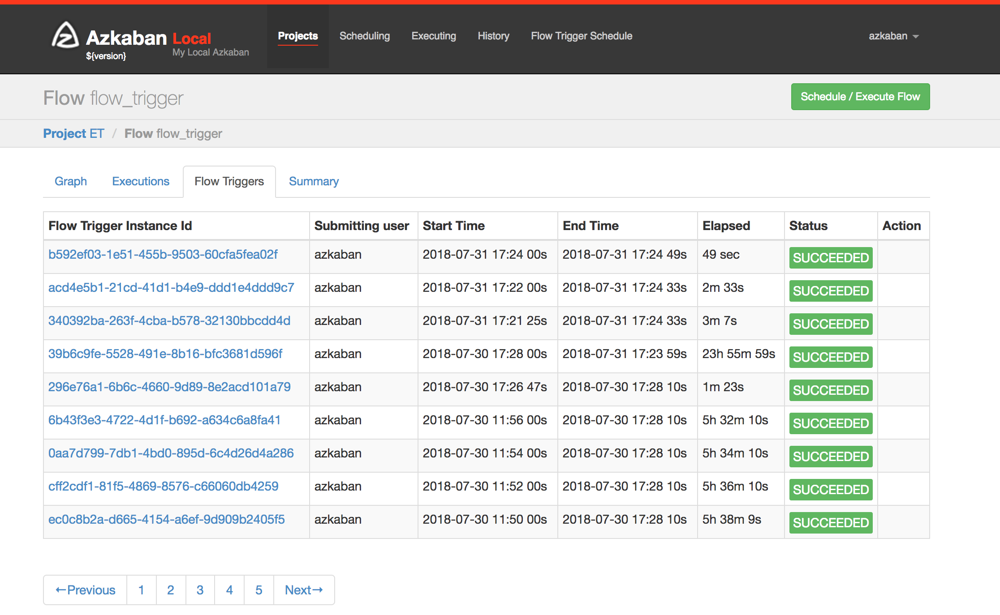

流触发依赖插件
================================================================================
## 1.基于Kafka事件的触发器
目前，Azkaban支持通过 **调度Flow** 或 **Ajax API** 来启动Flow。但是，它们是有限的，因为有时
需要根据需要自动执行Job。事件触发器是Azkaban引入的新功能。它定义了一种新的触发Flow范式：**触发
Kafka事件到达时的Flow**。此概念使用户能够定义Flow所依赖的事件。一旦所有事件都准备就绪，将触发工
作流程。

Apache Kafka是一个发布和订阅数据流系统。通过使用Kafka，我们在Kafka事件有效负载上进行正则表达
式匹配。通过包含逻辑匹配，仅当整个有效负载包含用户预定义的正则表达式模式时，才会将依赖关系标记为
满足。

## 2.在Azkaban上部署事件触发器入门
Azkaban构建使用Gradle（使用gradlew运行时自动下载，这是Gradle包装器）并且需要Java 8或更高版
本。

### 2.1.构建
以下命令在`Linux`、`OS X`等`*nix`平台上运行。要构建`Flow Trigger Dependency Plugin`，我
们需要在`/az-flow-trigger-dependency-type/kafka-event-trigger`目录中运行注释。
```shell
# Build Azkaban
../../gradlew build

# Clean the build
../../gradlew clean

# Build without running tests
../../gradlew build -x test
```
这些都是标准的Gradle命令。有关详细信息，请查看Gradle文档。

### 2.2.Server配置
gradlew命令可以帮助您构建胖JAR。之后，您需要在`conf`中指定`plugin.dir`。以solo-server
为例，覆盖solo-server `conf`目录下`azkaban.properties`文件中运行时参数的
`azkaban.dependency.plugin.dir`属性。此属性需要设置为包含放置Event-Trigger JAR文件的位置。

### 2.3.数据库配置
必须在`conf/azkaban.private.properties`中定义以下4个属性。对于基于solo-server的用例。

| 属性 |
|:----- |
| `mysql.user` |
| `mysql.password` |
| `org.quartz.dataSource.quartzDS.user` |
| `org.quartz.dataSource.quartzDS.password` |

## 3.基于事件的触发器插件配置
在Azkaban依赖插件目录中，应该有两个项目，Event Based Trigger插件jar和
`dependency.properties`。

必需的属性是：
+ **dependency.classpath**：由Azkaban用于识别插件的类路径。应该是JAR文件的绝对路径。
+ **dependency.class**：由Azkaban流触发器实例用于与此配置文件集成。以事件触发器为例，它应该
是`trigger.kafka.KafkaDependencyCheck`。
+ **kafka.broker.url**：指定Kafka broker所在的URL和端口号。

## 4.事件触发器实例配置
事件触发器是Flow定义的一部分，每个Flow最多只能有一个事件触发器。通过Hadoop DSL支持定义事件触发
器。需要在Flow文件中配置触发器以及用户上载的项目zip。事件触发器由事件依赖列表，最大等待时间和调
度组成。以下图为例：


+ **最长等待时间**：触发器在取消之前等待所有依赖项可用的时间。
+ **Trigger.schedule**：定期执行此工作流程的计划。我们在这里使用`cron`时间格式来指定，每2分
钟创建一个触发器，然后是项目工作流程。
+ **triggerDependencies**：这里的参数是澄清来自特定主题频道的事件中正在发生的正则表达式模式。
如果满足所有预定义的依赖条件，则触发器启动流程。

因此，此触发器示例将在`AzEvent_Topic4`中检测到Kafka事件时启动流程。`* Partition [A-Z] ....`
事件来自`AzEvent_Topic1`中的`AzEvent_Topic4`和`hadoop？.*`的事件。

匹配机制可以扩展到正则表达式之外，因为现在它被实现为通用接口。

## 5.使用Azkaban UI的基于事件的触发器示例
所有计划数据触发器都将显示`Azkaban Flow Trigger`部分。此外，项目管理员可以暂停和恢复不良情况
的计划触发器。

特定流程的触发信息页面：



特定流程的当前和历史触发器：



按照以下步骤运行端到端本地测试：
1. **在本地启动Kafka Broker**：
    按照[Kafka QuickStart](https://kafka.apache.org/quickstart/)在Kafka包中运行这些
    Kafka控制台脚本。
    ```shell
    #Start ZooKeeper
    bin/zookeeper-server-start.sh config/zookeeper.properties
    #Start Kafka Server
    bin/kafka-server-start.sh config/server.properties
    ```
2. 以包含AzEvent_Topic4的主题发送Json事件为例：
    ```shell
    bin/kafka-console-producer.sh --broker-list localhost:9092 --topic AzEvent_Topic4 < recordPartition.json
    ```
    这是我的`recordPartition.json`的示例：
    ```json
    {
        "name":"Charlie",
        "team": "Azkaban",
        "event":"MetastorePartitionAuditEvent"
    }
    ```
    一旦此事件到来，Azkaban将此特定事件依赖标记为成功。

    

3. 从生产者发送另一个事件以启动流程：
    ```shell
    bin/kafka-console-producer.sh --broker-list localhost:9092 --topic AzEvent_Topic4 < recordHadoop.json
    ```
    触发清除所有依赖项的工作流：
    
    