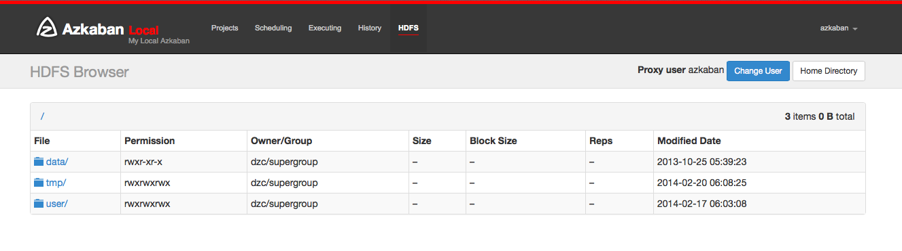

插件
================================================================================
Azkaban设计为模块化。我们可以插入代码来添加查看器页面或以可自定义的方式执行作业。这些页面将描述
可以从 [下载页面](https://azkaban.readthedocs.io/en/latest/%7B%7B%20site.home%20%7D%7D/downloads.html)
下载的azkaban插件，以及如何通过创建自己的插件或扩展现有插件来扩展Azkaban。
```
注意：上面设置的下载页面好像不能下载。
```

## 1.HadoopSecurityManager
Azkaban最常见的采用方式是Hadoop等大数据平台。Azkaban的jobtype插件系统允许对这些系统提供最灵
活的支持。

Azkaban能够支持所有Hadoop版本，并支持Hadoop安全功能；Azkaban能够在同一个实例上支持各种不同版
本的生态系统组件，例如不同版本的pig，hive。

实现此目标的常见模式是使用 **HadoopSecurityManager** 类，该类处理与Hadoop集群的通信并以安全
的方式处理Hadoop安全性。

### 1.1.Hadoop安全性与Kerberos，Hadoop令牌
在企业生产环境中使用Hadoop时，建议打开其安全功能，以保护您的数据并防止出错。

#### 1.1.1.Kerberos身份验证
Apache Hadoop提供的最常见身份验证是通过Kerberos，它需要KDC来验证用户和服务。

用户可以通过用户名/密码使用KDC进行身份验证或使用密钥表。KDC将tgt分发给经过身份验证的用户。Hadoop
服务（例如namenode和jobtracker）可以使用此tgt来验证这是经过身份验证的用户。

#### 1.1.2.Hadoop令牌
一旦用户使用Hadoop服务进行身份验证，Hadoop就会向用户发出令牌，以便其内部服务不会充斥KDC。有关
令牌的说明，请参见 [此处](https://hortonworks.com/blog/the-role-of-delegation-tokens-in-apache-hadoop-security/)。

#### 1.1.3.Hadoop SecurityManager
对于人类用户，可以使用kinit命令对KDC进行身份验证。但是对于像其他用户那样代表运行作业的Azkaban等
调度程序，它需要获取将由用户使用的令牌。特定的Azkaban作业类型应该使用HadoopSecurityManager类
来处理这个问题。

例如，当Azkaban加载pig作业类型时，它将启动一个HadoopSecurityManager，该HadoopSecurityManager
使用所需的KDC和Hadoop Cluster进行身份验证。pig作业类型conf应指定与不同服务进行通信所需的令牌。
至少它需要来自namenode和jobtracker的令牌。当一个pig作业启动时，它将转到HadoopSecurityManager
以获取所有这些令牌。当用户进程完成时，pig作业类型再次调用HadoopSecurityManager来取消所有这些
令牌。

### 1.2.所有Hadoop集群的通用设置
当用户程序想要与Hadoop集群通信时，它需要知道namenode和jobtracker的位置。它还需要知道如何使用
它们进行身份验证。这些信息都在Hadoop配置文件中，通常位于`$HADOOP_HOME/conf`中。因此，此conf
目录以及hadoop-core jar需要位于azkaban executor服务器类路径上。

如果您使用的是使用HCat作为其Metastore的Hive，那么您还需要在类路径上使用相关的hive jar和hive 
conf。

#### 1.2.1.Native Library
您的Hadoop平台很可能依赖于某些本地库，这应该在azkaban executor服务器的java.library.path中
指定。

#### 1.2.2.temp dir
除此之外，Hadoop上的许多工具，如Pig/Hive/Crunch都将文件写入临时目录。默认情况下，它们都转到
`/tmp`。当许多作业同时运行时，这可能会导致操作问题。因此，您可能希望通过将`java.io.tmp.dir`设
置为其他目录来更改此设置。

### 1.3.设置与非安全Hadoop集群通信
如果您刚开始使用Hadoop，很可能您的Hadoop没有kerberos身份验证。根据您是否要将所有内容作为azkaban
用户（或任何用户启动azkaban执行程序服务器）运行，您可以执行以下设置：
+ 如果您使用名为azkaban的用户启动执行程序服务器，并且希望在Hadoop上以azkaban的身份运行所有作
业，只需设置`azkaban.should.proxy = false`与`obtain.binary.token=false`。
+ 如果您使用名为azkaban的用户启动了执行程序服务器，但是您希望将Hadoop作业作为其各个用户运行，
则需要设置`azkaban.should.proxy = true`和`obtain.binary.token = false`。

### 1.4.设置与安全Hadoop集群通信
对于安全的Hadoop集群，Azkaban需要自己的kerberos密钥表来与KDC进行身份验证。Azkaban作业类型应
该在用户作业进程开始之前获取必要的Hadoop令牌，并且应该在用户作业完成后取消令牌。

所有特定于作业类型的设置都应该转到各自的插件配置文件中。一些常见设置可以转到`commonprivate.properties`
和`common.properties`。

例如，Hadoop作业类型通常需要namenode令牌和jobtracker令牌。这些可以转到`commonpriate.properties`。

#### 1.4.1.Azkaban作为代理用户
`HadoopSecurityManager`需要以下设置才能使用KDC进行身份验证：
```ini
proxy.user=YOUR_AZKABAN_KERBEROS_PRINCIPAL
```
此主体也应在Hadoop conf中的`core-site.xml`中设置，并具有相应的权限。
```ini
proxy.keytab.location=KEYTAB_LOCATION
```
应验证代理用户和密钥表是否与指定的KDC一起使用。

#### 1.4.2.获取用户作业的令牌
以下是大多数Hadoop作业的常见问题。
```ini
hadoop.security.manager.class=azkaban.security.HadoopSecurityManager_H_1_0
```
此实现应与`Hadoop 1.x`一起使用：
```ini
azkaban.should.proxy=true
obtain.binary.token=true
obtain.namenode.token=true
obtain.jobtracker.token=true
```
此外，如果您的工作需要与HCat交谈，例如，如果您安装了使用kerbrosed HCat的Hive，或者您的Pig工作
需要与HCat交谈，则需要为这些Hive工作类型设置：
```ini
obtain.hcat.token=true
```
这使得HadoopSecurityManager也获得了HCat令牌。

### 1.5.在安全的Hadoop集群上创建新的作业类型
如果您要创建一个与Hadoop集群通信的新作业类型，则可以使用HadoopSecurityManager来处理安全性。
对于不安全的Hadoop集群，没有什么特别需要的。

对于安全的Hadoop集群，hadoop安全管理器包中包含两种方式：
+ 将密钥选项卡信息提供给用户作业流程。hadoopsecuritymanager静态方法负责从该公共密钥表和用户的
代理登录。这对于原型设计很方便，因为将有一个真正的tgt授予用户作业。另一方面，用户可能会使用密钥表
来登录和代理其他人，这会带来安全漏洞。
+ 在用户作业进程开始之前获取Hadoop令牌。作业包装器将在用户作业进程中获取这些二进制令牌。用户作业
完成后，应明确取消令牌。

通过使用hadoopJava，pig，hive等基本作业类型配置正确配置的hadoopsecuritymanager，可以使这些
作业类型适用于具有各种安全设置的不同版本的Hadoop。

azkaban-plugins中包含了针对Hadoop-1.x版本的hadoopsecuritymanager。它与Hadoop-0.20和先
前版本不兼容，因为Hadoop UGI不向后兼容。但是，实现与它们一起使用的应该不难。展望未来，Hadoop 
UGI主要是向后兼容的，只需要使用更新版本的Hadoop重新编译hadoopsecuritymanager包。

## 2.Azkaban HDFS浏览器
Azkaban HDFS浏览器是一个插件，允许您查看HDFS文件系统并解码多种文件类型。它最初是在LinkedIn上
创建的，用于查看Avro文件，Linkedin的BinaryJson格式和文本文件。随着此插件的进一步成熟，我们可
能会在将来添加不同文件类型的解码。



### 2.1.建立
从 [下载页面](https://azkaban.readthedocs.io/en/latest/%7B%7B%20site.home%20%7D%7D/downloads.html)
下载HDFS插件并将其解压缩到Web服务器的插件目录中。这通常是`azkaban_web_server_dir/plugins/viewer/`。

#### 2.1.1.用户
默认情况下，Azkaban HDFS浏览器可以模拟登录用户。通常，数据由无头帐户创建和处理。要查看这些文件，
如果打开了用户代理，则只要UserManager验证了用户代理，用户就可以切换到无头帐户。

#### 2.1.2.设置
这些是在AzkabanWebServer上配置HDFS浏览器的属性。它们可以在
`azkaban_web_server_dir/plugins/viewer/hdfs/conf/plugin.properties`中设置。

| 参数 | 描述 | 默认 |
|:-----|:-----|:-----|
| `viewer.name` | 此查看器插件的名称 | HDFS |
| `viewer.path` | 查看器目录中此查看器插件的路径。 | hdfs |
| `viewer.order` | 所有查看器插件中此查看器插件的顺序。 | 1 |
| `viewer.hidden` | 此插件是否应显示在Web UI上。 | false |
| `viewer.external.class path` | 此查看器插件应在init时加载额外的jar。 | `extlib/*` |
| `viewer.servlet.class` | 此查看器插件的主要servlet类。 对于hdfs浏览器，请使用azkaban.viewer.hdfs .HdfsBrowserServlet | |
| `hadoop.security.manager.class` | 处理与hadoop集群交谈的类。对hadoop1.x使用azkaban.security.HadoopSecurityManager_H _1_0 |
| `azkaban.should.proxy` | Azkaban是否应在安全群集上代理个人用户hadoop帐户，默认为false | false |
| `proxy.user` | Azkaban用户配置了kerberos和hadoop。 类似于应如何配置oozie，用于安全的hadoop安装 | |
| `proxy.keytab.location` | 密钥表文件的位置，Azkaban可以使用Kerberos为指定的proxy.user进行身份验证 | |
| `allow.group.proxy` | 是否允许同一无头用户组中的用户以无头用户的身份查看hdfs文件系统 | false |


