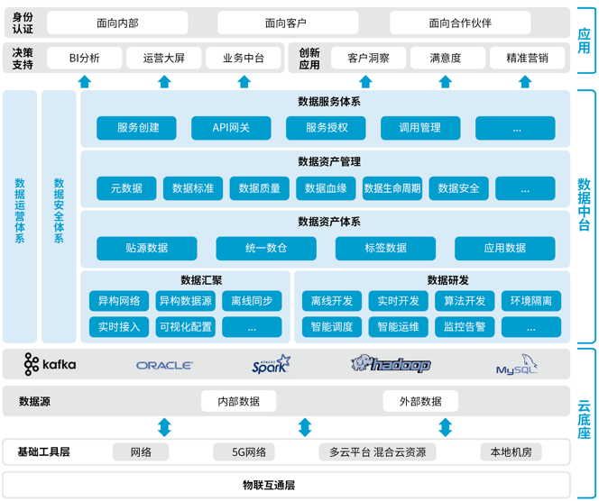

数据中台架构
===================================================================================
  数据中台的目标是让数据持续用起来，通过数据中台提供的工具、方法和运行机制，把数据变为一种服务能力，
  让数据更方便地被业务所使用。 

  

  **通过数据中台的数据汇聚、数据开发模块建立企业数据资产。通过资产管理与治理、数据服务把数据资产变为
  数据服务能力，服务于企业业务。数据安全管理、数据运营体系保障数据中台可以长期健康、持续运转**。

## 1.数据汇聚
数据汇聚是数据中台必须提供的核心工具，把各种异构风格、异构数据源的数据方便地采集到数据中台中进行集
中存储，为后续的加工建模做准备。数据汇聚方式一般有数据库同步、埋点、网格爬虫、消息队列等；从汇聚的
时效性来分，有离线批量汇聚和实时采集。

## 2.数据开发
数据开发是一整套数据加工过程管控的工具，有经验的数据开发、算法建模人员利用数据加工模块提供的功能，
可以快速把数据加工成对业务有价值的形式，提供给业务使用。数据开发模块主要面向开发人员、分析人员，提
供离线、实时、算法开发工具，以及任务的管理、代码发布、运维、监控、告警等一系列集成工具，方便使用，
提升效率。

## 3.数据体系
有了数据汇聚、数据开发模块，中台已经具备传统数据仓库平台的基本能力，可以做数据的汇聚以及各种数据开
发，就可以建立企业的数据体系。必须考虑数据的一致性和可复用性，垂直的、烟囱式的数据和数据服务的建设
方式注定不能长久存在。**建议数据按照贴源数据、统一数仓、标签数据、应用数据的标准统一建设**。

## 4.数据资产管理
通过数据体系建立起来的数据资产较为偏技术，业务人员比较难理解。资产管理是以企业全员更好理解的方式，
把企业的数据资产展现给企业全员，**数据资产管理包括对数据资产目录、元数据、数据质量、数据血缘、数据
生命周期等进行管理和展示，以一种更直观的方式展现企业的数据资产，提升企业的数据意识**。

## 5.数据服务体系
数据服务体系就是把数据变为一种服务能力，通过数据服务让数据参与到业务，激活整个数据中台，数据服务体
系是数据中台存在的价值所在。**中台产品可以带有一些标准服务**，但是很难满足企业的服务诉求，大部分服
务还是需要通过中台的能力快速定制。数据中台的服务模块并没有自带很多服务，**而是提供快速的服务生成能
力以及服务的管控、鉴权、计量等功能**。

## 6.运营体系和安全管理
运营体系和安全管理是数据中台得以健康、持续运转的基础。

