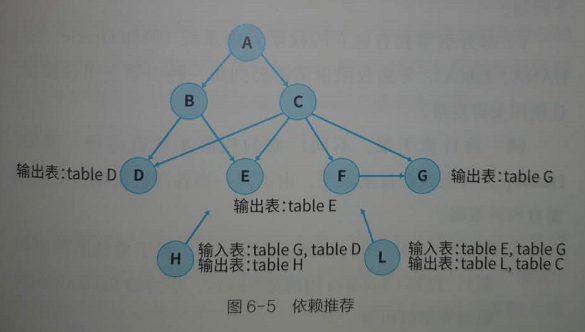

离线开发
===================================================================================
**离线开发套件** 封装了大数据相关的技术，包括 **数据加工、数据分析、在线查询、即席分析等能力，同时也
将任务的调度、发布、运维、监控、告警等进行整合**，让开发者可以直接通过浏览器访问，不再需要安装任何
服务，也不用关心底层技术的实现，只需专注于业务的开发，帮助企业快速构建数据服务，赋能业务。

## 1.作业调度
在数据开发过程中，经常需要配置作业的 **上游依赖作业**，这样作业之间便会组成一个 **有向无环图**（
`DAG`），同时会配置作业的 **开始调度时间**。

例如，对于上图中的B作业来说，其父作业分别是为A和C，调度开始时间设置为：05:00。
+ **依赖调度**：所有父作业运行完成后，当前作业才能开始运行。上图中的作业B，只有父作业A和C运行完成
后，才能开始被调度。
+ **时间调度**：可指定作业的调度开始时间。上图中的作业B，只有到达05:00后才能开始被调度。

**如果一个节点既有父作业又有调度时间约束，那么在调度过程中只有同时满足两种约束条件时，才能开始被调
度**。

## 2.基线控制
在大数据离线计算中，**由于作业执行时间较长，经常会遇到急着用数据却发现数据还没出来的情形**。重新跑
需要几个小时，时间已然来不及。因此本书提出一种 **基线控制方法，用于统一管理数据处理作业的完成时间、
优先级、告警策略，保障数据加工按时完成。调度模块会根据最先到达、最短执行时间原则，动态调整资源分配
及作业的优先级，让资源利用效率最大化**。

同时采用算法对作业完成时间进行智能预测。**根据预测，当作业无法正常产出且动态调整无法完成时，调度中
心会及时通过监控告警通知运维值班人员提前介入处理**，为大数据作业执行留出充裕的时间。

## 3.异构存储
当前，企业内部的计算存储引擎呈现多元化趋势。例如，国内某大型企业同时使用Oracle、IQ、HANA、Hadoop、
LibrA等多种数据库，涉及关系型DB、MPP、大数据数仓等多种不同类型。

## 4.代码校验
在离线任务的开发过程中，会涉及各种各样的任务类型。对于常见的 **SQL任务类型**，SQL检查器会做好严格
的管控，做到事前发现问题，避免代码在周期调度过程中或运行完成后才发现问题。**校验分为语法校验和规则
校验**。
+ **语法校验** 是对SQL的语法进行校验。不同类型的SQL语法是不一样的，如常用的Hive、Spark、Phoenix等；
相同类型而不同版本的SQL语法也不一样，如Spark1.x、Spark2.x等。
+ **规则校验** 是指SQL检查器根据 **规则库** 提供的规则，**对SQL进行规则校验**。校验的规则是可以 **动
态添加和扩展维护的**，比如可以包含 **代码规范校验、代码质量校验、代码安全校验** 等。

## 5.多环境级联
可以通过环境级联的方式灵活 **支持企业的各类环境需求，方便对资源、权限进行控制和隔离**。例如在新建项
目时，企业可根据自身需求配置各种环境和级联方式，每个环境拥有独立的Hive数据库、Yarn调度队列，甚至不
同的Hadoop集群。常见环境如下：
+ **单一环境**：只有一个生产环境，内部管理简单。
+ **经曲环境**：开发环境中存放脱敏数据、供开发测试使用，上生产走发布流程，用于真实数据生产。
+ **复杂环境**：企业有外部人员和内部人员时，**会给外部人员提供一个脱敏管控环境**，外部人员开发完的
数据模型经过测试后发布到 **内部开发环境**，由内部员工检查确认及内部测试验证流程，完成确认后发布。
**在内部生产、内部开发、外部开发等环境中，数据样本也会根据面向的群体不同，进行不同等级的加密和脱敏
处理**。

**在新建项目时，一般会创建开发和生产两个环境**，开发环境用于用户开发、任务调试，生产环境即线上环境，
系统默认会按天进行周期调度以执行任务。生产环境不允许用户直接操作任务、资源和函数，必须在开发环境下
进行新建、修改或删除，**在经过提交、创建发布包、同意发布** 三个操作后，才可以同步到生产环境。

## 6.推荐依赖
随着业务的不断深入，数据开发人员需要开发的作业会不断累加，峰值时，一个工作流下会挂成千上万个作业。
这会让工作流任务的人工维护非常艰难。**如何从上千个作业中找到需要依赖的上游作业？如何保证选定了上游
作业后，不会因形成环路而导致调度失败？** 这时候就需要一把利器，**能自动推荐上游作业**，既能保证准确
找到需要定位的上游作业，又能保证不会形成环路。可以看下图：

已知A、B、C、D、E、F、G及依赖关系，现开发了两个新的任务H和L，需要对H、L设置上游依赖信息，智能推
荐依赖的工作原理具体如下：
+ 获取推荐依赖的核心原理在于 **上下游作业输入和输出的表级血缘依赖图**；
+ 通过血缘分析当前作业的输入和输出，找到合适的上游作业；
+ 对合适的作业 **进行环路检测，剔除存在闭环的作业**；
+ 返回合适的节点列表；

通过上图中的关系，**可以智能推荐出H节点的上游作业为D、G， L的上游节点为E、G**。

## 7.数据权限
由于企业内部计算引擎的多样化，数据权限的管理会面临如下问题：
1. **部分引擎拥有独立的权限管理系统**（例如Oracle、IQ、HANA、LibrA），导致权限申请需要到每一种引擎
上单独操作，让使用变得复杂。
**同一种计算引擎，不同厂商的权限系统有多种**。例如，Hadoop自身无数据权限系统，由不同厂商各自去实
现，**目前主要有两种策略**：
    + **RBAC**（`Role-Based Access Control`，**基于角色的访问控制**）：比如 **Cloudera用的是Sentry**，
    华为的FusionInsight也是类似的机制。
    + **PBAC**（`Policy-Based Access Control`，**基于策略的访问控制**）：比如 **Hortonworks用的
    Ranger**。
2. **数据权限是由大数据集群或数据库运维人员管理的，开发人员无法直接操作或者接触**，所有的权限申请都
需要运维人员开通，造成运维人员负担过重。在实际开发中，**一般需要运维人员把整个库的权限授权给某个开
发负责人**，然后库里面的表、字段、函数的权限管理由开发负责人负责就行。
3. **缺乏一套能同时支持多种计算引擎的权限申请、审批、管理系统**。本书提出的数据权限管理目标就是构建
统一的权限管理系统来支持多种引擎，可以直接在此系统上进行各种引擎的权限申请、审批和管理，无须接触底
层引擎的权限管理系统。**在适配不同引擎时，仍旧采用插件化的设计思路，针对每种权限管理系统开发一种插
件**，并支持用户通过二次开发来扩展插件。数据权限管理中心提供界面化操作。数据申请方直接在页面上进行
各种权限的申请，数据管理方在界面上审核权限，执行同意或拒绝操作。同时，所有权限的申请、审批都会有记
录，便于进行权限审计。在统一数据权限服务中，会对接底层的各种权限管理系统，例如Sentry、Ranger、Oracle，
同时对数据权限管理中心提供服务，执行权限的申请、授权、撤销等操作。

 

