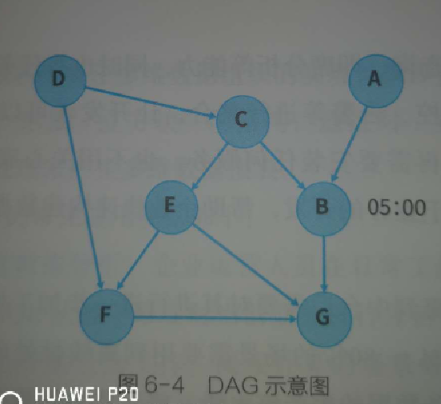

离线开发
===================================================================================
**离线开发套件** 封装了大数据相关的技术，包括 **数据加工、数据分析、在线查询、即席分析等能力，同时也
将任务的调度、发布、运维、监控、告警等进行整合**，让开发者可以直接通过浏览器访问，不再需要安装任何
服务，也不用关心底层技术的实现，只需专注于业务的开发，帮助企业快速构建数据服务，赋能业务。

## 1.作业调度
在数据开发过程中，经常需要配置作业的 **上游依赖作业**，这样作业之间便会组成一个 **有向无环图**（
`DAG`），同时会配置作业的 **开始调度时间**。

例如，对于上图中的B作业来说，其父作业分别是为A和C，调度开始时间设置为：05:00。
+ **依赖调度**：所有父作业运行完成后，当前作业才能开始运行。上图中的作业B，只有父作业A和C运行完成
后，才能开始被调度。
+ **时间调度**：可指定作业的调度开始时间。上图中的作业B，只有到达05:00后才能开始被调度。

**如果一个节点既有父作业又有调度时间约束，那么在调度过程中只有同时满足两种约束条件时，才能开始被调
度**。

## 2.基线控制
在大数据离线计算中，**由于作业执行时间较长，经常会遇到急着用数据却发现数据还没出来的情形**。重新跑
需要几个小时，时间已然来不及。因此本书提出一种 **基线控制方法，用于统一管理数据处理作业的完成时间、
优先级、告警策略，保障数据加工按时完成。调度模块会根据最先到达、最短执行时间原则，动态调整资源分配
及作业的优先级，让资源利用效率最大化**。

同时采用算法对作业完成时间进行智能预测。**根据预测，当作业无法正常产出且动态调整无法完成时，调度中
心会及时通过监控告警通知运维值班人员提前介入处理**，为大数据作业执行留出充裕的时间。

## 3.异构存储
当前，企业内部的计算存储引擎呈现多元化趋势。例如，国内某大型企业同时使用Oracle、IQ、HANA、Hadoop、
LibrA等多种数据库，涉及关系型DB、MPP、大数据数仓等多种不同类型。

## 4.代码校验
在离线任务的开发过程中，会涉及各种各样的任务类型。对于常见的SQL任务类型，

