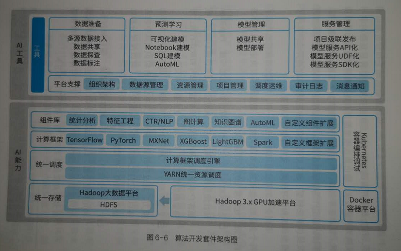

算法开发
===================================================================================
DT时代的数据具有 **高维稀疏特征**，对算法处理提出了更高的要求。面对 **百亿样本级别** 是的数据量，传
统的数据挖掘在辨识价值信息、挖掘数据关系和数据趋势方面 **捉襟见肘**。具体表现如下方面：
+ 数据处理难度加大；
+ 业务处理要求变高；
+ 烟囱式的开发模型；
+ 散落各地的模型服务；
+ 模型研发环节繁多；
+ 冗余分散的基础设施；
+ 数据处理/特征工程；
+ 多角色企业研发团队；

因此，**一款能支撑多环境、多集群、多形态模型服务化能力的算法开发工具** 对企业创新业务、实现数据智能
化起着至关重要的作用。

算法开发作为一站式的企业级机器学习工具，旨在快速赋予企业构建核心算法服务的能力，它集成了 **以批处理
为核心的离线模型训练功能，以流计算为核心的在线机器学习，以及基于在线查询、即席分析的数据探索和统计
分析能力**。**算法开发套件为算法人员提供可视化建模和Notebook建模两种建模方式，集成主流的机器学习、
深度学习计算框架和丰富的标准化算法组件能力**，在开展数据智能、数据科研、预测分析等方面能够帮助企业
快速实现人工智能应用的构建与落地，如下图：

作为数据开发的重要工具，**算法开发** 需要满足 **复杂的学习预测类智能需求，输出算法模型能力，将数据洞
察升级为学习预测**，驱动业务创新。当数据开发和资产加工无法满足 **数据挖掘、算法标签生产** 等场景的需
求时，**算法开发可以为离线开发和实时开发提供算法模型。加工好的数据和标签资产又能被算法开发用于模型
训练和学习预测**，支持智能需求研发。

不同企业的算法应用场景也不一样，数据的差异性也决定了每个企业的算法效果会有很大差别，**数据和特征决
定了机器学习的上限**。比较常见的应用场景如下：
+ **金融风控和反欺诈**：利用关联分析、标签传播、PageRank和社团发现等 **图算法** 组件，构建金融反欺
诈核心能力，根据客户本身属性和行为数据识别虚假帐号和欺诈行为，增强金融监管能力，保障金融业务稳定和
安全。
+ **文本挖掘分析**：利用 **命名实体识别**（`NER`）、**图挖掘** 等文本算法能力，通过分析非结构化的文
本信息自动识别其中的实体以及它们之间的关系，构建关系网、可以深度分析以前未处理的一些线索。
+ **广告精准营销**：通过深入洞察客户需求、偏好和行为，利用 **特征分箱、LightGBM、PMI等算法组件** 
构建的 **机器学习模型** 来智能挖掘潜在客户，实现可持续的精准营销计划和高质量曝光率，有效提升广告点
击率。

