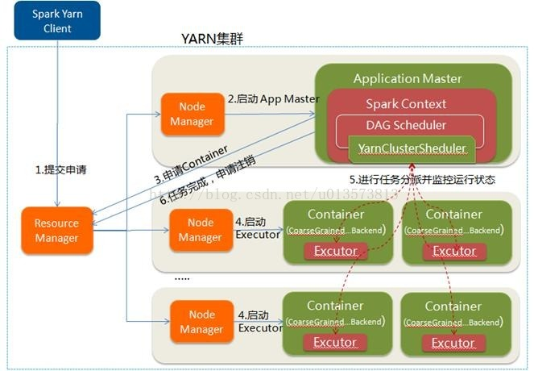

Spark on Yarn的运行原理
=================================================================================
### yarn是集群的资源管理服务
1. **ResourceManager**：负责整个集群的资源管理和分配。
2. **ApplicationMaster**：YARN中每个Application对应一个AM进程，负责与RM协商获取资源，获取资源
后告诉NodeManager为其分配并启动Container。
3. **NodeManager**：每个节点的资源和任务管理器，负责启动/停止Container，并监视资源使用情况。
4. **Container**：YARN中的抽象资源。

### spark的概念
1. **Driver**：和ClusterManager通信，进行资源申请、任务分配并监督其运行状况等。
2. **ClusterManager**：这里指YARN。
3. **DAGScheduler**：把spark作业转换成Stage的DAG图。
4. **TaskScheduler**：把Task分配给具体的Executor。

### spark on yarn

#### cluster模式

1. ResourceManager接到请求后在集群中选择一个NodeManager分配Container，并在Container中启动
ApplicationMaster进程；
2. 在ApplicationMaster进程中初始化SparkContext；
3. ApplicationMaster向ResoureManager申请到Container后，通知NodeManager在获得的Container中
启动excutor进程；
4. SparkContext分配Task给excutor，excutor发送运行状态给ApplicationMaster。

ddd
