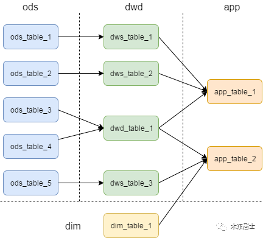
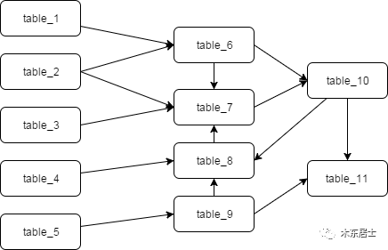
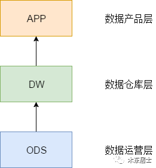
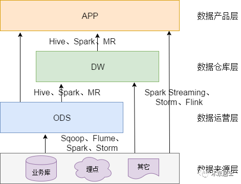
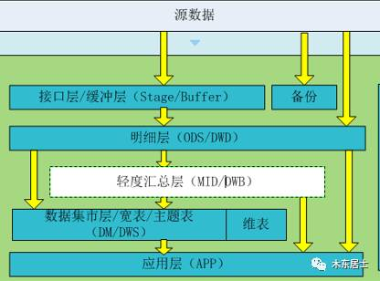
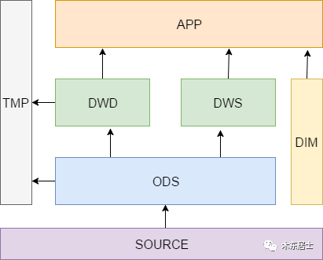

数据仓库-如何优雅地设计数据分层
================================================================================
## 1.为什么要分层
我们对数据进行分层的一个主要原因就是希望在管理数据的时候，能对数据有一个更加清晰的掌控，详细来讲，
主要有下面几个原因：
1. **清晰数据结构**：每一个数据分层都有它的作用域，这样我们在使用表的时候能更方便地定位和理解。
2. **数据血缘追踪**：简单来讲可以这样理解，我们最终给业务呈现的是能直接使用的一张业务表，但是它
的来源有很多，如果有一张来源表出问题了，我们希望能够快速准确地定位到问题，并清楚它的危害范围。
3. **减少重复开发**：规范数据分层，开发一些通用的中间层数据，能够减少极大的重复计算。
4. **把复杂问题简单化**：将一个复杂的任务分解成多个步骤来完成，每一层只处理单一的步骤，比较简单和
容易理解。而且便于维护数据的准确性，当数据出现问题之后，可以不用修复所有的数据，只需要从有问题的步
骤开始修复。
5. **屏蔽原始数据的异常**。
6. **屏蔽业务的影响**，不必改一次业务就需要重新接入数据。

数据体系中的各个表的依赖就像是电线的流向一样，我们都希望它是规整、流向清晰、便于管理的，如下图：

但是，最终的结果大多却是依赖复杂、层级混乱，想梳理清楚一张表的生成途径会比较困难，如下图：

## 2.怎样分层

### 2.1.理论
我们从理论上来做一个抽象，可以把数据仓库分为下面三个层，即：**数据运营层**、**数据仓库层** 和 **数
据产品层**。

#### 2.1.1.ODS全称是Operational Data Store，操作数据存储
“面向主题的”，**数据运营层**，也叫 **ODS层**，是最接近数据源中数据的一层，数据源中的数据，经过抽取、
洗净、传输，也就说传说中的 **ETL** 之后，装入本层。本层的数据，总体上大多是按照源头业务系统的分类方
式而分类的。

但是，**这一层面的数据却不等同于原始数据**。在源数据装入这一层时，要进行诸如 **去噪**（例如有一条数据
中人的年龄是300岁，这种属于异常数据，就需要提前做一些处理）、**去重**（例如在个人资料表中，同一ID却有
两条重复数据，在接入的时候需要做一步去重）、**字段命名规范等** 一系列操作。

#### 2.1.2.数据仓库层(DW)，是数据仓库的主体
在这里，从 **ODS层** 中获得的数据按照主题建立各种数据模型。这一层和维度建模会有比较深的联系，可以多参
考一下前面的几篇文章。

#### 2.1.3.数据产品层（APP），这一层是提供给数据产品使用的结果数据
在这里，主要是提供给数据产品和数据分析使用的数据，**一般会存放在ES、Mysql等系统中供线上系统使用**，
也可能会存在Hive或者Druid中供数据分析和数据挖掘使用。比如我们经常说的报表数据，或者说那种大宽表，
一般就放在这里。

### 2.2.技术实践
这三层技术划分，相对来说比较粗粒度，后面我们会专门细分一下。在此之前，先聊一下每一层的数据一般都是怎
么流向的。这里仅仅简单介绍几个常用的工具，侧重开源界主流。

#### 2.2.1.数据来源层→ ODS层
这里其实就是我们现在大数据技术发挥作用的一个主要战场。我们的数据主要会有两个大的来源：
1. **业务库**，这里经常会使用 **Sqoop** 来抽取，比如我们每天定时抽取一次。在实时方面，可以考虑用
**Canal** 监听 **Mysql的Binlog**，实时接入即可。
2. **埋点日志**，线上系统会打入各种日志，这些日志一般以文件的形式保存，我们可以选择用 **Flume**
定时抽取，也可以用用 **Spark Streaming** 或者 **Storm** 来实时接入，当然，**Kafka** 也会是一
个关键的角色。
3. 其它数据源会比较多样性，这和具体的业务相关，不再赘述。

**注意：在这层，理应不是简单的数据接入，而是要考虑一定的数据清洗，比如异常字段的处理、字段命名规范化、
时间字段的统一等，一般这些很容易会被忽略，但是却至关重要**。特别是后期我们做各种特征自动生成的时候，
会十分有用。后续会有文章来分享。

#### 2.2.2.ODS、DW → App层
这里面也主要分两种类型：
1. **每日定时任务型**：比如我们典型的日计算任务，每天凌晨算前一天的数据，早上起来看报表。这种任务经常
使用Hive、Spark或者生撸MR程序来计算，最终结果写入Hive、Hbase、Mysql、ES或者Redis中。
2. **实时数据**：这部分主要是各种实时的系统使用，比如我们的实时推荐、实时用户画像，一般我们会用
Spark Streaming、Storm或者Flink来计算，最后会落入Es、Hbase或者Redis中。

## 3.举个例子
网上的例子很多，就不列了，只举个笔者早期参与设计的数据分层例子。分析一下当初的想法，以及这种设计的缺陷。
上原图和内容。

当初的设计总共分了6层，其中去掉元数据后，还有5层。下面分析一下当初的一个设计思路。

### 缓冲层(buffer)
+ **概念**：又称为接口层（stage），用于存储每天的增量数据和变更数据，如Canal接收的业务变更日志。
+ **数据生成方式**：直接从 **kafka** 接收源数据，需要业务表每天生成 **update,delete,insert**
数据，只生成insert数据的业务表，数据直接入明细层
+ **讨论方案**：只把canal日志直接入缓冲层，如果其它有 **拉链数据** 的业务，也入缓冲层。
+ **日志存储方式**：使用 **impala外表，parquet文件格式**，方便需要MR处理的数据读取。
+ **日志删除方式**：长久存储，可只存储最近几天的数据。讨论方案：直接长久存储
+ **表schema**：一般按天创建分区
+ **库与表命名**：库名：buffer,表名：初步考虑格式为：buffer日期业务表名,待定。

### 明细层（ODS,Operational Data Store，DWD: data warehouse detail）
+ **概念**：是数据仓库的细节数据层，是对STAGE层数据进行沉淀，减少了抽取的复杂性，同时ODS/DWD的信息
模型组织主要遵循企业业务事务处理的形式，将各个专业数据进行集中，明细层跟stage层的粒度一致，属于分析的
公共资源。
+ **数据生成方式**：部分数据直接来自kafka，部分数据为接口层数据与历史数据合成。canal日志合成数据的
方式待研究。
+ **讨论方案**：canal数据的合成方式为：每天把明细层的前天全量数据和昨天新数据合成一个新的数据表，覆盖
旧表。同时使用历史镜像，按周/按月/按年 存储一个历史镜像到新表。
+ **日志存储方式**：直接数据使用impala外表，parquet文件格式，canal合成数据为二次生成数据，建议使用
内表，下面几层都是从impala生成的数据，建议都用内表+静态/动态分区。
+ **日志删除方式**：长久存储。
+ **表schema**：一般按天创建分区，没有时间概念的按具体业务选择分区字段。
+ **库与表命名**。库名：ods,表名：初步考虑格式为ods日期业务表名,待定。
+ **旧数据更新方式**：直接覆盖

### 轻度汇总层(MID或DWB, data warehouse basis)
+ **概念**：轻度汇总层数据仓库中DWD层和DM层之间的一个过渡层次，是对DWD层的生产数据进行轻度综合和汇总
统计（可以把复杂的清洗，处理包含，如根据PV日志生成的会话数据）。轻度综合层与DWD的主要区别在于二者的应用
领域不同，DWD的数据来源于生产型系统，并未满足一些不可预见的需求而进行沉淀；轻度综合层则面向分析型应用进
行细粒度的统计和沉淀。
+ **数据生成方式**：由明细层按照一定的业务需求生成轻度汇总表。明细层需要复杂清洗的数据和需要MR处理的数
据也经过处理后接入到轻度汇总层。
+ **日志存储方式**：内表，parquet文件格式。
+ **日志删除方式**：长久存储。
+ **表schema**：一般按天创建分区，没有时间概念的按具体业务选择分区字段。
+ **库与表命名**。库名：dwb,表名：初步考虑格式为：dwb日期业务表名,待定。
+ **旧数据更新方式**：直接覆盖。

### 主题层（DM，data market或DWS，data warehouse service）
+ **概念**：又称 **数据集市或宽表**。**按照业务划分**，如流量、订单、用户等，生成字段比较多的宽表，
用于提供后续的业务查询，OLAP分析，数据分发等。
+ **数据生成方式**：由轻度汇总层和明细层数据计算生成。
+ **日志存储方式**：使用impala内表，parquet文件格式。
+ **日志删除方式**：长久存储。
+ **表schema**：一般按天创建分区，没有时间概念的按具体业务选择分区字段。
+ **库与表命名**。库名：dm,表名：初步考虑格式为：dm日期业务表名,待定。
+ **旧数据更新方式**：直接覆盖。

### 应用层(App)
+ **概念**：应用层是根据业务需要，由前面三层数据统计而出的结果，可以直接提供查询展现，或导入至Mysql中
使用。
+ **数据生成方式**：由明细层、轻度汇总层，数据集市层生成，一般要求数据主要来源于集市层。
+ **日志存储方式**：使用impala内表，parquet文件格式。
+ **日志删除方式**：长久存储。
+ **表schema**：一般按天创建分区，没有时间概念的按具体业务选择分区字段。
+ **库与表命名**。库名：暂定apl，另外根据业务不同，不限定一定要一个库。
+ **旧数据更新方式**：直接覆盖。

## 4.如何更优雅一些
前面提到的一种设计其实相对来讲已经很详细了，**但是可能层次会有一点多，而且在区分一张表到底该存放在什么
位置的时候可能还有不小的疑惑**。我们在这里再设计一套 **数据仓库的分层**，同时在前面的基础上加上 **维
表** 和一些 **临时表** 的考虑，来让我们的方案更优雅一些。

下图，做了一些小的改动，我们 **去掉了上一节的Buffer层**，把 **数据集市层和轻度汇总层放在同一个层级上**，
**同时独立出来了维表和临时表**。

这里解释一下DWS、DWD、DIM和TMP的作用。
+ **DWS：轻度汇总层**，从ODS层中对用户的行为做一个初步的汇总，抽象出来一些通用的维度：时间、ip、id，
并根据这些维度做一些统计值，比如用户每个时间段在不同登录ip购买的商品数等。这里做一层轻度的汇总会让计算
更加的高效，在此基础上如果计算仅7天、30天、90天的行为的话会快很多。我们希望80%的业务都能通过我们的DWS层
计算，而不是ODS。
+ **DWD：这一层主要解决一些数据质量问题和数据的完整度问题**。比如用户的资料信息来自于很多不同表，而且经
常出现延迟丢数据等问题，为了方便各个使用方更好的使用数据，我们可以在这一层做一个屏蔽。
+ **DIM**：这一层比较单纯，举个例子就明白，比如国家代码和国家名、地理位置、中文名、国旗图片等信息就存在
DIM层中。
+ **TMP**：每一层的计算都会有很多临时表，**专设一个DWTMP层来存储我们数据仓库的临时表**。

dd
