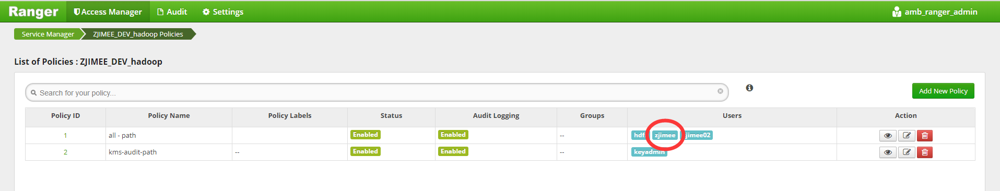

在Ranger中为独立用户配置访问权限
================================================================================
前一节，我们已经配置了独立用户`zjimee`，这里我们为`zjimee`用户在Ranger服务中配置访问并操作
HDFS的权限，同时为oozie用户配置操作Hive与HDFS的权限（oozie用户会作为被代理用户）。
```
目前现在做的项目只需要操作Hive，Sqoop，HDFS，所以只需要为oozie配置Hive与HDFS权限。
```

## 登录到Ranger
可以从Ambari的控制界面中找到入口，另外安装HDP时有配置Ranger的管理员帐号与密码，不要搞忘记了。

## 让zjimee用户操作Hive仓库的权限与hive用户一样
图1： 


图2：



