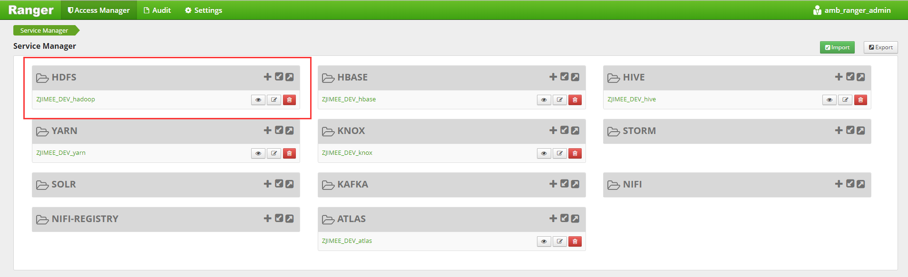

在Ranger中为独立用户配置访问权限
================================================================================
前一节，我们已经配置了独立用户`zjimee`，这里我们为`zjimee`用户在Ranger服务中配置访问并操作HDFS
的权限。

## 登录到Ranger
可以从Ambari的控制界面中找到入口，另外安装HDP时有配置Ranger的管理员帐号与密码，不要搞忘记了。

## 让zjimee用户操作HDFS与hdfs用户一样的权限
图1： 

