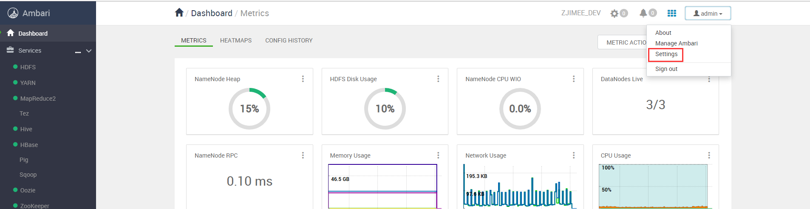
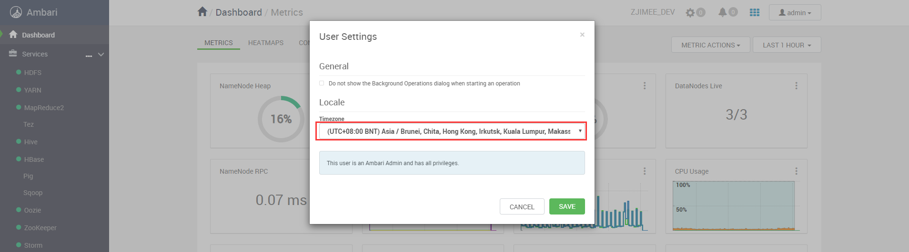
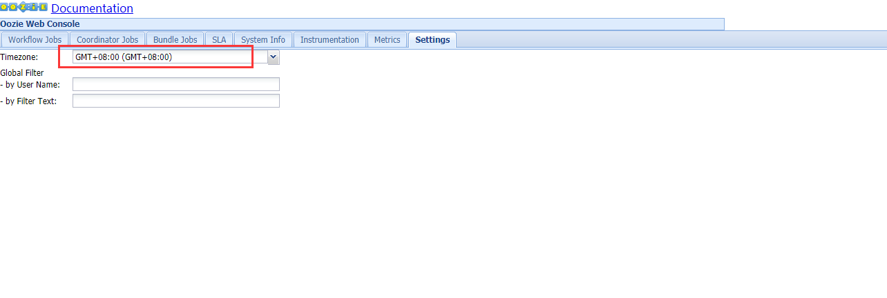

设置HDP的时区
================================================================================
## 1.设置Ambari使用的时区
设置时区只需要在Ambari中操作一下即可。





## 2.设置Oozie使用的时区

### 2.1.增加oozie-site.xml配置项
在`Oozie -> CONFIGS -> ADVANCED -> Custom oozie-site`增加如下配置：
```ini
oozie.processing.timezone = GMT+0800
```
**然后重启Oozie服务**。

### 2.2.设置Oozie web界面上显示用时区

 

### 2.3.时区的使用
在通过Oozie做coordinator job时，注意`job.properties`中时间的写法：
```ini
# 所有coordinator统一开始和结束的时间
start=2018-02-03T11:50+0800
end=2018-02-10T00:00+0800
```


