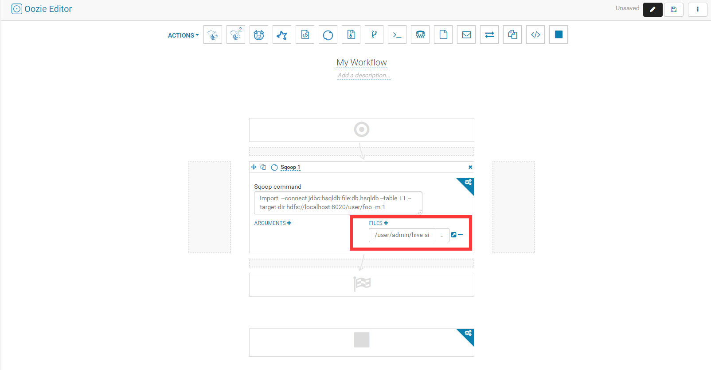

上传hive-site.xml文件到HDFS（Oozie中使用Sqoop1）
================================================================================
如果使用Oozie来调度Sqoop1来从MySQL导入数据表到Hive中（或者从Hive导出数据表到MySQL中），不调整
参数的情况下一般会失败。比如：
```shell
sqoop import --connect jdbc:mysql://172.16.41.251:3306/mytest --username myhive
    --password 123456 --table beian --hive-import --create-hive-table --hive-table
    mytest.ods_beian -m 1
```
一般来说，**数据从MySQL导入到HDFS会成功，HDFS到Hive会失败**！！！

## 原因
Oozie中没有关联Hive相关的配置，主要是：**hive.metastore.uris**。

## 解决方案
上传 **/etc/hive/conf.cloudera.hive/hive-site.xml** 到 **hdfs://user/admin** 下（
注：根据自己的实际安装地址，hive-site.xml的实际路径; 上传的hdfs路径也根据自己的意愿）。



如上图，在使用Oozie调度Sqoop1时，在红框中选择HDFS中的hive-site.xml文件，保存并运行即可！！
