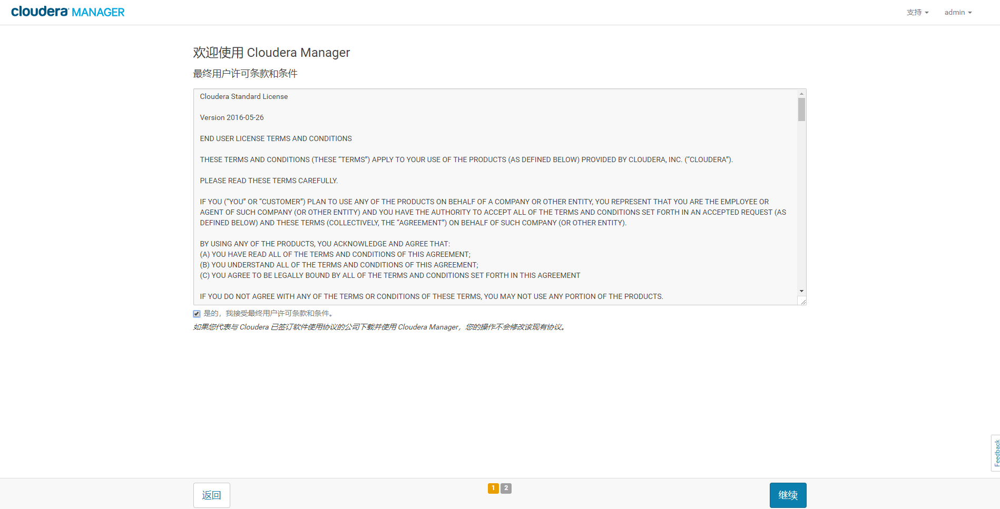
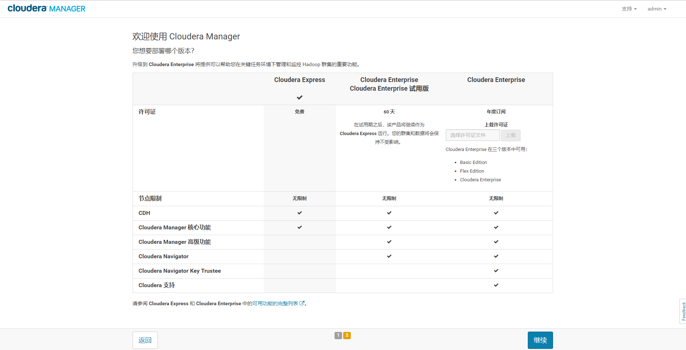
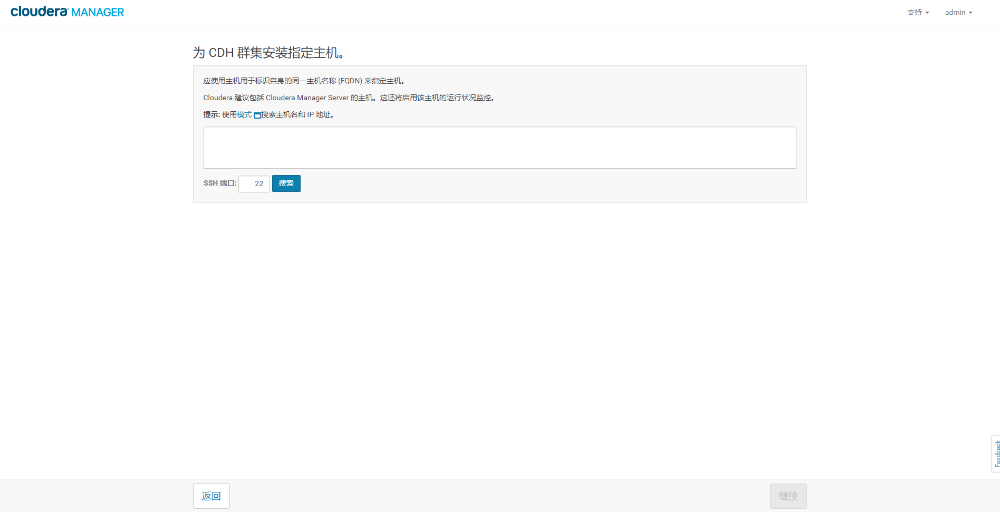
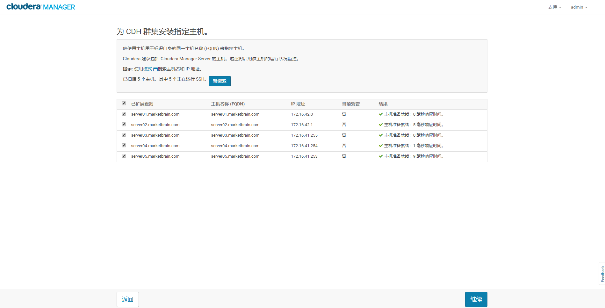
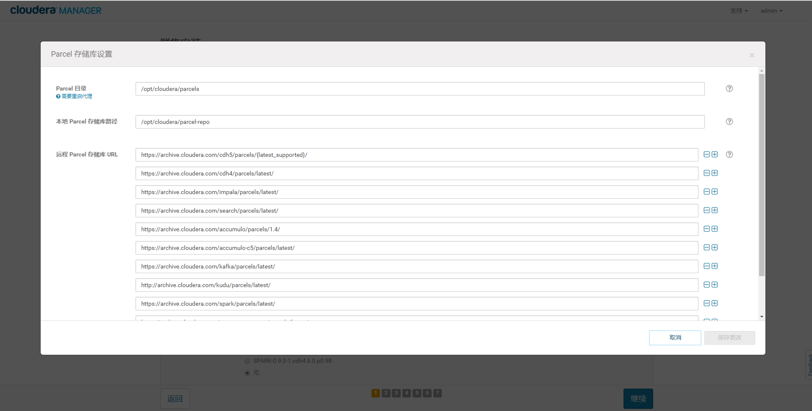
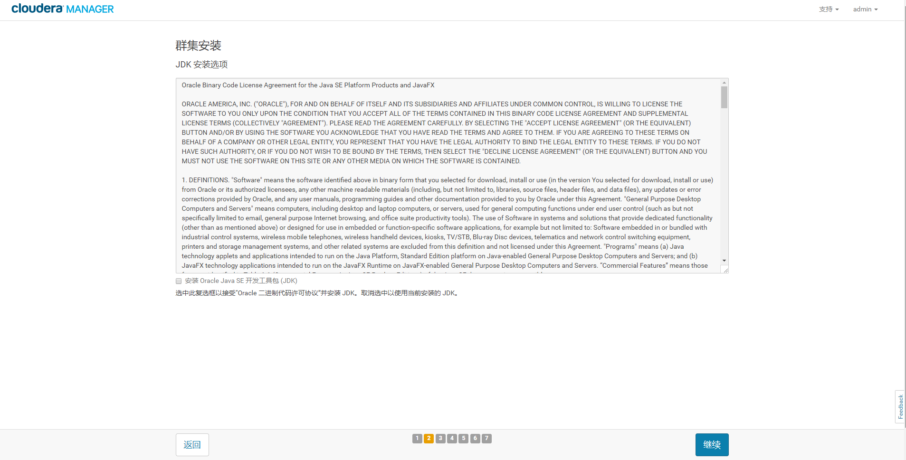

安装CDH和其他软件
================================================================================
## 1.启动Cloudera Manager Server
```shell
$ sudo systemctl start cloudera-scm-server
```
等待Cloudera Manager Server启动：
```shell
$ sudo tail -f /var/log/cloudera-scm-server/cloudera-scm-server.log
```
当您看到此日志条目时，Cloudera Manager管理控制台已准备就绪：
```
INFO WebServerImpl:com.cloudera.server.cmf.WebServerImpl: Started Jetty server.
INFO ScmActive-0:com.cloudera.server.cmf.components.ScmActive: ScmActive completed successfully.
```

## 2.登录Cloudera Manager管理控制台
在Web浏览器中，转到 **http//<server_host>7180**，其中`<server_host>`是运行Cloudera Manager
服务器的主机的 **FQDN** 或 **IP地址**。登录到Cloudera Manager管理控制台。默认凭证是：
username: **admin**，password: **admin**。

## 3.安装向导

### 3.1.用户许可条款
勾选 “**是的，我接受最终用户许可条款和条件**”。



### 3.2.选择版本
您想要部署哪个版本？选择：**Cloudera Express**。



### 3.3.感谢页面


### 3.4.为CDH群集安装指定主机





### 3.5.群集安装 - 选择存储库


点击”使用Parcel(建议)“旁边的 **更多选项** 按钮：



点击“远程Parcel存储库URL”旁边的 https://archive.cloudera.com/cdh5/parcels/{latest_supported}/
边上的“＋”按钮，打开一个新行，输入自己配置的内部Parcel存储库地址：
```shell
# 隐藏了IP地址
http://xx.xx.xx.xx/cloudera-parcels/cdh5/5.15.0/
```
点击确定，再点击继续。

### 3.6.JDK安装选项
注意：不要勾选“**安装 Oracle JavaSE开发工具包(JDK)**”，因为我们已经安装了Java。




eee
