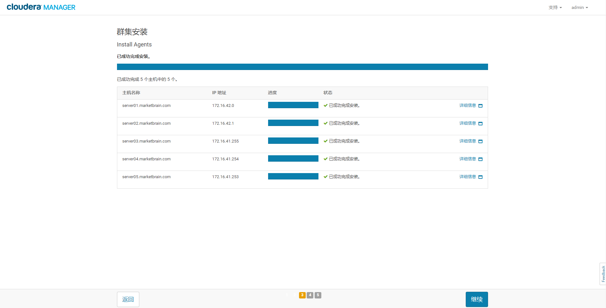
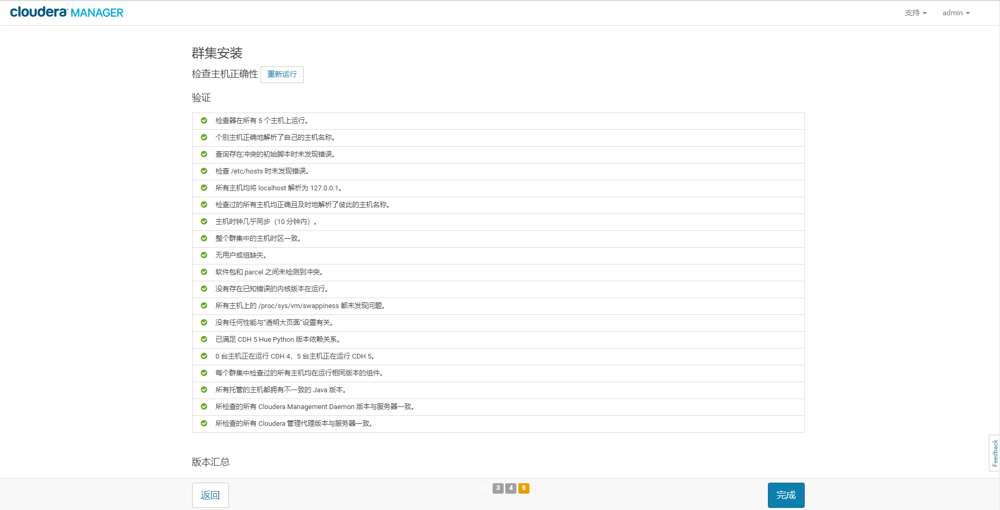
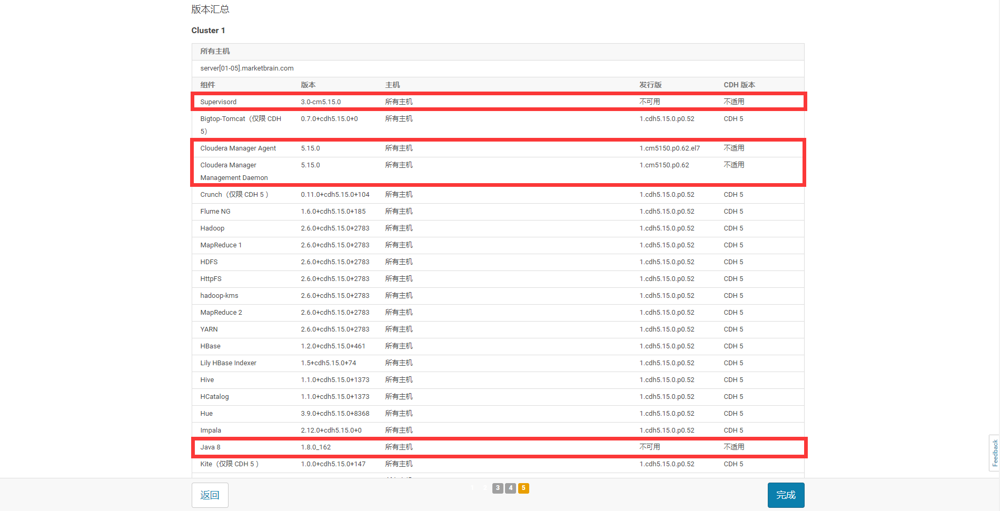
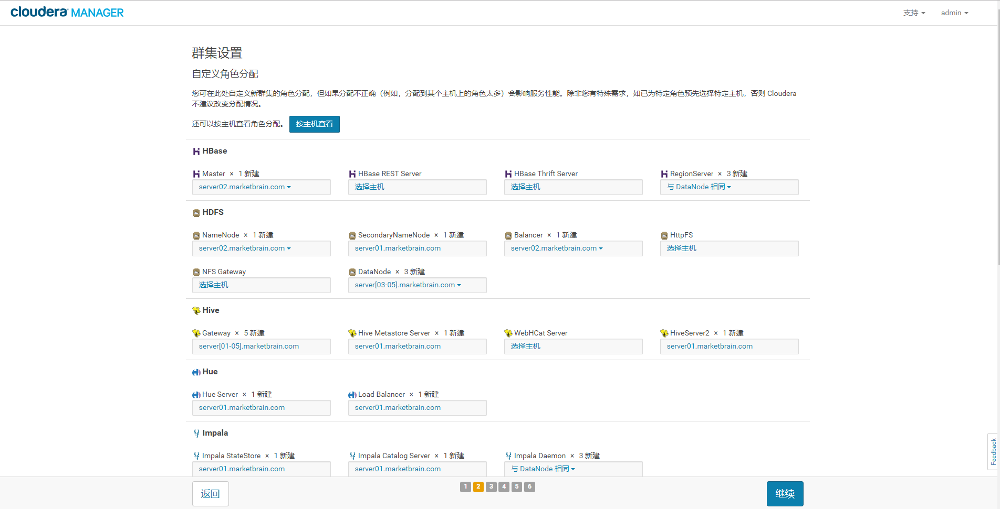
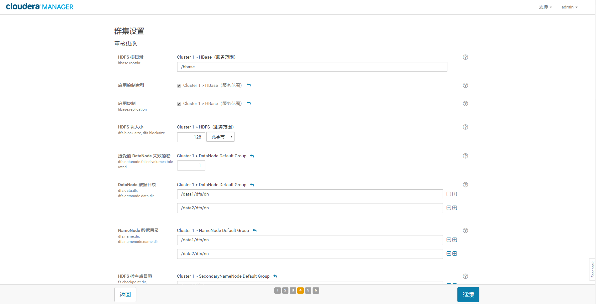
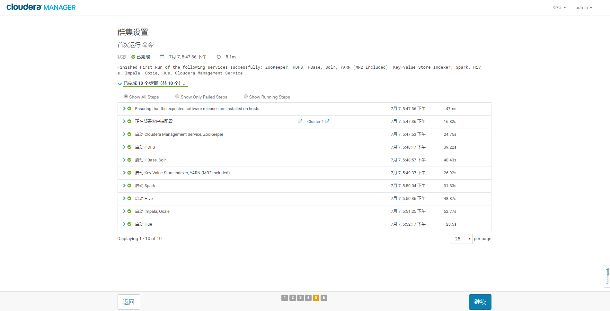
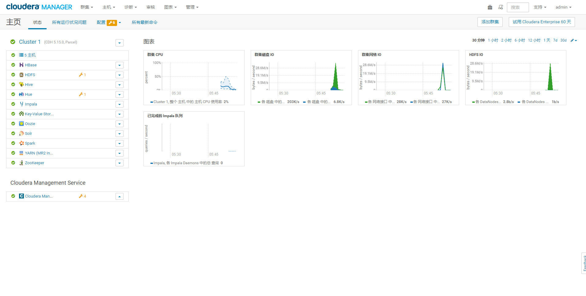

安装CDH
================================================================================
根据规划，我们应该在 **server01.marketbrain.com** 节点上操作，Cloudera Manager服务安装在这
个节点上。

## 1.启动Cloudera Manager Server
```shell
$ sudo systemctl start cloudera-scm-server
```
等待Cloudera Manager Server启动：
```shell
$ sudo tail -f /var/log/cloudera-scm-server/cloudera-scm-server.log
```
当您看到此日志条目时，Cloudera Manager管理控制台已准备就绪：
```
INFO WebServerImpl:com.cloudera.server.cmf.WebServerImpl: Started Jetty server.
INFO ScmActive-0:com.cloudera.server.cmf.components.ScmActive: ScmActive completed successfully.
```

## 2.登录Cloudera Manager管理控制台
在Web浏览器中，转到 **http//<server_host>7180**，其中`<server_host>`是运行Cloudera Manager
服务器的主机的 **FQDN** 或 **IP地址**。登录到Cloudera Manager管理控制台。默认凭证是：
username: **admin**，password: **admin**。

## 3.安装向导

### 3.1.用户许可条款
勾选 “**是的，我接受最终用户许可条款和条件**”。


### 3.2.选择版本
您想要部署哪个版本？选择：**Cloudera Express**。


### 3.3.感谢页面


### 3.4.为CDH群集安装指定主机


**注意：server06.marketbrain.com主机是我们的内部Parcel存储库，按照服务器规划与角色分配，我们在这里
不应该把它选择进来**。


### 3.5.选择存储库


点击”使用Parcel(建议)“旁边的 **更多选项** 按钮：


点击“远程Parcel存储库URL”旁边的 https://archive.cloudera.com/cdh5/parcels/{latest_supported}/
边上的“＋”按钮，打开一个新行，输入自己配置的内部Parcel存储库地址：
```shell
# 隐藏了IP地址
http://xx.xx.xx.xx/cloudera-parcels/cdh5/5.15.0/
```
点击确定，再点击继续。

### 3.6.JDK安装选项
注意：不要勾选“**安装 Oracle JavaSE开发工具包(JDK)**”，因为我们已经安装了Java。


### 3.7.启用单用户模式
注意：不要勾选“**单用户模式**”


### 3.8.提供SSH登录凭据


使用root用户，使用相同的密码。

### 3.9.Install Agents



### 3.10.正在安装选定 Parcel


### 3.11.检查主机正确性



**注：看来要禁止大页面压缩！！**



**注：为什么自己安装的Java8不能用？？还有两个组件不可用？？？**

### 3.12.Select Services
选择要安装的服务组合。这里我们选择 "**自定义服务**"：`HDFS`、`Hive`、`Hue`、`Impala`、`Oozie`、
`YARN (MR2 Included)`、`ZooKeeper`。**注意：`ZooKeeper`安装一定是选择奇数个节点进行安装**。


注：因为很多组件现在还用不上，所以没有选择"**所有服务**"。

### 3.13.自定义角色分配



**注：妈的！服务推荐的最佳选项是 Utility/Gateway 相关的角色都放到了 server06.marketbrain.com
这个节点上**。

### 3.14.数据库设置


### 3.15.审核更改



### 3.16."首次运行"命令



### 3.17.群集设置完成


登录到Cloudera Manager管理控制台：


