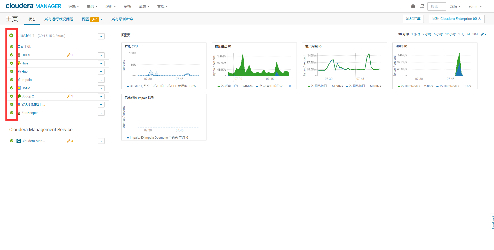
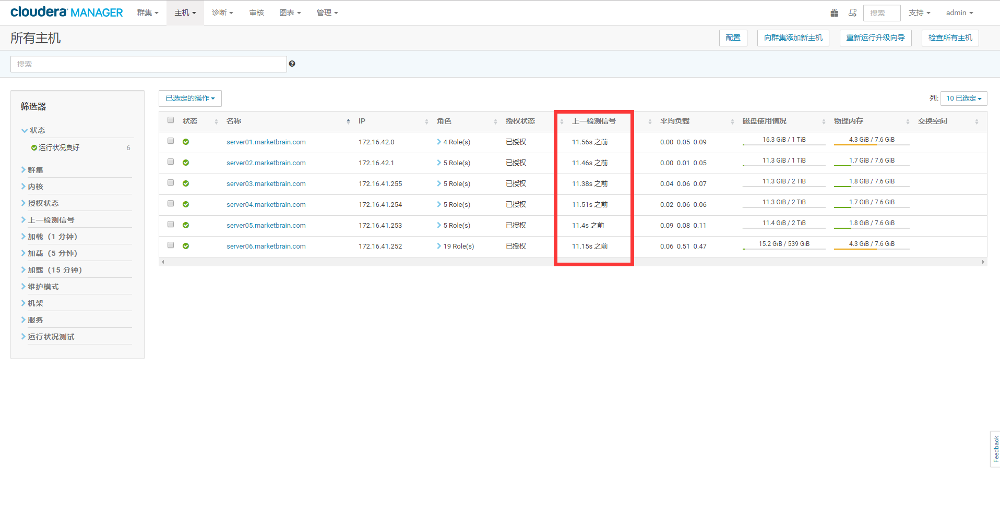

测试安装
================================================================================
## 1.检查Cloudera Manager管理控制台



屏幕左侧是当前运行的服务列表的状态信息。所有的服务应该运行健康良好 

## 2.检查主机心跳
查看自上次心跳以来的时间。您可以通过单击 **“主机”选项卡 -> "所有主机"** 执行此操作，您可以在其中
查看所有主机的列表以及其“最后心跳”的值。默认情况下，每个代理程序必须每15秒成功检测一次。



## 3.运行MapReduce作业
运行Hadoop PiEstimator示例：
```shell
sudo -u hdfs hadoop jar /opt/cloudera/parcels/CDH/lib/hadoop-mapreduce/hadoop-mapreduce-examples.jar pi 10 100
```
```
......
......
18/07/06 19:51:11 INFO mapreduce.Job: Counters: 50
        File System Counters
                FILE: Number of bytes read=94
                FILE: Number of bytes written=1648575
                FILE: Number of read operations=0
                FILE: Number of large read operations=0
                FILE: Number of write operations=0
                HDFS: Number of bytes read=2790
                HDFS: Number of bytes written=215
                HDFS: Number of read operations=43
                HDFS: Number of large read operations=0
                HDFS: Number of write operations=3
        Job Counters
                Launched map tasks=10
                Launched reduce tasks=1
                Data-local map tasks=8
                Rack-local map tasks=2
                Total time spent by all maps in occupied slots (ms)=21283
                Total time spent by all reduces in occupied slots (ms)=2133
                Total time spent by all map tasks (ms)=21283
                Total time spent by all reduce tasks (ms)=2133
                Total vcore-milliseconds taken by all map tasks=21283
                Total vcore-milliseconds taken by all reduce tasks=2133
                Total megabyte-milliseconds taken by all map tasks=21793792
                Total megabyte-milliseconds taken by all reduce tasks=2184192
        Map-Reduce Framework
                Map input records=10
                Map output records=20
                Map output bytes=180
                Map output materialized bytes=340
                Input split bytes=1610
                Combine input records=0
                Combine output records=0
                Reduce input groups=2
                Reduce shuffle bytes=340
                Reduce input records=20
                Reduce output records=0
                Spilled Records=40
                Shuffled Maps =10
                Failed Shuffles=0
                Merged Map outputs=10
                GC time elapsed (ms)=499
                CPU time spent (ms)=5690
                Physical memory (bytes) snapshot=4800626688
                Virtual memory (bytes) snapshot=30738710528
                Total committed heap usage (bytes)=4715970560
        Shuffle Errors
                BAD_ID=0
                CONNECTION=0
                IO_ERROR=0
                WRONG_LENGTH=0
                WRONG_MAP=0
                WRONG_REDUCE=0
        File Input Format Counters
                Bytes Read=1180
        File Output Format Counters
                Bytes Written=97
Job Finished in 19.193 seconds
Estimated value of Pi is 3.14800000000000000000
```
