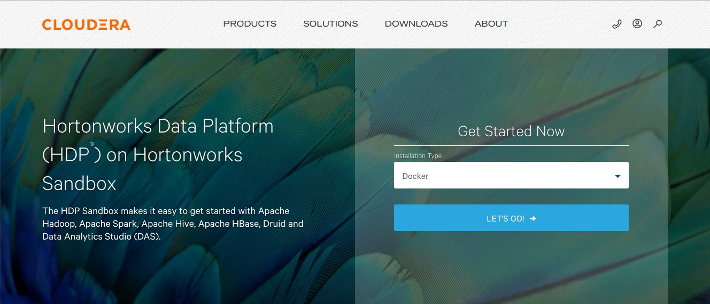
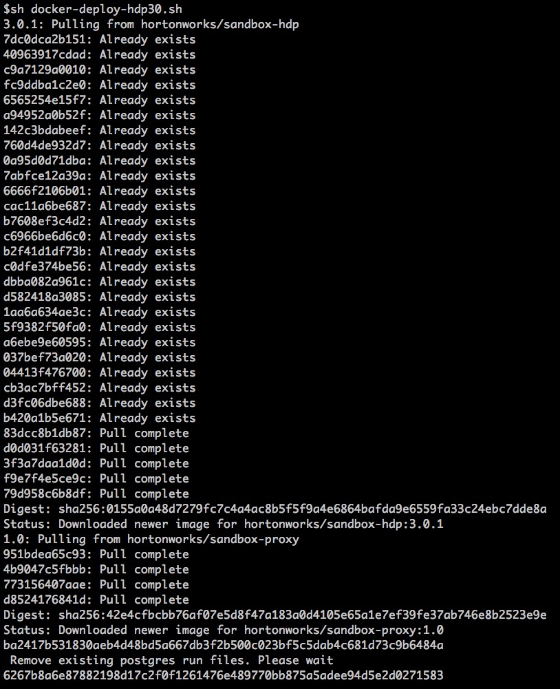
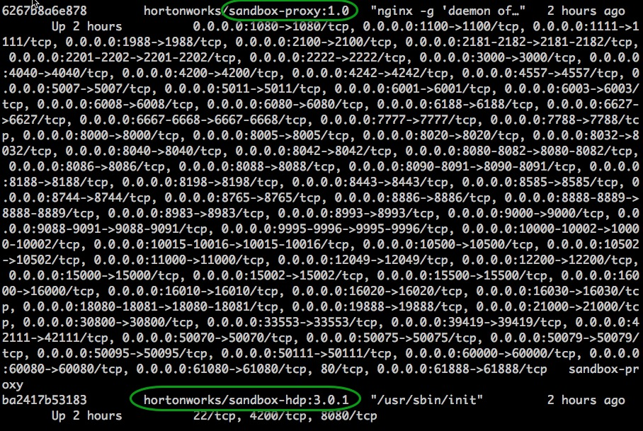

在Docker上部署Hortonworks Sandbox
===================================================================================
## 1. 介绍
本教程介绍了将Hortonworks Sandbox（**HDP** 或 **HDF**）通过Docker安装的常规方法。

## 2. 先决条件
+ 已安装 **Docker 17.09版或更高版本**。
+ 至少有 **10 GB RAM** 专用于虚拟机的计算机。

## 3. 概述

### 3.1. 内存配置
Linux不需要特殊的配置。

### 3.2. HDP部署

#### 3.2.1. 部署HDP Sandbox
下载适用于Docker的最新脚本 [Hortonworks Data Platform（HDP）](https://www.cloudera.com/downloads/hortonworks-sandbox/hdp.html?utm_source=mktg-tutorial) 并解压缩zip文件。



在解压缩的文件夹中，您会找到shell脚本`docker-deploy-xxx.sh`（如：**docker-deploy-hdp30.sh**）。从
Linux命令行运行脚本：
```shell
$ cd /home/fuhd/work/HDP_3.0.1_docker-deploy-scripts_18120587fc7fb
$ sh docker-deploy-hdp30.sh
```
```
注意：您只需要运行一次脚本。它将为您设置并启动Sandbox。在此过程中，并在必要时创建Sandbox docker容器。
```
脚本输出将类似于：



#### 3.2.2. 验证HDP Sandbox
通过发出以下命令来验证HDP Sandbox是否已成功部署：
```shell
docker ps
```
您应该看到类似以下内容：



#### 3.2.3. 停止HDP Sandbox
当您想要停止/关闭HDP Sandbox时，请运行以下命令：
```shell
docker stop sandbox-hdp
docker stop sandbox-proxy
```

#### 3.2.4. 重新启动HDP Sandbox
当您想重新启动Sandbox时，请运行以下命令：
```shell
docker start sandbox-hdp
docker start sandbox-proxy
```

#### 3.2.5. 删除HDP Sandbox
容器是Sandbox image的实例。您必须先停止容器，然后再删除它。发出以下命令：
```shell
docker stop sandbox-hdp
docker stop sandbox-proxy
docker rm sandbox-hdp
docker rm sandbox-proxy
```
如果要删除HDP Sandbox镜像，请在停止和删除容器之后发出以下命令：
```shell
docker rmi hortonworks/sandbox-hdp:3.0.1
```

### 3.3. HDF部署
