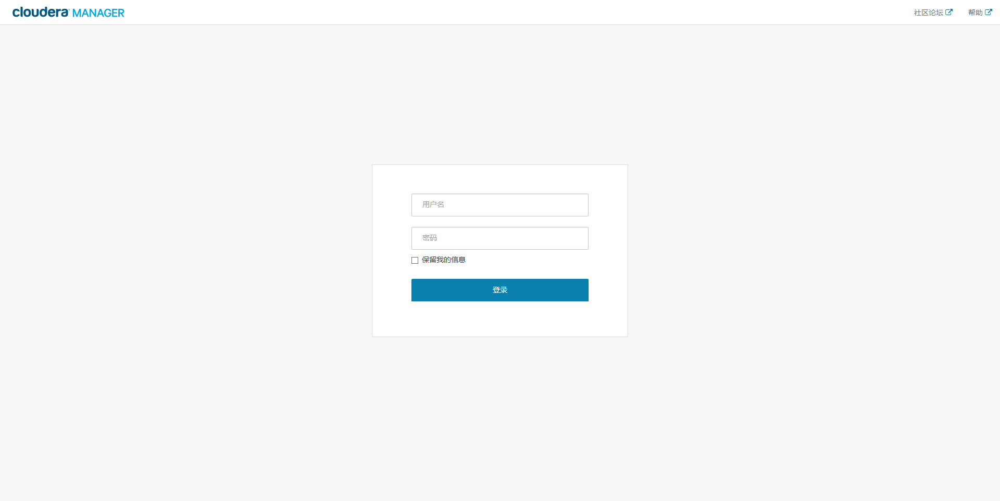

Cloudera Manager安装
=================================================================================
### 1.server01主机安装
进入到上传的安装文件所在的目录：
```shell
#/root/soft，我是存在这里的
cd ~/soft/
```
修改仓库文件 **cloudera-manager.repo**，把版本号加上：
```ini
[cloudera-manager]
name = Cloudera Manager
baseurl = https://archive.cloudera.com/cm5/redhat/7/x86_64/cm/5.14.1/  #主要改这里的版本号
gpgkey = https://archive.cloudera.com/redhat/cdh/RPM-GPG-KEY-cloudera
gpgcheck = 1
```
开始 **server01** 的安装：
```shell
yum localinstall --nogpgcheck *.rpm
```

### 2.server02~06从机安装
**同server01主机一样，修改cloudera-manager.repo**：
```ini
[cloudera-manager]
name = Cloudera Manager
baseurl = https://archive.cloudera.com/cm5/redhat/7/x86_64/cm/5.14.1/  #主要改这里的版本号
gpgkey = https://archive.cloudera.com/redhat/cdh/RPM-GPG-KEY-cloudera
gpgcheck = 1
```
开始 **server02~06** 的安装：
```shell
yum localinstall --nogpgcheck *.rpm
```

### 3.在server01~06节点检查我们的安装
```shell
yum list | grep cloudera
```

### 4.安装cloduera manager二进制安装包
进入 **server01** 的 **cloudera-manager-installer.bin** 所在目录，**设置安装权限**：
```shell
chmod u+x cloudera-manager-installer.bin
```
执行安装命令：
```shell
# 因为是本地yum库安装，所以加上 --skip_repo_package=1
./cloudera-manager-installer.bin --skip_repo_package=1
```
如果提示需要删除配置文件，则 **删除该文件**：
```shell
rm -rf /etc/cloudera-scm-server/db.properties
```
**重新执行安装命令**，根据安装向导一路next。注意，如果之前master上没有手动安装rpm包此时就会联网下载，
下载速度一般都较慢，太费时间，相同配置下顺利安装时间在1分钟内即可完成。

然后我们在 **web浏览器** 访问 http://xxx.xxx.xxx.xxx:7180/  ，看是否能打开页面即可，**先不要进行登录操作**。

**注意：chd server服务器启动需要一些时间，等1分钟左右**。

如果能访问，那证明 cloudera manager安装正常。

### 5.CDH服务安装

#### 5.1.制作本地parcel
前面完成cloudera manager安装之后 **server01** 会在 **/opt** 目录下生成 **cloudera** 文件夹，
将之前下载好的 **CDH-* 文件** 移动到 **parcel-repo** 文件夹中：
```shell
cp CDH-5.14.0-1.cdh5.14.0.p0.24-el7.parcel /opt/cloudera/parcel-repo/
#注意这里有重命名
cp CDH-5.14.0-1.cdh5.14.0.p0.24-el7.parcel.sha1 /opt/cloudera/parcel-repo/CDH-5.14.0-1.cdh5.14.0.p0.24-el7.parcel.sha  
```
将 **cloudera manager的用户授权给/opt和日志目录**：
```shell
chown cloudera-scm.cloudera-scm  /opt  -R
chown cloudera-scm.cloudera-scm  /var/log/cloudera-scm-agent -R
```

#### 5.2.重启cloudera-scm-server
```shell
/etc/init.d/cloudera-scm-server restart
```
重启速度较慢，约1分钟后访问 http://xxx.xxx.xxx.xxx:7180/  登陆，账号/密码: admin/admin。

#### 5.3.通过cloudera manager控制台安装CDH




ddd
