Cloudera Manager安装
=================================================================================
### 1.server01主机安装
进入到上传的安装文件所在的目录：
```shell
#/root/soft，我是存在这里的
cd ~/soft/
```
修改仓库文件 **cloudera-manager.repo**，把版本号加上：
```ini
[cloudera-manager]
name = Cloudera Manager
baseurl = https://archive.cloudera.com/cm5/redhat/7/x86_64/cm/5.14.1/  #主要改这里的版本号
gpgkey = https://archive.cloudera.com/redhat/cdh/RPM-GPG-KEY-cloudera
gpgcheck = 1
```
开始 **server01** 的安装：
```shell
yum localinstall --nogpgcheck *.rpm
```

### 2.server02~06从机安装
**同server01主机一样，修改cloudera-manager.repo**：
```ini
[cloudera-manager]
name = Cloudera Manager
baseurl = https://archive.cloudera.com/cm5/redhat/7/x86_64/cm/5.14.1/  #主要改这里的版本号
gpgkey = https://archive.cloudera.com/redhat/cdh/RPM-GPG-KEY-cloudera
gpgcheck = 1
```
开始 **server02~06** 的安装：
```shell
yum localinstall --nogpgcheck *.rpm
```

### 3.在server01~06节点检查我们的安装
```shell
yum list | grep cloudera
```

### 4.安装cloduera manager二进制安装包
进入 **server01** 的 **cloudera-manager-installer.bin** 所在目录，**设置安装权限**：
```shell
chmod u+x cloudera-manager-installer.bin
```
执行安装命令：
```shell
# 因为是本地yum库安装，所以加上 --skip_repo_package=1
./cloudera-manager-installer.bin --skip_repo_package=1
```
如果提示需要删除配置文件，则 **删除该文件**：
```shell
rm -rf /etc/cloudera-scm-server/db.properties
```
**重新执行安装命令**，根据安装向导一路next。注意，如果之前master上没有手动安装rpm包此时就会联网下载，
下载速度一般都较慢，太费时间，相同配置下顺利安装时间在1分钟内即可完成。

然后我们在 **web浏览器** 访问 http://xxx.xxx.xxx.xxx:7180/  ，看是否能打开页面即可，**先不要进行登录操作**。

**注意：chd server服务器启动需要一些时间，等1分钟左右**。

如果能访问，那证明 cloudera manager安装正常。

### 5.CDH服务安装

#### 5.1.制作本地parcel
前面完成cloudera manager安装之后 **server01** 会在 **/opt** 目录下生成 **cloudera** 文件夹，
将之前下载好的 **CDH-* 文件** 移动到 **parcel-repo** 文件夹中：
```shell
cp CDH-5.14.0-1.cdh5.14.0.p0.24-el7.parcel /opt/cloudera/parcel-repo/
#注意这里有重命名
cp CDH-5.14.0-1.cdh5.14.0.p0.24-el7.parcel.sha1 /opt/cloudera/parcel-repo/CDH-5.14.0-1.cdh5.14.0.p0.24-el7.parcel.sha  
```
将 **cloudera manager的用户授权给/opt和日志目录**：
```shell
chown cloudera-scm.cloudera-scm  /opt  -R
chown cloudera-scm.cloudera-scm  /var/log/cloudera-scm-agent -R
```

#### 5.2.重启cloudera-scm-server
```shell
/etc/init.d/cloudera-scm-server restart
```
重启速度较慢，约1分钟后访问 http://xxx.xxx.xxx.xxx:7180/  登陆，账号/密码: admin/admin。

#### 5.3.通过cloudera manager控制台安装CDH


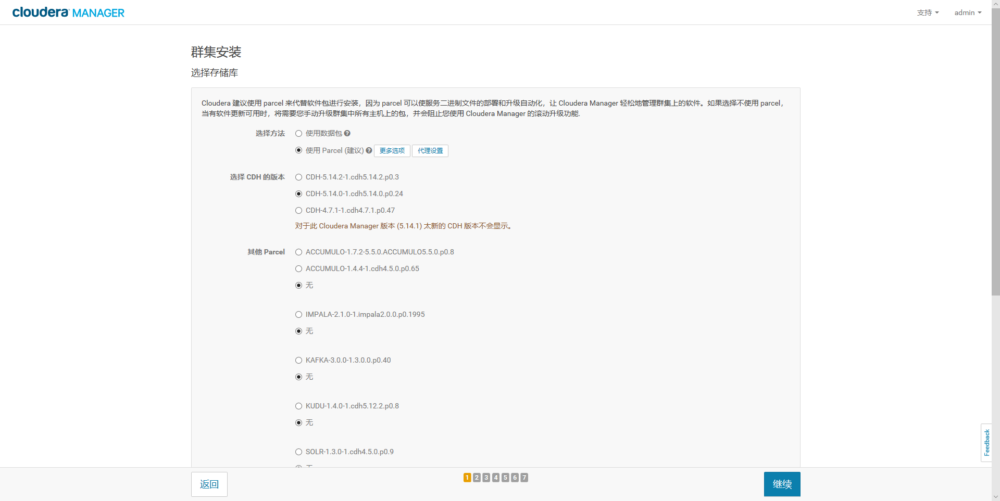
**注：CDH版本一定要选择与自己下载的版本一致** ！


**注：勾选Oracle JDK开发工具包** !

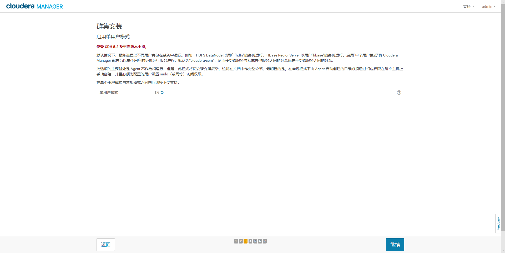
**注：勾选单用户模式** ！

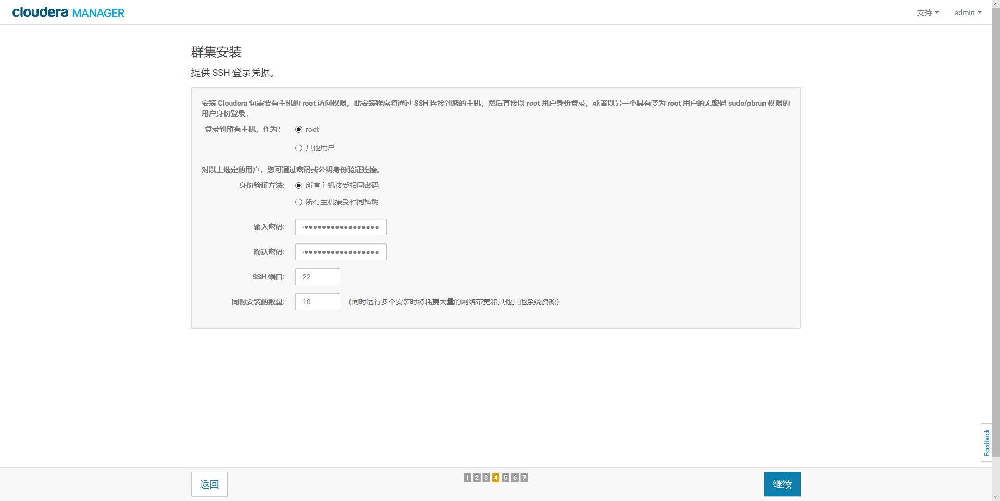

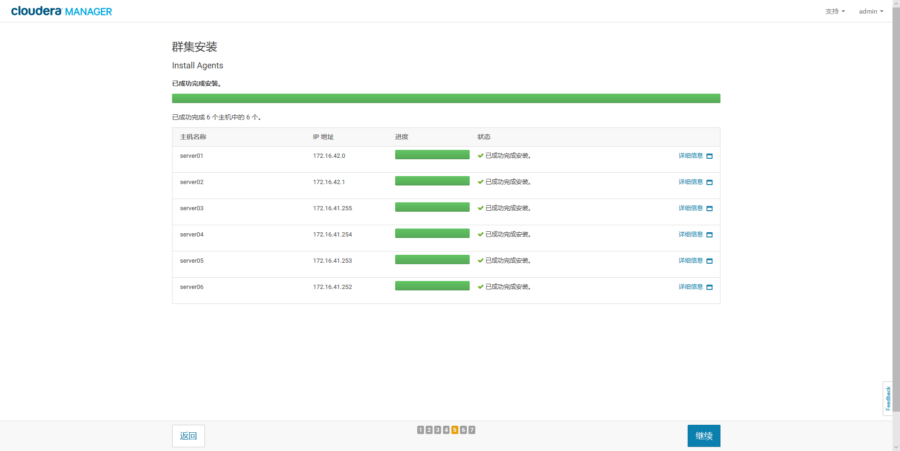

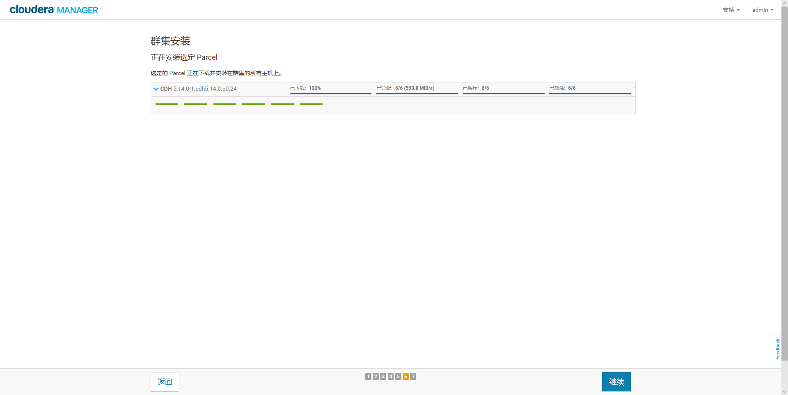

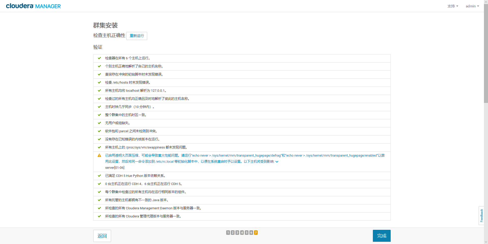

--------------------------------------------------------------------------------
注意：发现一个警告，与它们相关：
```shell
echo never > /sys/kernel/mm/transparent_hugepage/defrag  
echo never > /sys/kernel/mm/transparent_hugepage/enabled
```
解决办法:在 **server01~06** 主机上编辑：
```shell
vim /etc/rc.d/rc.local
```
添加：
```
if test -f /sys/kernel/mm/transparent_hugepage/enabled; then
 echo never > /sys/kernel/mm/transparent_hugepage/enabled
fi
if test -f /sys/kernel/mm/transparent_hugepage/defrag; then
 echo never > /sys/kernel/mm/transparent_hugepage/defrag
fi
```
保存退出，然后赋予rc.local文件执行权限：
```shell
chmod +x /etc/rc.d/rc.local
```
最后重启系统即可生效！！我们也可以手动执行：
```shell
echo never > /sys/kernel/mm/transparent_hugepage/defrag  
echo never > /sys/kernel/mm/transparent_hugepage/enabled
```
--------------------------------------------------------------------------------

使机器即刻生效！！再次检测：

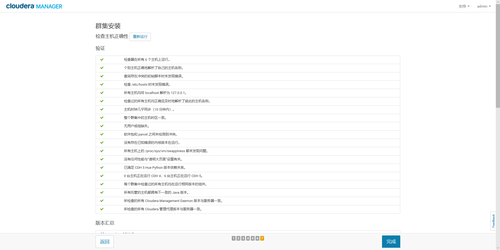

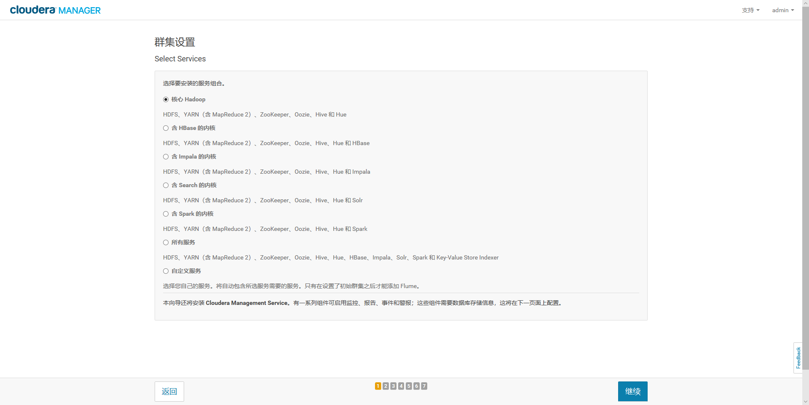

**注：这里我们选择的是核心Hadoop，后续需要Spark的支持，再下载Spark的进行配置安装！！**。


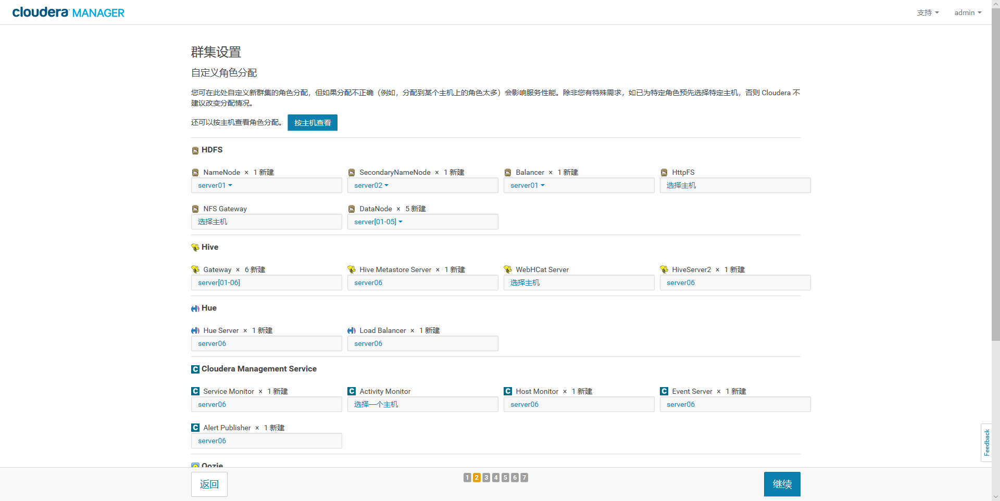

**注：这里我是按照默认配置**！

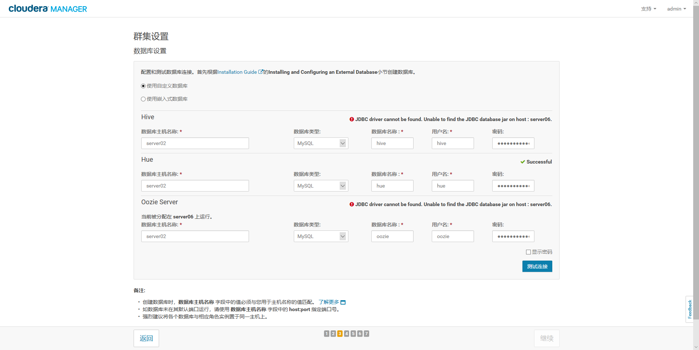
--------------------------------------------------------------------------------
注：这里我们使用MySQL作为外部数据库，测试发现两个库不通。**发现是没有MySQL驱动在server06中**。
这里只需要把MySQL驱动（比如：**mysql-connector-java-5.1.38.jar**）放到 **/usr/share/cmf/lib**
这个目录下即可。再测试：

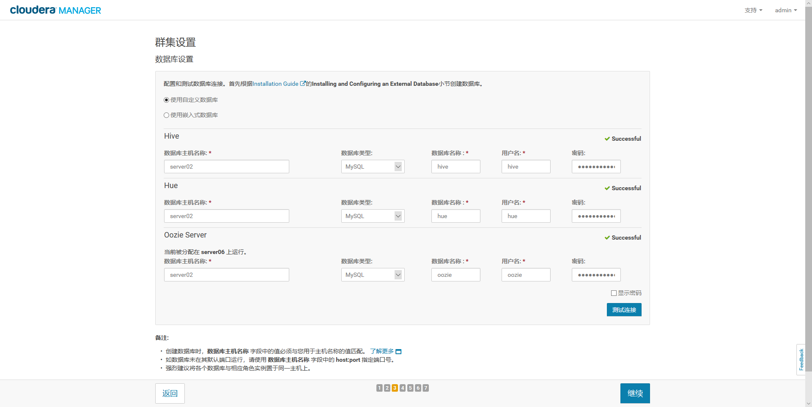

--------------------------------------------------------------------------------

**几个重要的配置项**：
+ **zookeeper相关的目录配置**
  + dataDir目录，保证属于cloudera-scm:cloudera-scm（用户与用户组）
  + datalogDir目录，保证属于cloudera-scm:cloudera-scm（用户与用户组）
  + ZooKeeper日志目录，保证属于cloudera-scm:cloudera-scm（用户与用户组）
  + 在web管理页面的zookeeper配置页面上 勾选 [启用数据目录的自动创建]
+ **/var/log/cloudera-scm-firehose目录**
  + 新增/var/log/cloudera-scm-firehose目录，保证属于cloudera-scm:cloudera-scm（用户与用户组）
+ **/var/lib/cloudera-service-monitor目录**
  + 新增/var/lib/cloudera-service-monitor目录，保证属于cloudera-scm:cloudera-scm（用户与用户组）
+ **/var/log/cloudera-scm-eventserver目录**
  + 新增/var/log/cloudera-scm-eventserver目录，保证属于cloudera-scm:cloudera-scm（用户与用户组）
+ **/var/lib/cloudera-scm-eventserver目录**
  + 新增/var/lib/cloudera-scm-eventserver目录，保证属于cloudera-scm:cloudera-scm（用户与用户组）
+ **/var/lib/cloudera-host-monitor目录**
  + 新增/var/lib/cloudera-host-monitor目录，保证属于cloudera-scm:cloudera-scm（用户与用户组）
+ **/var/log/zookeeper目录（默认的，我这里是server06）**
  + 新增/var/log/zookeeper目录，保证属于cloudera-scm:cloudera-scm（用户与用户组）
+ **在zookeeper部署机器上，新增/var/lib/zookeeper/version-2目录（默认的，我这里是server06）**
  + 新增/var/lib/zookeeper/version-2目录，保证属于cloudera-scm:cloudera-scm（用户与用户组）
+ **在namenode部署机器上，新增/data1/dfs/nn目录（默认的，我这里是server06）**
  + 新增/data1/dfs/nn目录，保证dfs以及子目录都是属于cloudera-scm:cloudera-scm（用户与用户组）
+ **/var/run/hdfs-sockets目录**
  + 新增/var/run/hdfs-sockets目录，保证属于cloudera-scm:cloudera-scm（用户与用户组）
+ **/var/lib/hadoop-yarn/yarn-nm-recovery/yarn-nm-state**
  + 新增/var/lib/hadoop-yarn/yarn-nm-recovery/yarn-nm-state目录，保证属于cloudera-scm:cloudera-scm（用户与用户组）
+ **把mysql驱动copy到/usr/share/java并重命令为：mysql-connector-java.jar**
+ **/var/lib/oozie**
  + 创建/var/lib/oozie目录，保证属于cloudera-scm:cloudera-scm（用户与用户组）。并复制/usr/share/java/mysql-connector-java.jar到该目录。
+ **/var/log/hue**
  + 把/var/log/hue目录的所有权给cloudera-scm:cloudera-scm（用户与用户组）

--------------------------------------------------------------------------------


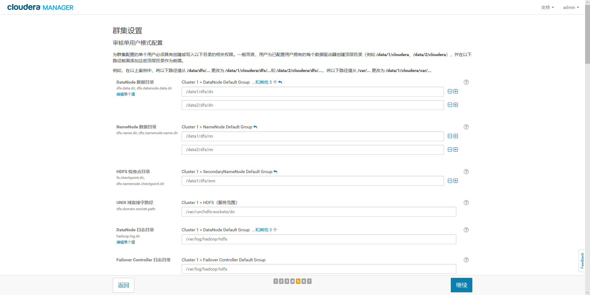

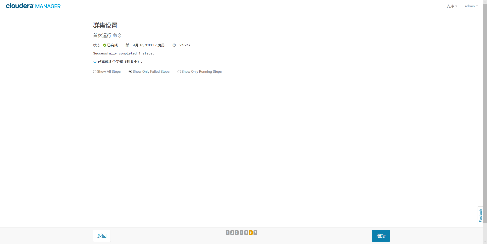

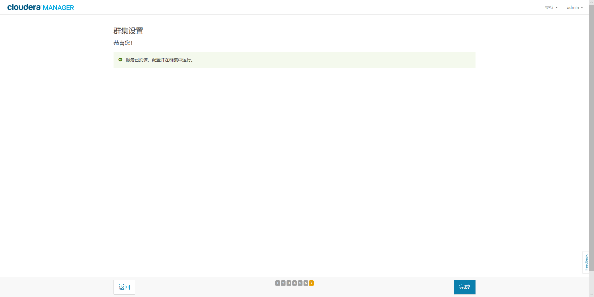
