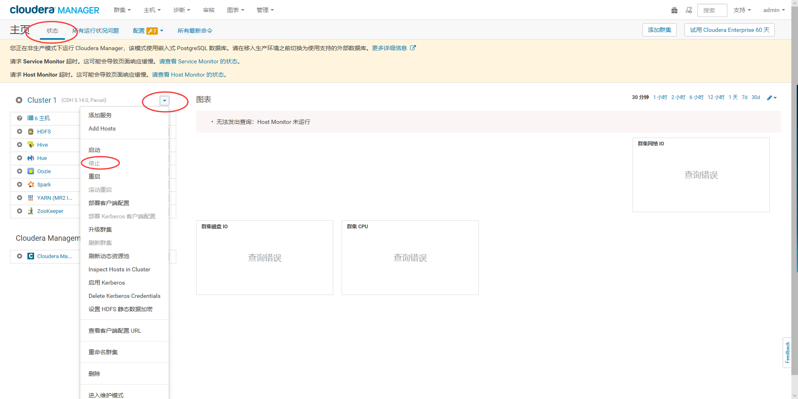
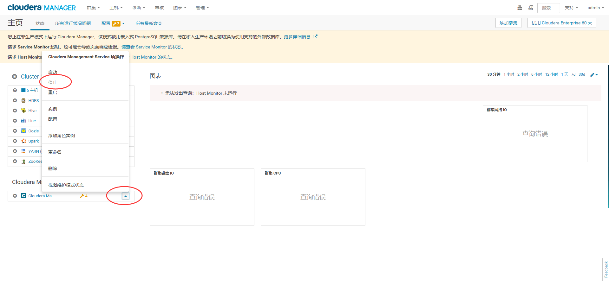

CDH5.x完全卸载指南
================================================================================
### 1.备份用户数据
建议在卸载CDH前，先备份或转移集群上的用户数据。以下路径是默认安装配置下的用户数据所在目录：
```shell
/var/lib/flume-ng
/var/lib/hadoop*
/var/lib/hue  
/var/lib/navigator
/var/lib/oozie
/var/lib/solr
/var/lib/sqoop*  
/var/lib/zookeeper

# 请修改 data_drive_path 为自己机器上的路径
data_drive_path/dfs
data_drive_path/mapred
data_drive_path/yarn
```

### 2.停止所有服务
1. **打开Cloudera Manager控制台**
2. **关闭集群**：点击 **Home > Status**，找到其中的集群名称右边的 **倒三角**，点击后在弹出的下拉菜单中
点击 **Stop**，之后静待所有服务都停止完成。（如果有多个集群，每个集群依次操作）操作如下图：

  

3. **关闭Cloudera Management Service**：
点击 **Home > Status**，找到 **Cloudera Management Service**，并找到其下的 **CM** 服务名称
**右边的倒三角**，在弹出的下拉菜单中点击 **Stop**，之后静待服务停止完成。操作如下图：

  

### 3.关闭并移除Parcels
假如是通过 **parcels方式** 来安装的，请按照以下方式操作。

#### 3.1.卸载cloudera manager
```shell
# 在server01(主节点)运行该命令
/usr/share/cmf/uninstall-cloudera-manager.sh
```

#### 3.2.卸载Cloudera Manager Agent与Managed Software
1. **停止Cloudera Manager Agent**
```shell
service cloudera-scm-agent next_stop_hard
service cloudera-scm-agent stop
```
2. 卸载软件
```shell
yum remove 'cloudera-manager-*'
```


ddd
