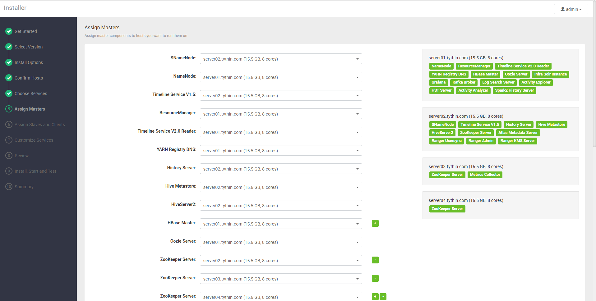

安装、配置和部署集群
================================================================================
## 1.启动Ambari服务器
在Ambari Server（`10.10.26.31`）主机上运行以下命令：
```shell
ambari-server start
```

## 2.登录Apache Ambari
地址：http://10.10.26.31:8080 

账号/密码：admin/admin

## 3.启动Ambari群集安装向导
1. 在Ambari Welcome页面中，选择Launch Install Wizard。

    

2. 命名的集群

    

3. 选择版本

    

    

    注意：要勾选

4. 安装选项

    

    **注意：这里的私钥文件要从Ambari server主机上复制到自己当前的工作机器上**。

5. 确认主机

    

6. 选择服务

    

    

    当前选择了如下服务：
    + HDFS
    + YARN+MR2
    + Tez
    + Hive
    + HBase
    + Sqoop
    + Oozie
    + Zookeeper
    + Infra Solr
    + Ambari Metrics
    + Atlas
    + Kafka
    + Log Search
    + Ranger
    + Ranger KMS
    + Spark2

7. 分配Masters

    

    

    

    


    


