安装、配置和部署集群
================================================================================
## 1.启动Ambari服务器
在Ambari Server（`10.10.26.31`）主机上运行以下命令：
```shell
ambari-server start
```

## 2.登录Apache Ambari
地址：http://10.10.26.31:8080 

账号/密码：admin/admin

## 3.启动Ambari群集安装向导
1. **在Ambari Welcome页面中，选择Launch Install Wizard**

    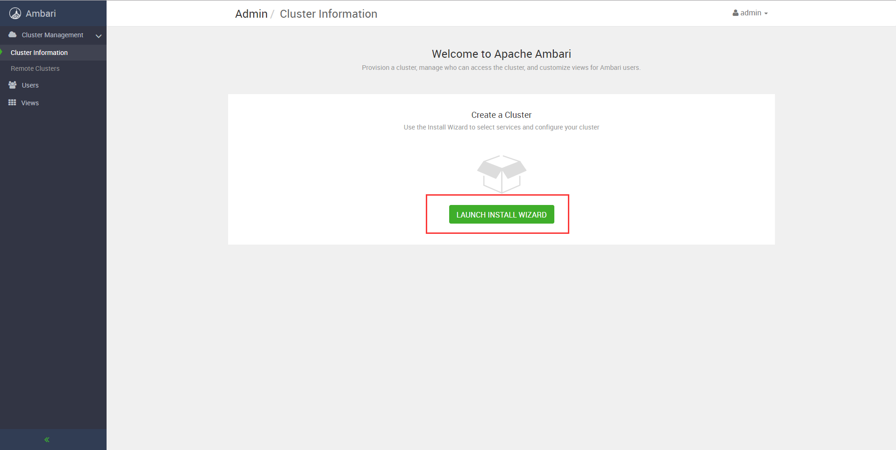

2. **命名的集群**

    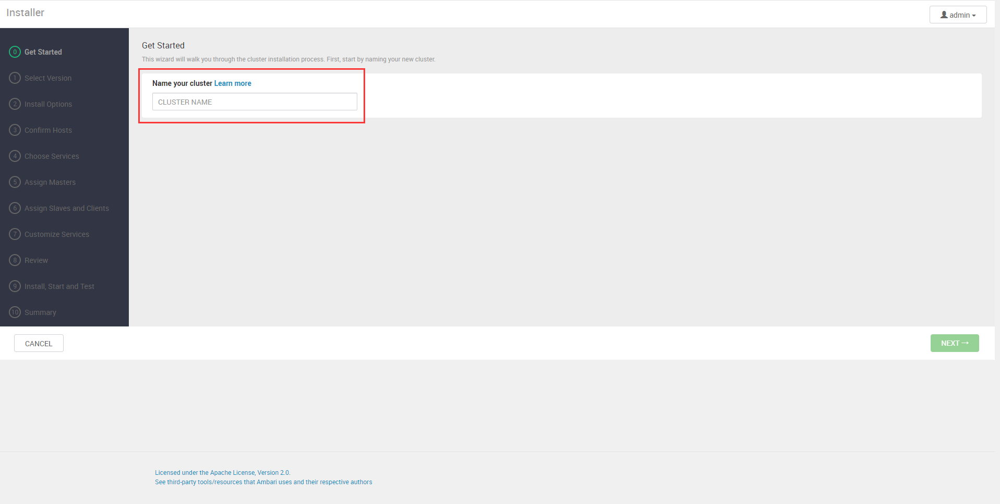

3. **选择版本**

    

    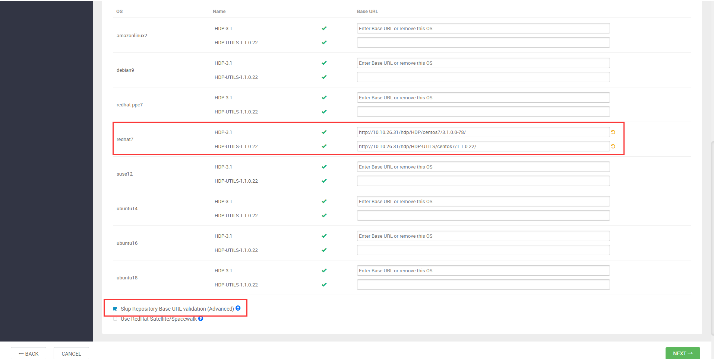

    注意：要勾选

4. **安装选项**

    

    **注意：这里的私钥文件要从Ambari server主机上复制到自己当前的工作机器上**。

5. **确认主机**

    

6. **选择服务**

    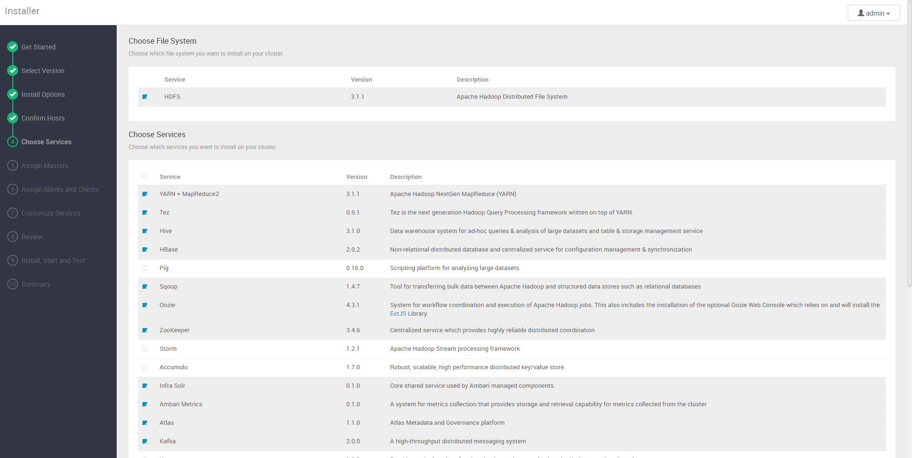

    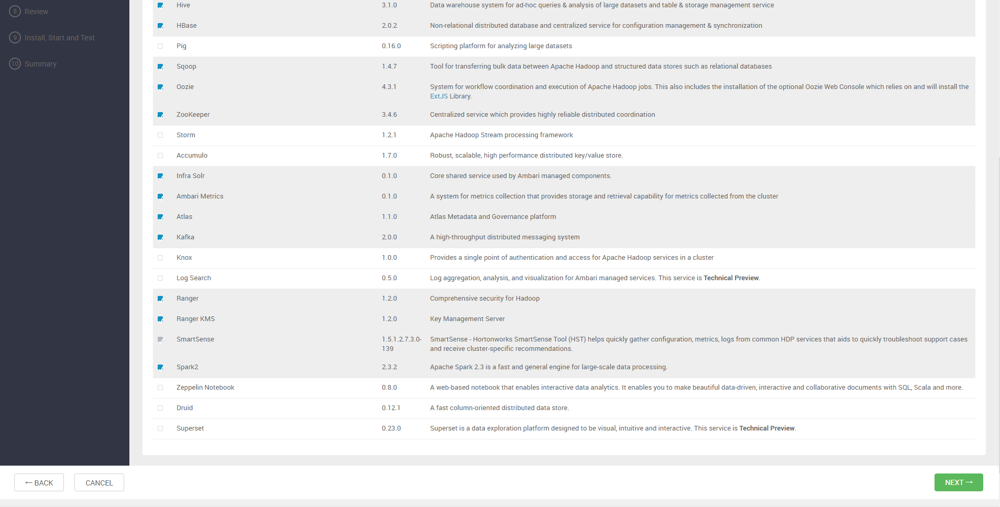

7. **分配Masters**

    

    

8. **分配Slaves和客户端**

    

9. **自定义服务**

    + **密码**
        
        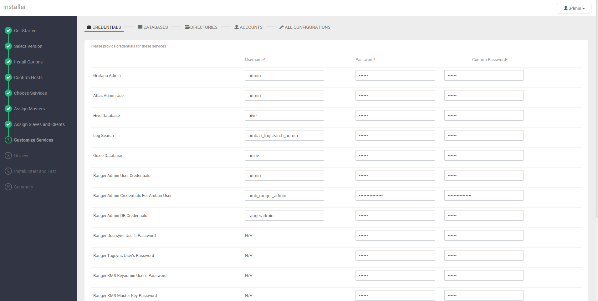

        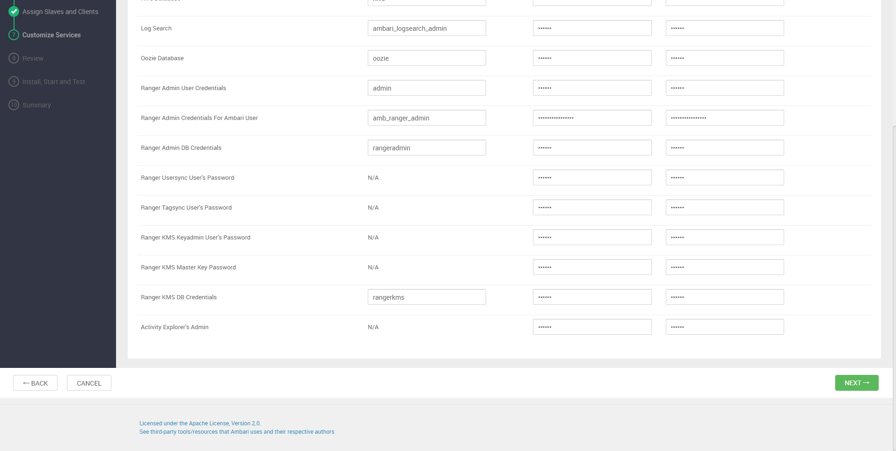

        **这里都统一设置成MyPass009@，必须字母加数字超过8个字符**

    + **数据库**

        **HIVE**：
        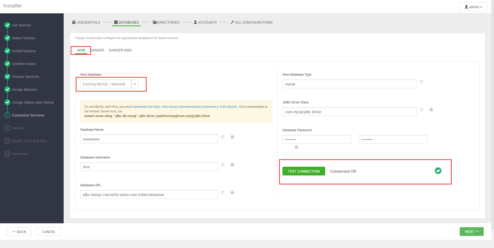

        **这里使用已有的MySQL数据库，相关帐号与库已创建好了！特别注意：连接到MySQL的URL一定要是非常完整的！！**

        **RANGER**：
        

        

        **这里使用已有的MySQL数据库，相关帐号与库实时创建**

        **RANGER KMS**：
        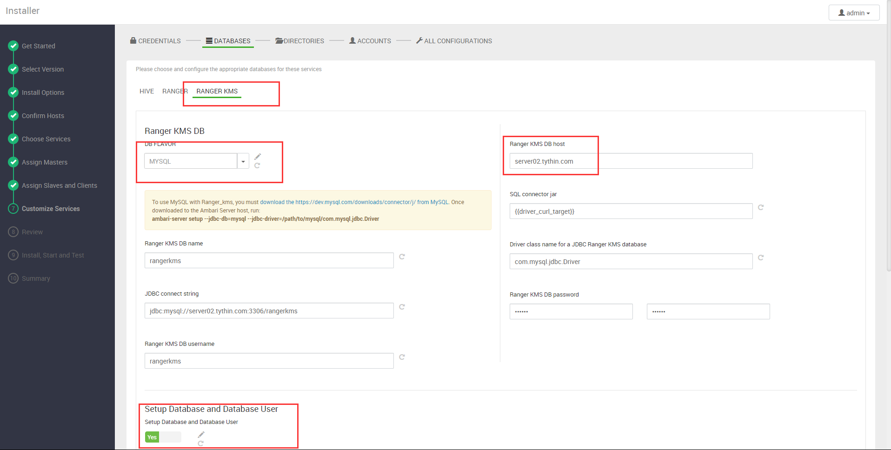

        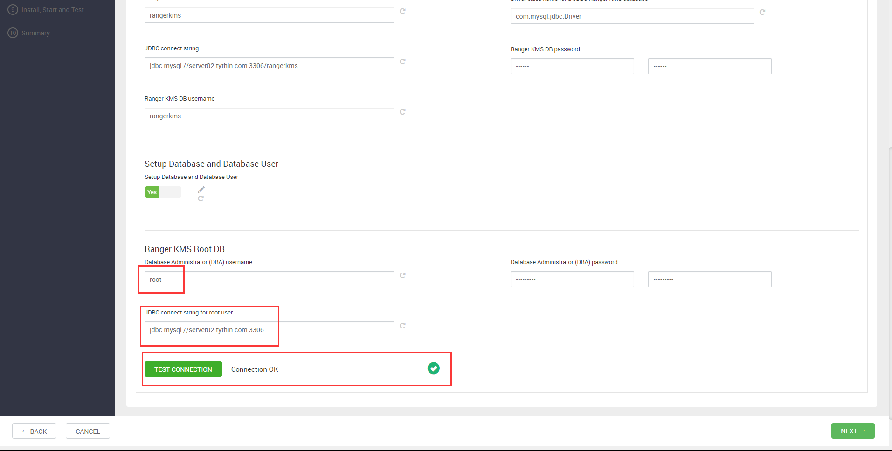

        **这里使用已有的MySQL数据库，相关帐号与库实时创建**

    + **目录**

        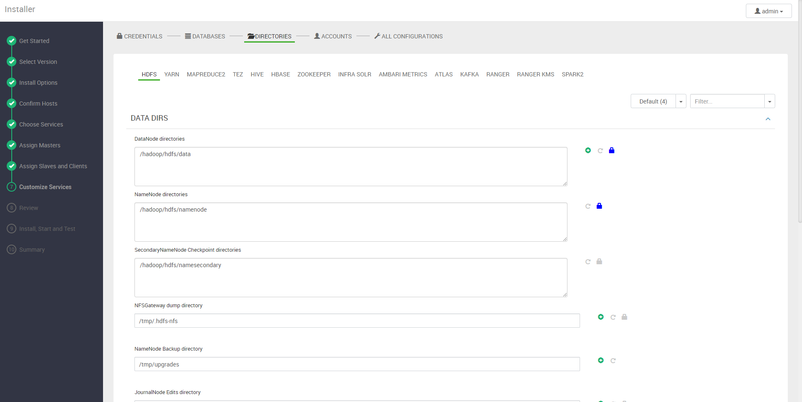

    + **帐号**

        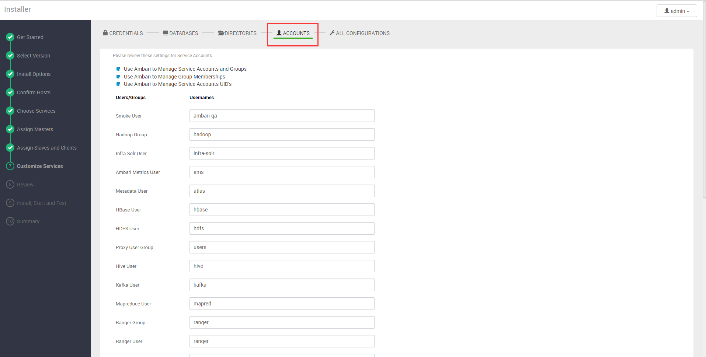

    + **所有配置**

        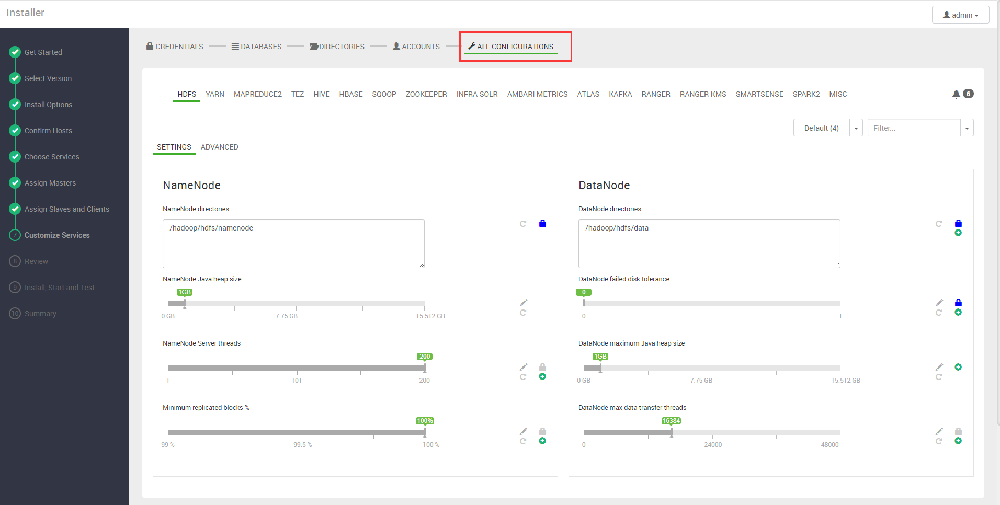

10. **Review**

    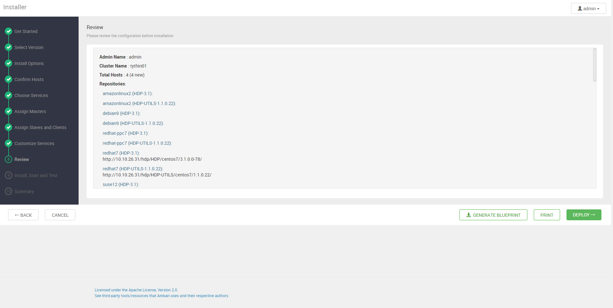

11. **安装、启动和测试**

    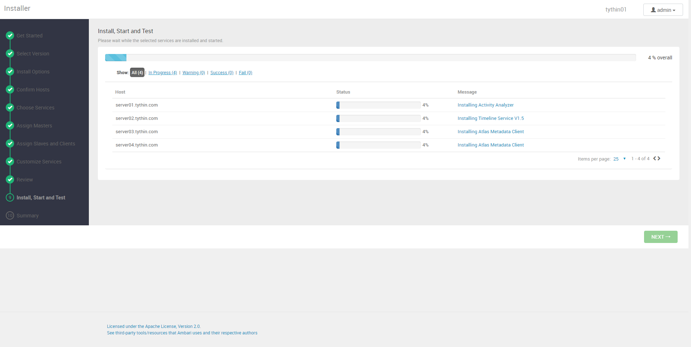

    

12. **安装成功**

    

## 4.可能出现的警告

### 4.1.Ranger警告
```
User:amb_ranger_admin credentials on Ambari UI are not in sync with Ranger
```
如果出现这种情况，要在Ambari的Ranger设置中保证 **amb_ranger_admin** 用户的密码与 **Ranger
登录界面** 中使用 **amb_ranger_admin**用户登录一致。如果出现这种情况可能登录到Ranger中修改
amb_ranger_admin用户的密码。

### 4.2.Atlas无法启动
```
Connection failed to http://server02.tythin.com:21000/api/atlas/admin/status (<urlopen error [Errno 111] Connection refused>)

内部异常表现为：

org.apache.hadoop.hbase.coprocessor.CoprocessorException: HTTP 404 Error: HTTP 404
```


    


    


