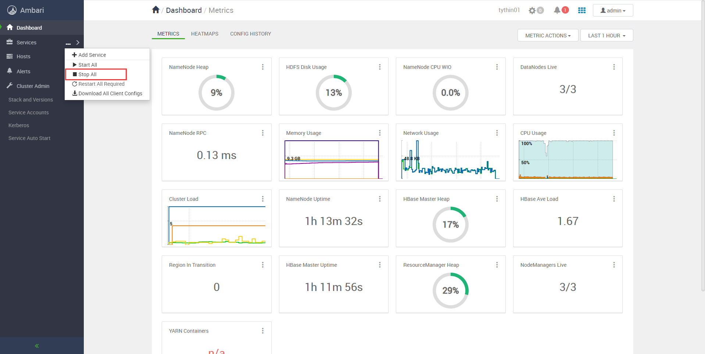

卸载并清除Ambari和HDP
================================================================================
## 1.停止在Ambari中的所有服务



## 2.停止Ambari Server与Ambari Agent
在`server01.tythin.com`上执行：
```shell
ambari-server stop
```
在 **所有节点上** 执行：
```shell
ambari-agent stop
```

## 3.卸载Ambari Server与Ambari Agent
在`server01.tythin.com`上执行：
```shell
yum remove ambari-server -y
```
在 **所有节点上** 执行：
```shell
yum remove ambari-agent -y
```

## 4.删除已安装的服务组件

### 4.1.卸载安装的软件
在 **所有节点** 上执行：
```shell
yum remove hadoop_3* hdp-select* ranger_3* zookeeper_* bigtop* atlas-metadata* ambari* postgresql* spark2*  slider* storm* snappy* smartsense-hst*
```

### 4.2.再检查已安装服务（可能有没卸载的软件）
在 **所有节点** 上执行：
```shell
yum list installed | grep ambari  

#示例结果：
ambari-agent.x86_64                   2.7.3.0-139                @ambari-2.7.3.0
ambari-infra-solr.noarch              2.7.3.0-139                @ambari-2.7.3.0
ambari-infra-solr-client.noarch       2.7.3.0-139                @ambari-2.7.3.0
ambari-metrics-grafana.x86_64         2.7.3.0-139                @ambari-2.7.3.0
ambari-metrics-hadoop-sink.x86_64     2.7.3.0-139                @ambari-2.7.3.0
ambari-metrics-monitor.x86_64         2.7.3.0-139                @ambari-2.7.3.0
smartsense-hst.x86_64                 1.5.1.2.7.3.0-139          @ambari-2.7.3.0
```
```shell
yum list installed | grep HDP 

#示例结果：
                                      1.1.0.3.1.0.0-78           @HDP-3.1-repo-1
                                      1.1.0.3.1.0.0-78           @HDP-3.1-repo-1
bigtop-jsvc.x86_64                    1.0.15-78                  @HDP-3.1-repo-1
hadoop_3_1_0_0_78.x86_64              3.1.1.3.1.0.0-78           @HDP-3.1-repo-1
hadoop_3_1_0_0_78-client.x86_64       3.1.1.3.1.0.0-78           @HDP-3.1-repo-1
hadoop_3_1_0_0_78-hdfs.x86_64         3.1.1.3.1.0.0-78           @HDP-3.1-repo-1
hadoop_3_1_0_0_78-libhdfs.x86_64      3.1.1.3.1.0.0-78           @HDP-3.1-repo-1
hadoop_3_1_0_0_78-mapreduce.x86_64    3.1.1.3.1.0.0-78           @HDP-3.1-repo-1
hadoop_3_1_0_0_78-yarn.x86_64         3.1.1.3.1.0.0-78           @HDP-3.1-repo-1
hbase_3_1_0_0_78.noarch               2.0.2.3.1.0.0-78           @HDP-3.1-repo-1
hdp-select.noarch                     3.1.0.0-78.el7             @HDP-3.1-repo-1
hive_3_1_0_0_78.noarch                3.1.0.3.1.0.0-78           @HDP-3.1-repo-1
hive_3_1_0_0_78-hcatalog.noarch       3.1.0.3.1.0.0-78           @HDP-3.1-repo-1
hive_3_1_0_0_78-jdbc.noarch           3.1.0.3.1.0.0-78           @HDP-3.1-repo-1
                                      1.0.0.3.1.0.0-78           @HDP-3.1-repo-1
kafka_3_1_0_0_78.noarch               2.0.0.3.1.0.0-78           @HDP-3.1-repo-1
livy2_3_1_0_0_78.noarch               0.5.0.3.1.0.0-78           @HDP-3.1-repo-1
phoenix_3_1_0_0_78.noarch             5.0.0.3.1.0.0-78           @HDP-3.1-repo-1
ranger_3_1_0_0_78-hbase-plugin.x86_64 1.2.0.3.1.0.0-78           @HDP-3.1-repo-1
ranger_3_1_0_0_78-hdfs-plugin.x86_64  1.2.0.3.1.0.0-78           @HDP-3.1-repo-1
ranger_3_1_0_0_78-hive-plugin.x86_64  1.2.0.3.1.0.0-78           @HDP-3.1-repo-1
ranger_3_1_0_0_78-kafka-plugin.x86_64 1.2.0.3.1.0.0-78           @HDP-3.1-repo-1
ranger_3_1_0_0_78-yarn-plugin.x86_64  1.2.0.3.1.0.0-78           @HDP-3.1-repo-1
snappy-devel.x86_64                   1.1.0-3.el7                @HDP-UTILS-1.1.0.22-repo-1
spark2_3_1_0_0_78.noarch              2.3.2.3.1.0.0-78           @HDP-3.1-repo-1
spark2_3_1_0_0_78-python.noarch       2.3.2.3.1.0.0-78           @HDP-3.1-repo-1
spark2_3_1_0_0_78-yarn-shuffle.noarch 2.3.2.3.1.0.0-78           @HDP-3.1-repo-1
tez_3_1_0_0_78.noarch                 0.9.1.3.1.0.0-78           @HDP-3.1-repo-1
zookeeper_3_1_0_0_78.noarch           3.4.6.3.1.0.0-78           @HDP-3.1-repo-1
zookeeper_3_1_0_0_78-server.noarch    3.4.6.3.1.0.0-78           @HDP-3.1-repo-1
```

### 4.3.根据检查出的服务进行卸载
在 **所有节点** 上执行：
```shell
#示例：
yum remove ambari* -y
yum remove smartsense-hst* -y
#
yum remove hadoop* -y
yum remove bigtop-jsvc* -y
yum remove hbase* -y
yum remove hdp-select* -y
yum remove hive* -y
yum remove kafka* -y
yum remove livy2* -y
yum remove phoenix* -y
yum remove ranger* -y
yum remove snappy-devel* -y
yum remove spark2* -y
yum remove tez* -y
yum remove zookeeper* -y
```

## 5.删除postgresql的数据
在`10.10.26.31`（server01.tythin.com）上执行：
```shell
rm -rf /var/lib/pgsql
```

## 6.删除用户
在 **所有节点** 上执行：
```shell
userdel oozie  
userdel hive  
userdel ambari-qa  
userdel flume    
userdel hdfs    
userdel knox    
userdel storm    
userdel mapred  
userdel hbase    
userdel tez    
userdel zookeeper  
userdel kafka    
userdel falcon  
userdel sqoop    
userdel yarn    
userdel hcat  
userdel atlas  
userdel spark  
userdel ams
userdel kms
userdel activity_analyzer
userdel infra-solr
userdel livy
userdel ranger
userdel yarn-ats
userdel mahout
userdel accumulo
```
```shell
rm -rf /home/atlas  
rm -rf /home/accumulo  
rm -rf /home/hbase  
rm -rf /home/hive  
rm -rf /home/oozie  
rm -rf /home/storm  
rm -rf /home/yarn  
rm -rf /home/ambari-qa  
rm -rf /home/falcon  
rm -rf /home/hcat  
rm -rf /home/kafka  
rm -rf /home/mahout  
rm -rf /home/spark  
rm -rf /home/tez  
rm -rf /home/zookeeper  
rm -rf /home/flume  
rm -rf /home/hdfs  
rm -rf /home/knox  
rm -rf /home/mapred  
rm -rf /home/sqoop  
rm -rf /home/kms
rm -rf /home/activity_analyzer
rm -rf /home/ams
rm -rf /home/infra-solr
rm -rf /home/livy
rm -rf /home/ranger
rm -rf /home/yarn-ats
```

## 7.删除日志文件夹
在 **所有节点** 上执行：
```shell
rm -rf /var/log/ambari-agent
rm -rf /var/log/ambari-metrics-grafana
rm -rf /var/log/ambari-metrics-monitor
rm -rf /var/log/ambari-server/
rm -rf /var/log/falcon
rm -rf /var/log/flume
rm -rf /var/log/hadoop
rm -rf /var/log/hadoop-mapreduce
rm -rf /var/log/hadoop-yarn
rm -rf /var/log/hive
rm -rf /var/log/hive-hcatalog
rm -rf /var/log/hive2
rm -rf /var/log/hst
rm -rf /var/log/knox
rm -rf /var/log/oozie
rm -rf /var/log/solr
rm -rf /var/log/zookeeper
```

## 8.删除Hadoop文件夹，包括HDFS数据
在 **所有节点** 上执行：
```shell
rm -rf /hadoop/*
rm -rf /hdfs/hadoop
rm -rf /hdfs/lost+found
rm -rf /hdfs/var
rm -rf /local/opt/hadoop
rm -rf /tmp/hadoop
rm -rf /usr/bin/hadoop
rm -rf /usr/hdp
rm -rf /var/hadoop
```

## 9.删除配置文件夹
在 **所有节点** 上执行：
```shell
rm -rf /etc/ambari-agent
rm -rf /etc/ambari-metrics-grafana
rm -rf /etc/ambari-server
rm -rf /etc/ams-hbase
rm -rf /etc/falcon
rm -rf /etc/flume
rm -rf /etc/hadoop
rm -rf /etc/hadoop-httpfs
rm -rf /etc/hbase
rm -rf /etc/hive 
rm -rf /etc/hive-hcatalog
rm -rf /etc/hive-webhcat
rm -rf /etc/hive2
rm -rf /etc/hst
rm -rf /etc/knox 
rm -rf /etc/livy
rm -rf /etc/mahout 
rm -rf /etc/oozie
rm -rf /etc/phoenix
rm -rf /etc/pig 
rm -rf /etc/ranger-admin
rm -rf /etc/ranger-usersync
rm -rf /etc/spark2
rm -rf /etc/tez
rm -rf /etc/tez_hive2
rm -rf /etc/zookeeper
```

## 10.删除PID
在 **所有节点** 上执行：
```shell
rm -rf /var/run/ambari-agent
rm -rf /var/run/ambari-metrics-grafana
rm -rf /var/run/ambari-server
rm -rf /var/run/falcon
rm -rf /var/run/flume
rm -rf /var/run/hadoop 
rm -rf /var/run/hadoop-mapreduce
rm -rf /var/run/hadoop-yarn
rm -rf /var/run/hbase
rm -rf /var/run/hive
rm -rf /var/run/hive-hcatalog
rm -rf /var/run/hive2
rm -rf /var/run/hst
rm -rf /var/run/knox
rm -rf /var/run/oozie 
rm -rf /var/run/webhcat
rm -rf /var/run/zookeeper
```

## 11.删除库文件夹
在 **所有节点** 上执行：
```shell
rm -rf /usr/lib/ambari-agent
rm -rf /usr/lib/ambari-infra-solr-client
rm -rf /usr/lib/ambari-metrics-hadoop-sink
rm -rf /usr/lib/ambari-metrics-kafka-sink
rm -rf /usr/lib/ambari-server-backups
rm -rf /usr/lib/ams-hbase
rm -rf /usr/lib/mysql
rm -rf /var/lib/ambari-agent
rm -rf /var/lib/ambari-metrics-grafana
rm -rf /var/lib/ambari-server
rm -rf /var/lib/flume
rm -rf /var/lib/hadoop-hdfs
rm -rf /var/lib/hadoop-mapreduce
rm -rf /var/lib/hadoop-yarn 
rm -rf /var/lib/hive2
rm -rf /var/lib/knox
rm -rf /var/lib/smartsense
rm -rf /var/lib/storm
```

## 12.删除符号链接
在 **所有节点** 上执行：
```shell
cd /usr/bin
rm -rf accumulo
rm -rf atlas-start
rm -rf atlas-stop
rm -rf beeline
rm -rf falcon
rm -rf flume-ng
rm -rf hbase
rm -rf hcat
rm -rf hdfs
rm -rf hive
rm -rf hiveserver2
rm -rf kafka
rm -rf mahout
rm -rf mapred
rm -rf oozie
rm -rf oozied.sh
rm -rf phoenix-psql
rm -rf phoenix-queryserver
rm -rf phoenix-sqlline
rm -rf phoenix-sqlline-thin
rm -rf pig
rm -rf python-wrap
rm -rf ranger-admin
rm -rf ranger-admin-start
rm -rf ranger-admin-stop
rm -rf ranger-kms
rm -rf ranger-usersync
rm -rf ranger-usersync-start
rm -rf ranger-usersync-stop
rm -rf slider
rm -rf sqoop
rm -rf sqoop-codegen
rm -rf sqoop-create-hive-table
rm -rf sqoop-eval
rm -rf sqoop-export
rm -rf sqoop-help
rm -rf sqoop-import
rm -rf sqoop-import-all-tables
rm -rf sqoop-job
rm -rf sqoop-list-databases
rm -rf sqoop-list-tables
rm -rf sqoop-merge
rm -rf sqoop-metastore
rm -rf sqoop-version
rm -rf storm
rm -rf storm-slider
rm -rf worker-lanucher
rm -rf yarn
rm -rf zookeeper-client
rm -rf zookeeper-server
rm -rf zookeeper-server-cleanup
```

## 13.删除Ambari遗留数据
```shell
rm -rf /var/lib/ambari*  
rm -rf /usr/lib/python2.6/site-packages/ambari_*  
rm -rf /usr/lib/python2.6/site-packages/resource_management  
rm -rf /usr/lib/ambri-* 
```

## 14.清理yum数据源
在 **所有节点** 上执行：
```shell
yum clean all 
```