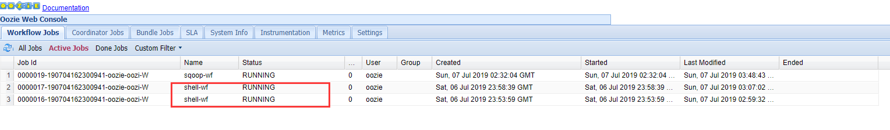

Oozie错误：job一直在running
===================================================================================
## 1.问题描述
Hadoop环境为：HDP3.1，现在使用Oozie调度一个Oozie官方的shell demo，但状态一直是：RUNNING。



## 2.原因
经过百般查找和无限次尝试，发现是`job.properties`的`jobTracker`属性端口配置错误导致。因为Oozie去调
用Hadoop的`jobtracker`去监听任务，但是`Hadoop2+`之后，使用yarn替代了jobtracker，所以此处应当配
置yarn的 **yarn.resourcemanager.address** 属性的对应值。

## 3.解决
在HDP web控制台可通过`YARN -> Configs -> Advanced -> Advanced yarn-site`，然后展开找到 
`yarn.resourcemanager.address`属性即可。对应的值可能是：
```ini
#master:8050
server01.xxxx.com:8085
```

### 3.1.修改job.properties
```ini
nameNode=hdfs://server01.zjimee.com:8020
jobTracker=server01.zjimee.com:8050
queueName=default
examplesRoot=zjimee_dev

oozie.wf.application.path=${nameNode}/user/${user.name}/${examplesRoot}/apps/shell
```
