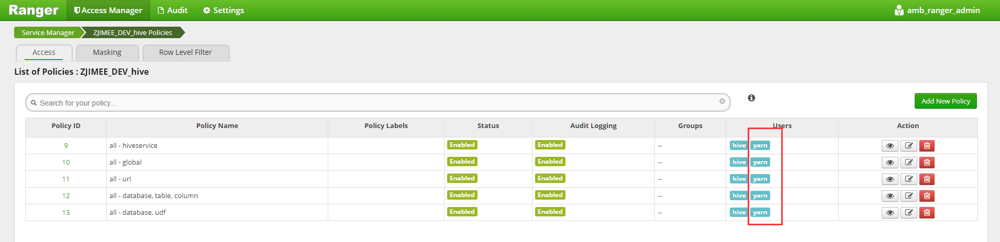

用Oozie调度Sqoop异常问题（二）
===================================================================================
## 1.问题描述
环境为HDP3.1，使用Oozie调度Sqoop Action向Hive表中同步数据，报异常：
```
2019-07-14 00:43:01,127 INFO [Thread-30] org.apache.sqoop.hive.HiveImport: Error: Error while compiling statement: FAILED: HiveAccessControlException Permission denied: user [yarn] does not have [UPDATE] privilege on [road_monitor/ods_road_monitor_capital_construction_1] (state=42000,code=40000)
2019-07-14 00:43:01,131 INFO [Thread-30] org.apache.sqoop.hive.HiveImport: Closing: 0: jdbc:hive2://server02.zjimee.com:2181,server01.zjimee.com:2181,server03.zjimee.com:2181/default;password=yarn;serviceDiscoveryMode=zooKeeper;user=yarn;zooKeeperNamespace=hiveserver2
2019-07-14 00:43:01,180 ERROR [main] org.apache.sqoop.tool.ImportTool: Import failed: java.io.IOException: Hive exited with status 2
	at org.apache.sqoop.hive.HiveImport.executeExternalHiveScript(HiveImport.java:299)
	at org.apache.sqoop.hive.HiveImport.importTable(HiveImport.java:234)
	at org.apache.sqoop.tool.ImportTool.importTable(ImportTool.java:558)
	at org.apache.sqoop.tool.ImportTool.run(ImportTool.java:656)
	at org.apache.sqoop.Sqoop.run(Sqoop.java:150)
	at org.apache.hadoop.util.ToolRunner.run(ToolRunner.java:76)
	at org.apache.sqoop.Sqoop.runSqoop(Sqoop.java:186)
......
```

## 2.原因
yarn用户没有操作hive数据仓库的权限。

## 3.解决
我们只要赋予yarn用户同等hive用户的权限即可。这可以在Ranger中进行操作：



