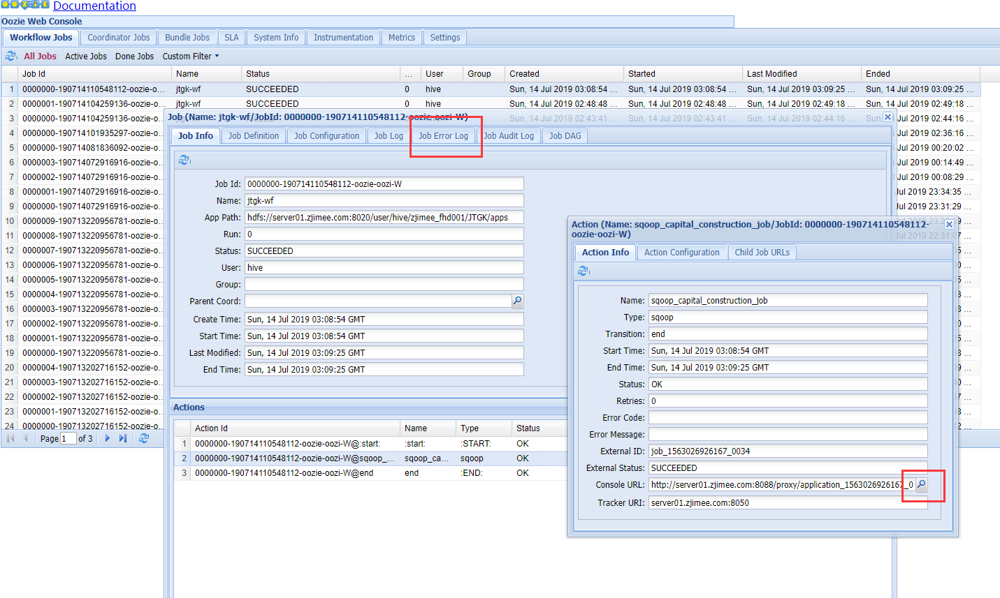

如何通过查看Hadoop的日志并查找问题
================================================================================
## 查找日志方法（一）
以HDP为例，各服务组件的日志目录大概在`/var/log/`之中：
+ YARN日志：在`/var/log/hadoop-yarn/yarn/`目录下。
+ Oozie日志：在`/var/log/oozie`目录下。
+ Hive日志：在`/var/log/hive`目录下（HiveServer2服务的主机上）。

## 查找日志方法（二）
会在上面那些组件服务的日志中发现一些问题，但不太方便。也可以通过Ambari的YARN UI界面查看YARN的
信息。
+ **ResourceManager UI**；
+ **ResourceManager logs**；

## 查找日志方法（三）
但上面那些日志都还不完整，我们还需要看MapReduce2的日志。**哪个节点在执行任务，执行情况，有何异
常信息**。可以通过Ambari的MapReduce2的界面进行查看：
+ **JobHistory UI**；
+ **JobHistory logs**；

## 查找日志方法（四）
Oozie做调度时，在Oozie的UI界面上也可以进去看日志。

