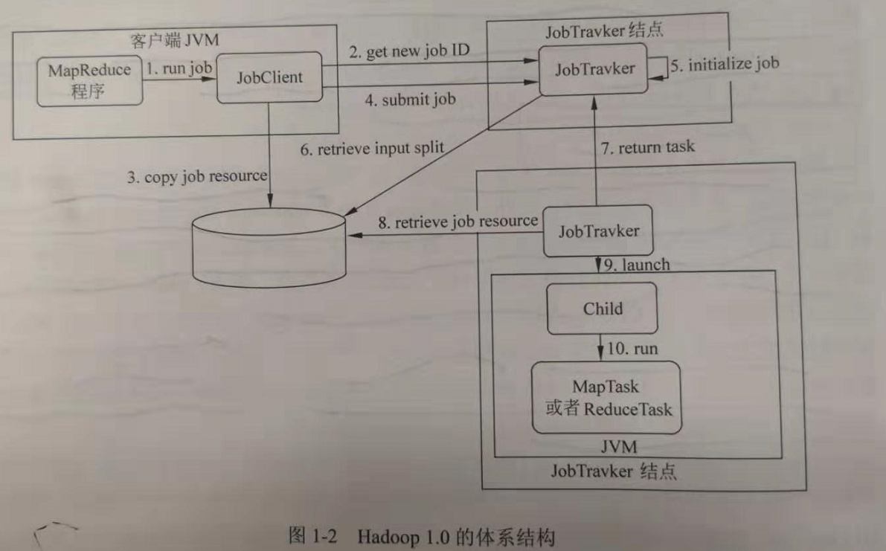

YARN和Hadoop1.0对比分析
================================================================================
## 1.体系结构对比
举个例子，假设Hadoop1.0同时运行有10个job，每个job又有1000个task，假设这些task都运行在不同的
机器上，那么，我们有10000个节点（Datanode）在同时运行，如果每个Datanode每隔5分钟定期向JobTracker
发送信息，那么JobTracker的工作压力会很大，所以 **正常情况下Hadoop1.0的集群管理规模只能达到4000
台左右**。这也是造成Hadoop1.0存在单点故障的直接原因，影响了Hadoop1.0的可扩展性、稳定性。

JobTracker任务过重是造成Hadoop1.0单点故障和可扩展性差的主要原因，**在Hadoop1.0中JobTracker
主要完成两大任务：资源的管理和作业控制**。由于需要对集群中几千台机器的资源进行管理，并对运行在集
群上的各种作业进行调度控制，JobTracker显得有些穷于应付。因此，**在YARN的设计中，资源的管理和作
业控制是被分离开的**。如下图：

**资源管理由ResourceManager来处理，而作业控制则由ApplicationMaster来处理**。

我们还是举Hadoop1.0的那个例子来说明。假设YARN同时运行有10个job，每个job又有1000个task，假设
这些task都运行在不同的机器上，那么，我们有10000个节点（Datanode）在同时运行，同时每个Datanode
每隔5分钟定期发送信息。那么，在YARN中会给每个job分配一个ApplicationMaster来负责管理其下运行
的1000个task。这1000个节点只会向对应的ApplicationMaster汇报情况，只有一些精简的汇总信息才会
通过这10个ApplicationMaster和ResourceManager通信。因此，对ResourceManager来说，它只会收
到10个ApplicationMaster的信息。相对于Hadoop1.0中JobTracker需要处理10000个节点的信息而言，
ResourceManger可以更专注于整个集群的资源管理。需要注意的是，每个job分配的ApplicationMaster
可以在同一台机器上，也可以在不同机器上，这样整个集群的作业控制负载相对均衡，不会集中在一个中心点。
将作业控制分离出来的结果是ResourceManager的负担减轻，可以专注于整个集群的资源管理。**这种体系
结构上的变更解决了Hadoop1.0的单点故障问题，整个集群也可以轻松扩展到上万台机器**。

## 2.运算框架对比
**Hadoop1.0中对计算模式的支持比较单一，只支持MapReduce模式**。然而，各类公司的业务处理却存在
多种需求。例如需要对 **实时业务** 进行及时处理，于是产生了 **Storm、Spark系统**；需要对具有
**工作流性质的业务** 进行处理，于是产生了 **Tez项目**，能够提供更底层的DAG编程接口；需要基于
**图业务性质** 进行处理，于是产生了 **Giraph图计算项目**。

在Hadoop2.0中，将计算框架MapReduce和HDFS分离开来，用YARN进行集群的资源管理，这样，在YARN上
可以运行不同的计算框架，而MapReduce只是其中一个选项。其他的如Storm、Spark、Tez等都可以在YARN
上运行，这极大地丰富了YARN的应用场景。

总体来说，YARN还是Master/Slave的架构，不同于Hadoop1.0的是，在整个资源管理框架中，ResourceManger
充当了Master的角色，NodeManager则充当了Slave的角色。ResourceManger的职责是对多个NodeManager
的资源进行统一管理和调度。

