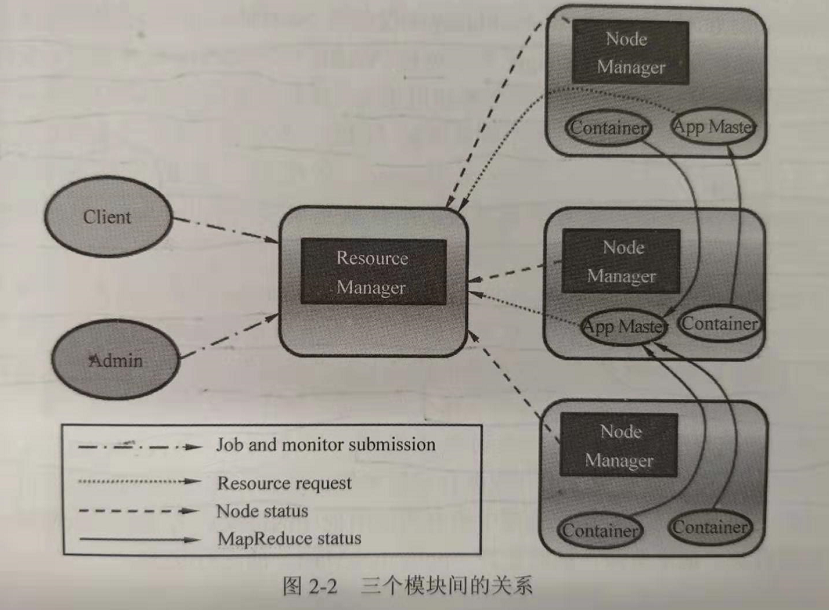

YARN基本框架
================================================================================
**YARN作为资源管理、任务调度的一个框架，主要包含三大模块，即ResourceManager（RM）、
NodeManager、ApplicationMaster（AM）。这其中，ResourceManager全局负责所有资源的监控、分
配和管理；ApplicationMaster负责每一个具体应用程序的调度和协调；NodeManager负责每一个节点的
维护**。如下图：

**相对于Hadoop1.0，YARN最重要的变化是将资源的管理和作业控制分离开**（即将Hadoop1.0中JobTracker
两个最重要的功能，即资源管理和作业调度与监控拆分开）,**分别由全局的ResourceManager负责资源管理、
ApplicationMaster负责作业调度和监控。对于所有的applications，RM拥有绝对的控制权和对资源的分
配权。而每个AM则会和RM协商资源，同时和NodeManager通信来执行和监控task**。

