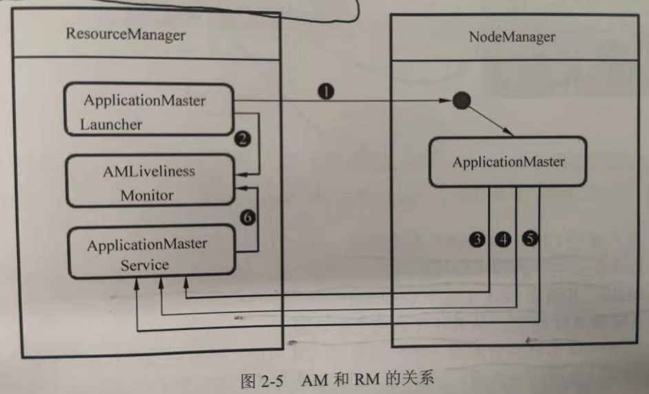

ApplicationMaster
================================================================================
用户每次提交一个应用便产生一个ApplicationMaster，AM常驻在NodeManager中，每个AM都需要与
NodeManager进行资源协商，将获得的资源（`Container`）用于Task的运行，监控Task的运行状况，如
果Task运行失败需重新为其申请资源和启动任务。AM的启动、注册、运行状态监控都需要RM的参与。它们之
间的关系可以用下图进行描述：

上图描述的6个步骤解释如下：
1. ApplicationMasterLaucher与对应的NodeManager联系，启动ApplicationMaster。
2. ApplicationMasterLivenessMonitor添加监控列表，启动对ApplicationMaster的监控。
3. ApplicationMaster启动后，向ApplicationMasterService注册，公布自己的URL、访问接口等。
4. ApplicationMaster定期向ApplicationMasterService发送心跳，及时更新自己的信息，便于RM进
行管理。
5. 当application job执行完毕后，ApplicationMaster向ApplicationMasterService报告执行完
成。
6. ApplicationMasterService通知ApplicationMasterLivenessMonitor从监控列表中删除
ApplicationMaster，释放资源。

