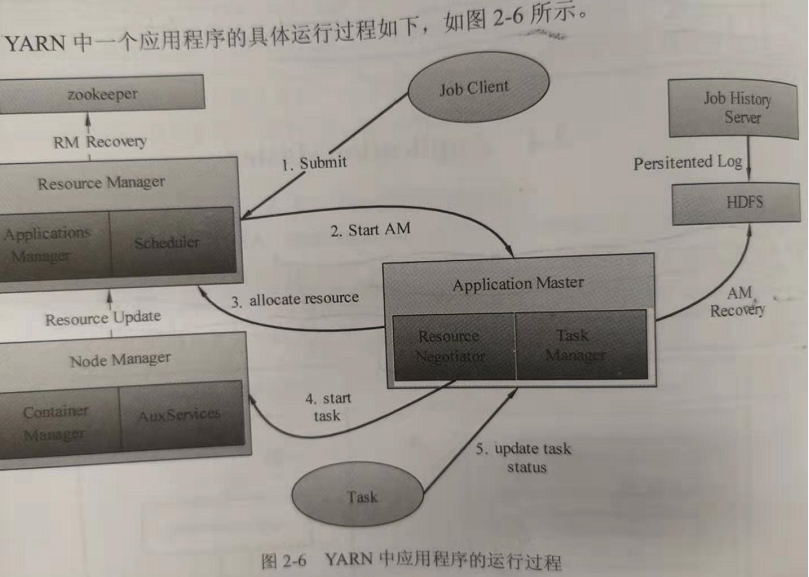

YARN中应用程序的运行过程
================================================================================

1. 用户通过Client向YARN提交作业；
2. RM根据用户的请求和集群现在资源状况，并根据调度的策略，为AM分配第一个Container，并请求NM在这
个Container中启动AM；
3. AM到RM注册，从RM中请求分配资源；
4. 一旦AM申请到资源后，便与对应的NM通信，要求它启动任务。NM为任务设置好运行环境（包括环境变量、
JAR包、二进制程序等）后，将任务启动命令写到一个脚本中，并通过运行该脚本启动任务。AM保持与NM的心
跳，启动、控制，并管理在NM上运行的任务。
5. 各个任务通过某个RPC协议向AM汇报自己的状态和进度，与AM保持心跳，更新状态。

