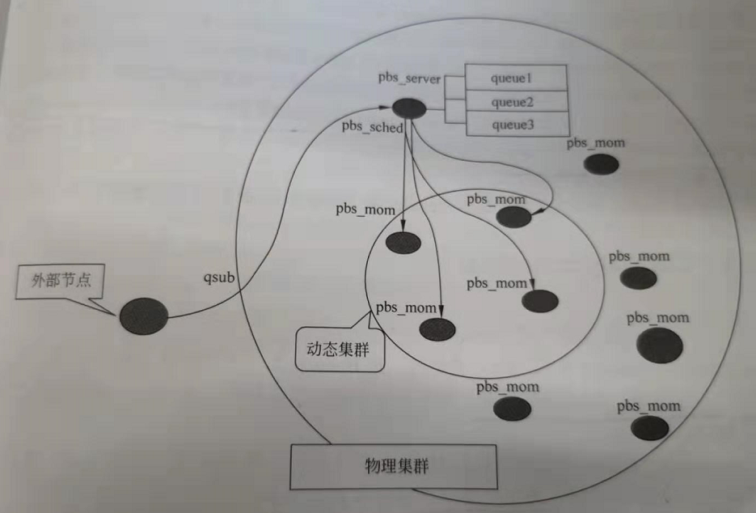

Hadoop资源调度器回顾
===================================================================================
**资源调度器**（Resource Scheduleer）是YARN中非常重要的一个组件，**其作用是按一定策略为作业分配系
统中的资源**。YARN自带了 **FIFO Scheduler、Capacity  Scheduler和Fair Scheduler** 三种常用的资源调
度器。

Hadoop最早只是为了运行像日志挖掘作业这样的大数据批处理作业，因此在 **Hadoop1.0初期只支持FIFOScheduler，
即先来先服务的调度策略。在该调度策略下按到达时间的先后选择被执行的作业**。

Hadoop发展到今，用户提交的不同应用程序要求不同的服务质量，由此产生了不同类型的作业。除批处理作业
外，典型的作业还有交互式作业（Hive的SQL查询等）、长时间运行作业（long run分析）等。**随着Hadoop的
普及，越来越多的公司开始使用它，Hadoop需对多种业务模式进行支撑。当Hadoop原来单一的FIFO Scheduler
面临多样化业务时，调度效果会受到影响。为了克服FIFO Scheduler的不足，有必要对Hadoop1.0中资源调度器
的设计进行调整**。在介绍现在YARN中的调度器之前，我们有必要对早期的HOD方案进行一个简单的回顾。

**HOD（Hadoop On Demand）即在大型物理集群内部提供虚拟集群**。

**由于Hadoop集群中存在不同类型的业务需求，HOD的设计思路就是对这些不同服务进行分类管理。用户或管
理员可通过HOD快速地在一个共享的物理集群上建立若干个独立的虚拟集群，每个虚拟集群可以运行不同类型的
应用程序**。

为了实现HOD的功能，需要一个强大的资源管理器框架来进行节点分配、监控、管理和回收。这样，HOD只需在
资源管理器所分配的节点上运行Hadoop的守护进程和MapReduce作业即可。因此，开发人员设计了强大的Torque
资源管理器。**Torque资源管理器由一个头节点和多个计算节点组成，其中头节点上运行一个`pbs_server`的守
护进程，计算节点上都运行着`pbs_mom`守护进程**，进行作业提交的客户端可以运行在任意一台机器上。头
节点除了运行`pbs_server`守护进程外，还会运行一个调度守护进程，该进程会和`pbs_server`进行通信，来
决定对资源的使用和作业分配的策略。 在Torque中包含一个FIFO Scheduler和几个高级的调度器。**默认情况下，
Torque采用FIFO调度机制，它将所有作业保存在一个队列中，按照到达的先后顺序对作业进行调度**。

基本的HOD系统架构包含下面两个主要组件：
1. **一个资源管理器（Torque）**：在HOD工作过程中，为它分配、回收节点并且管理各节点上的作业运行情
况，如监控作业的运行等。
2. **Hadoop-MapReduce和HDFS守护进程**：可以为各集群提供全套独立的Hadoop服务。

如下图所示，**HOD机制使得管理员可以将一个物理集群划分成若干个虚拟集群，以使用户将不同类型的应用程
序提交到不同的Hadoop集群上，可避免不同用户或者不同应用程序之间争夺资源，从而达到多用户共享集群的目
的。然而，HOD这种基于完全隔离的集群划分方法也存在不少问题**。主要表现如下：

1. 从集群管理角度来看，多个虚拟集群会带来管理上的诸多不便。
2. 从集群负载角度来看，多个虚拟集群可能存在负载不均衡的情况。有的集群是空闲的，而有的集群却有很多任
务，容易导致集群整体利用率低下。
3. 从集群数据角度看，虚拟集群回收后数据可能丢失，用户通常将虚拟集群中的数据写到外部的HDFS上，形成
I/O瓶颈。

**为了克服HOD中刻意划分虚拟集群的不足，我们最好保留Hadoop整个集群的完整性，通过Hadoop调度器将整
个集群中的资源划分给若干个队列，并让这些队列共享整个集群中的资源。因此诞生了`Capacity Scheduler`和
`Fair Scheduler`**。

