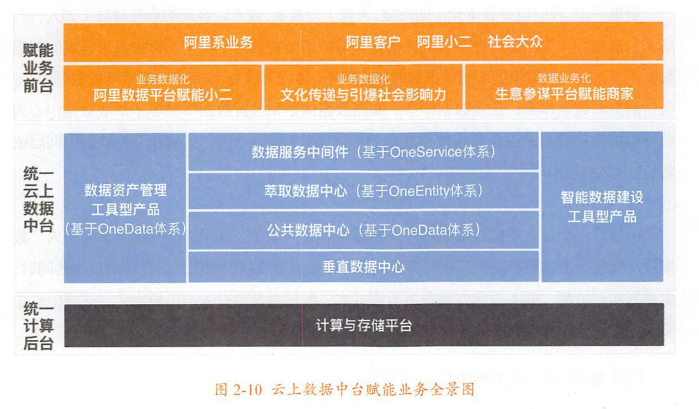

云上数据中台赋能业务全景图
===================================================================================

## 1. 首先看计算后台
计算后台同时具有 **离线计算能力、实时计算能力** 和 **在线分析能力**，从而让用户可以尽早地看到昨天以
前的各种统计汇总及萃取的数据，准确无误地看到上一秒产生的数据，在线分析、查看海量的数据。

## 2. 在计算后台之上的是云上数据中台
在云上数据中台中，我们通过智能数据能力实现了 **全局数据仓库规划、数据规范定义、数据建模研发、数据连
接萃取、数据运维监控等**，拥有了具有 **多样性** 数据的 **分层** 数据中心。

云上数据中台是如何实现这些功能的呢？

最初，我们 **通过各种方式采集尽可能丰富的数据**。在 **清洗、结构化后** 形成垂直数据中心，即 **统一的
ODS数据基础层**。

然后，我们 **进行数据建模研发**，并处理为 **不因业务特别是组织架构变动而轻易转移的数据中间层。包括
DWD明细数据中间层和DWS汇总数据中间层，它们与ODS数据基础层一起形成公共数据中心**。

更进一步，我们以 **业务单元**（如淘宝、天猫）为准星，或者以 **客观的业务对象**（如人、货、场）为准星，
计算出 **复用性强的统计指标** 并 **增加到公共数据中心** 中。再将各个 **垂直的孤岛数据连接起来并萃取不
同于统计指标的精华数据**。如 **行为标签**、**关系** 等，形成 **萃取数据中心**，包括消费者数据体系、
企业数据体系、商品数据体系和位置数据体系等；**萃取数据中心的数据根据数据模型的设计要求被存放在DWD
明细数据中间层、DWS汇总数据中间层或者ADS数据应用层中**。

