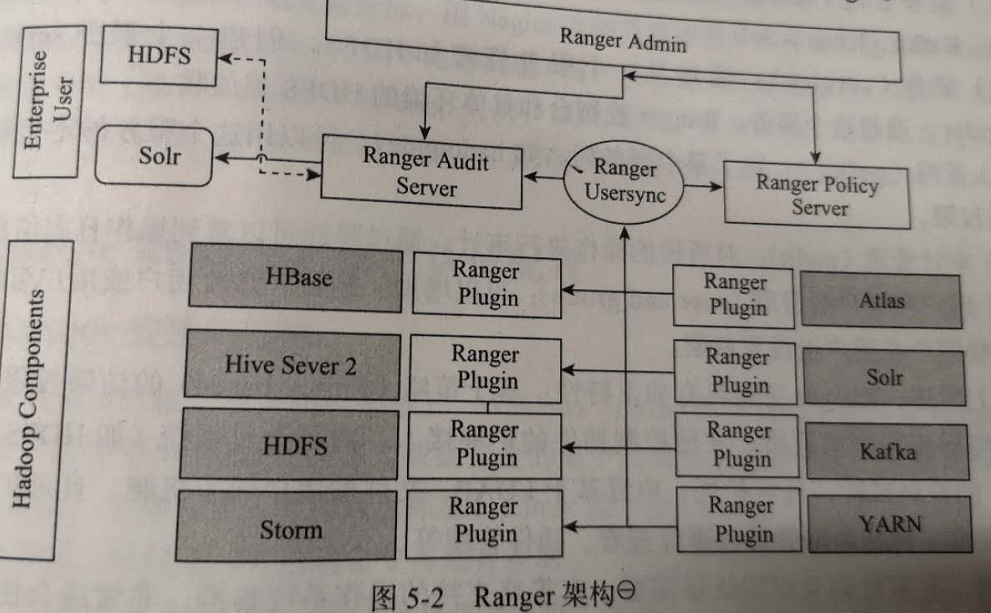

Ranger架构
===================================================================================
下图是Ranger安全认证机制的整体框架，主要包括`Ranger Admin`、`Ranger Plugin`和`Ranger Usersync`
三部分。

## 1.Ranger Admin
**Ranger Admin是安全管理的核心接口，也是Ranger框架的管理中心**。用户可以在它提供的Web UI上管理
系统用户权限，创建和更新权限认证策略，然后将这些策略存储在数据库中。**每个组件的插件会定期监测这些
策略**。它还提供一个审计服务，**可以收集存储在HDFS或者关系数据库中的数据并进行审计**。

## 2.Ranger Plugin

