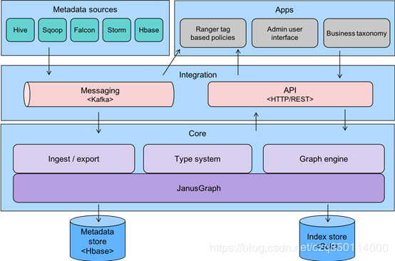

架构
===================================================================================

## 核心

### 1.类型系统
Atlas允许用户为他们要管理的元数据对象 **定义模型**。 该模型由称为“**类型**”的定义组成。 称为“**实
体**”的“类型”实例 **代表所管理的实际元数据对象**。 **类型系统是允许用户定义和管理类型和实体的组件**。 
开箱即用的Atlas管理的 **所有元数据对象**（例如，像Hive表一样）均 **使用类型进行建模**，并表示为实体。 
为了在Atlas中存储新类型的元数据，需要了解类型系统组件的概念。

需要注意的一个关键点是，**Atlas中建模的一般性质允许数据管理员和集成商定义技术元数据和业务元数据**。 
也可以使用Atlas的功能在两者之间定义丰富的关系。

### 2. 图引擎
在内部，**Atlas使用Graph模型管理的元数据对象**。 这种方法提供了极大的灵活性，**并可以有效处理元数
据对象之间的丰富关系**。 图引擎组件负责在Atlas类型系统的类型和实体以及底层的图持久性模型之间进行转换。 
除了管理图对象之外，**图引擎还为元数据对象创建适当的索引，以便可以高效地搜索它们。 Atlas使用
JanusGraph（图数据库）存储元数据对象**。

## 整合
用户可以使用两种方法在Atlas中管理元数据：

### 1.API
**Atlas的所有功能都通过REST API向最终用户公开**，该API允许创建，更新和删除类​​型和实体。它也是查询和
发现Atlas管理的类型和实体的主要机制。

### 2.消息传递
**除了API之外，用户还可以选择使用基于Kafka的消息传递接口与Atlas集成。这对于将元数据对象传达给Atlas
以及从Atlas消耗元数据更改事件（用于构建应用程序）都是很有用的**。如果有人希望使用与Atlas的松散耦合集
成，以实现更好的可伸缩性，可靠性等，则该消息传递接口特别有用。**Atlas使用Apache Kafka作为通知服务器
，用于钩子和元数据通知事件的下游使用者之间的通信。这些事件由钩子和Atlas编写，涉及不同的Kafka主题**。
