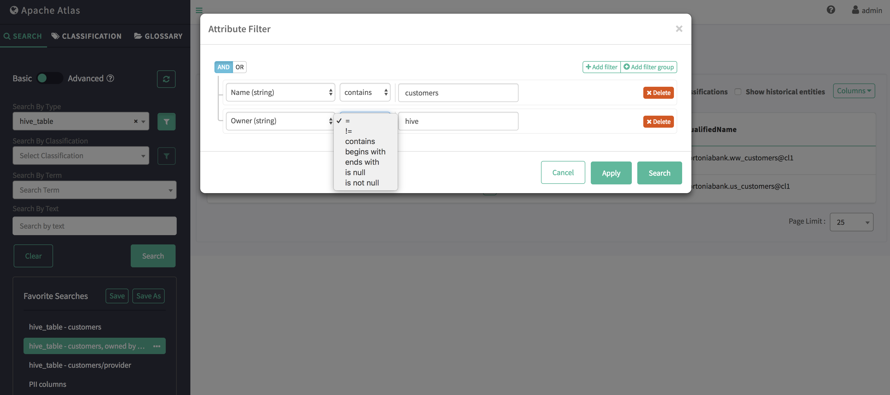

基本搜索
===================================================================================
基本搜索使您可以使用 **实体的类型名**，关联的 **分类/标签** 进行查询，并支持 **对实体属性以及分类/标
签属性进行过滤**。

可以使用以下JSON结构（称为SearchParameters）表示整个查询结构：
```json
{
  "typeName":               "hive_column",
  "excludeDeletedEntities": true,
  "classification":         "PII",
  "query":                  "",
  "offset":                 0,
  "limit":                  25,
  "entityFilters":          {  },
  "tagFilters":             { },
  "attributes":             [ "table", "qualifiedName"]
}
```
字段说明：
```ini
 ypeName:               要寻找的实体类型
excludeDeletedEntities:  搜索应排除已删除的实体吗？ （默认值：true）
classification:         仅包括具有给定分类的实体
query:                  实体应具有的任何自由文本出现（通用/通配符查询可能很慢）
offset:                 结果集的起始偏移量（用于分页）
limit:                  要获取的最大结果数
entityFilters:          实体属性过滤器
tagFilters:             分类属性过滤器
attributes:             要包含在搜索结果中的属性
```

基于属性的过滤可以在具有`AND/OR`条件的多个属性上进行。

## 过滤示例（针对hive_table属性）

+ 单一属性

```json
 {
     "typeName":               "hive_table",
     "excludeDeletedEntities": true,
     "offset":                 0,
     "limit":                  25,
     "entityFilters": {
        "attributeName":  "name",
        "operator":       "contains",
        "attributeValue": "customers"
     },
     "attributes": [ "db", "qualifiedName" ]
   }
```


+ 使用OR的多属性

```json
{
     "typeName":               "hive_table",
     "excludeDeletedEntities": true,
     "offset":                 0,
     "limit":                  25,
     "entityFilters": {
        "condition": "OR",
        "criterion": [
           {
              "attributeName":  "name",
              "operator":       "contains",
              "attributeValue": "customers"
           },
           {
              "attributeName":  "name",
              "operator":       "contains",
              "attributeValue": "provider"
           }
        ]
     },
     "attributes": [ "db", "qualifiedName" ]
   }
```


+ 使用AND的多属性

```json
{
     "typeName":               "hive_table",
     "excludeDeletedEntities": true,
     "offset":                 0,
     "limit":                  25,
     "entityFilters": {
        "condition": "AND",
        "criterion": [
           {
              "attributeName":  "name",
              "operator":       "contains",
              "attributeValue": "customers"
           },
           {
              "attributeName":  "owner",
              "operator":       "eq",
              "attributeValue": "hive"
           }
        ]
     },
     "attributes": [ "db", "qualifiedName" ]
  }
```


## 支持的运算符过滤
+ LT（符号：`<`，`lt`）与数字，日期属性一起使用。
+ GT（符号：`>`，`gt`）可用于数字，日期属性。
+ LTE（符号：`<=`，`lte`）可用于数字，日期属性。
+ GTE（符号：`>=`，`gte`）可与数字，日期属性一起使用。
+ EQ（符号：`eq`，`=`）可用于数值，日期，字符串属性。
+ NEQ（符号：`neq`，`!=`）可用于数字，日期，字符串属性。
+ LIKE（符号：`like`，`LIKE`）与String属性一起使用。
+ STARTS_WITH（符号：`startsWith`，STARTSWITH）可用于String属性。
+ ENDS_WITH（符号：`endsWith`，`ENDSWITH`）可用于字符串属性。
+ CONTAINS（符号：`contains`，`CONTAINS`）与String属性一起使用。

## CURL示例
```shell
 curl -sivk -g
    -u <user>:<password>
    -X POST
    -d '{
            "typeName":               "hive_table",
            "excludeDeletedEntities": true,
            "classification":         "",
            "query":                  "",
            "offset":                 0,
            "limit":                  50,
            "entityFilters": {
               "condition": "AND",
               "criterion": [
                  {
                     "attributeName":  "name",
                     "operator":       "contains",
                     "attributeValue": "customers"
                  },
                  {
                     "attributeName":  "owner",
                     "operator":       "eq",
                     "attributeValue": "hive"
                  }
               ]
            },
            "attributes": [ "db", "qualifiedName" ]
          }'
    <protocol>://<atlas_host>:<atlas_port>/api/atlas/v2/search/basic
```


