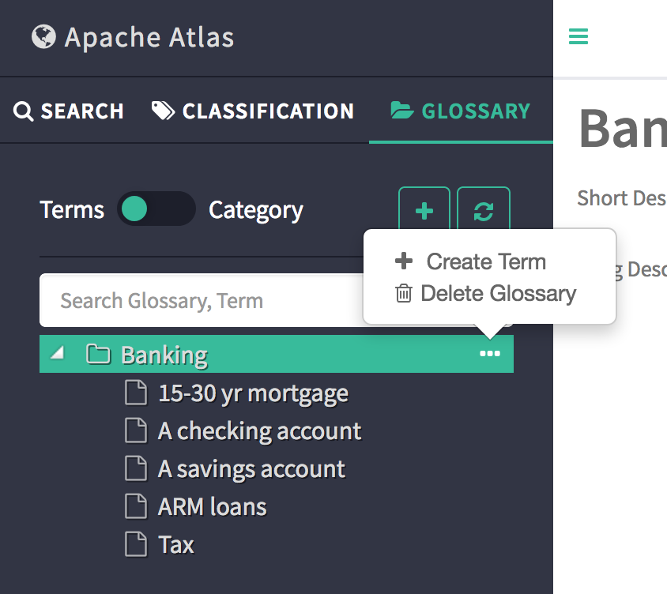
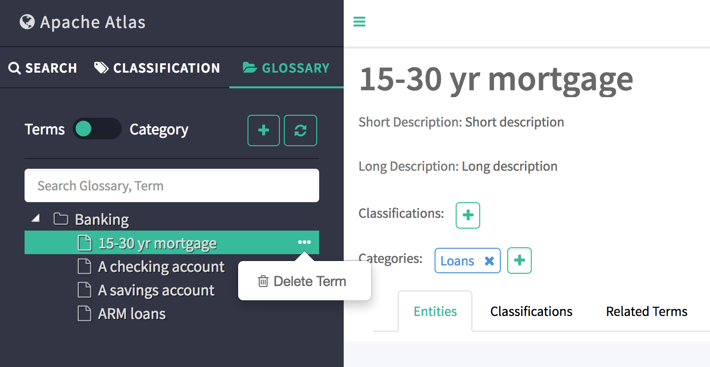
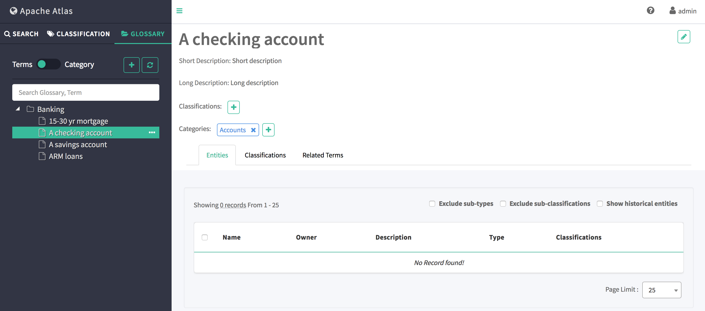
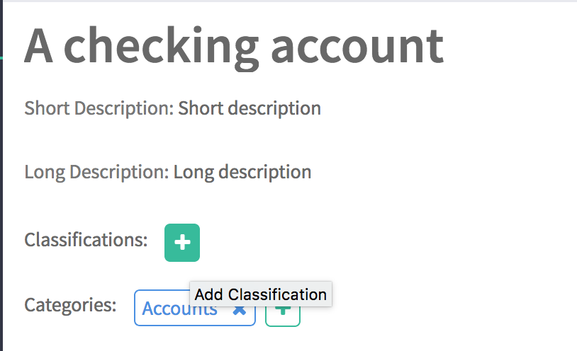
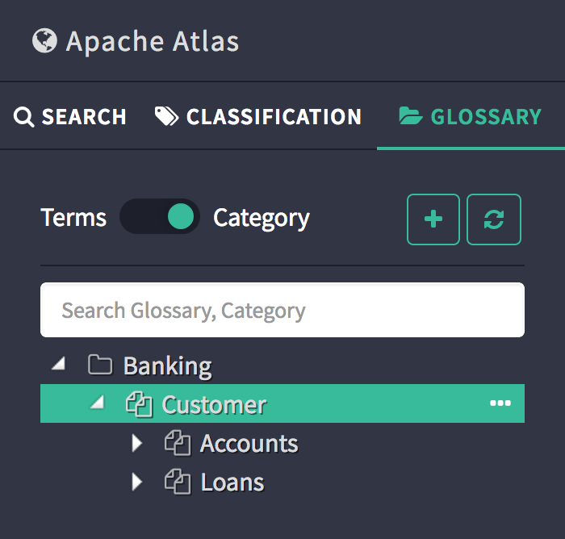
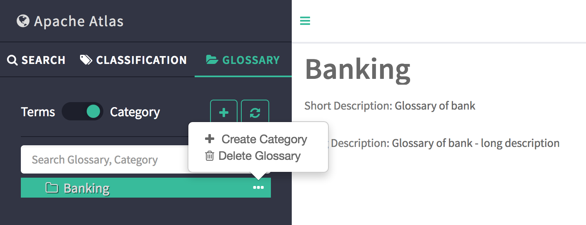

词汇表
===================================================================================
词汇表为业务用户提供适当的词汇表，并 **允许术语（单词）相互关联和分类**，以便可以在不同的上下文中理
解它们。 **然后可以将这些术语映射到资产，例如数据库，表，列等**。这有助于抽象化与存储库相关的技术术
语，并允许用户发现/使用词汇表中更熟悉的数据。

## 用例
+ 能够使用自然术语（技术术语和/或商业术语）定义丰富的词汇表词汇。
+ 语义上相互关联的能力。
+ 能够将资产映射到词汇表术语。
+ 能够按类别组织这些术语。这为术语增加了更多的上下文。
+ 允许类别按层次结构排列-表示更广泛和更精细的范围。
+ 术语表术语与元数据分开管理。

## 什么是词汇表术语？
术语对企业来说是一个有用的词。为了使这些术语有用且有意义，**它们需要围绕其用法和上下文进行分组**。
**Apache Atlas中的术语必须具有唯一的qualifiedName，可以存在具有相同名称的术语，但是它们不能属于相
同的词汇表。具有相同名称的术语只能存在于不同的词汇表中**。术语名称可以包含空格，下划线和破折号（自
然的称呼方式），但不能包含“.”或“@”，因为qualifiedName采用以下形式：`术语名称 @ 词汇表合格名称`。
完全限定的名称使使用特定术语更加容易。

**一个术语只能属于一个词汇表**，并且它的生命周期被绑定到同一词汇表，即如果删除了词汇表，则该术语也
将被删除。**一个术语可以属于零个或多个类别**，从而可以将它们划分为更狭窄或更宽泛的上下文。术语可以
分配/链接到Apache Atlas中的零个或多个实体。**可以使用分类（标签）对术语进行分类**，并将相同的分类应
用于该术语所分配到的实体。

## 什么是词汇表类别？
**类别是组织术语的一种方式**，以便可以丰富术语的上下文。**类别可能包含也可能不包含层次结构，即子类
别层次结构**。类别的qualifiedName是使用词汇表中的层次结构位置派生的，例如Category name。父类别
qualifiedName。当发生任何层次结构更改（例如添加父类别，删除父类别或更改父类别）时，此合格名称将更
新。

## 用户界面交互
Apache Atlas UI已更新，以提供用户友好的界面来处理词汇表的各个方面，包括：
+ 创建词汇表，术语和类别
+ 在术语之间创建各种关系-例如同义词，反义词，另请参见
+ 组织层次结构中的类别
+ 给实体分配条件
+ 使用关联词搜索实体

与词汇表相关的大多数UI都可以在名为 **GLOSSARY** 的新标签下找到，该标签位于现有的熟悉标签 **SEARCH** 
和 **CLASSIFICATION** 旁边。

### 词汇表标签
Apache Atlas UI提供了两种使用词汇表的方式 - **术语视图** 和 **类别视图**。

术语视图允许用户执行以下操作：
+ 创建，更新和删除术语项。
+ 添加，删除和更新与术语相关的分类。
+ 添加，删除和更新术语的分类。
+ 在术语项之间建立各种关系。
+ 查看与术语相关的实体。

类别视图允许用户执行以下操作：
+ 创建，更新和删除类​​别和子类别。
+ 将术语与类别相关联。

用户可以使用“词汇表”选项卡中提供的切换在术语视图和类别视图之间切换。

#### 术语上下文菜单
+ 创建新术语：单击词汇表名称旁边的省略号（...）将显示一个弹出菜单，允许用户在词汇表中创建术语或删除
词汇表-如下所示。

+ 删除术语：单击术语名称旁边的省略号（...）将显示一个弹出菜单，允许用户删除术语-如下所示。

#### 术语详细信息页面
可以通过在词汇表UI中单击术语名称来查看术语的各种详细信息。详细信息页面下的每个选项卡都提供了该术语
的不同详细信息。
+ 实体标签显示分配给所选术语的实体。
+ 分类标签显示与所选术语相关的分类。
+ “相关术语”选项卡显示与所选术语相关的术语。

#### 为术语添加分类
单击分类标签旁边的+，将分类添加到术语中。

#### 与其他术语建立术语关系
查看术语详细信息时，单击“相关术语”选项卡。单击+将允许将术语与当前术语链接。

#### 分类术语
单击类别标签旁边的+以对术语进行分类。将出现一个模式对话框，用于选择类别。

### 分类视图
当切换开关打开 **类别** 时，面板将列出所有词汇表以及类别层次结构。这是此视图下可能的交互作用的列表。

+ 展开图

#### 类别上下文菜单
单击类别名称旁边的省略号（...）将显示一个类别上下文菜单。
+ 创建一个新类别。

+  创建子类别或删除类别

