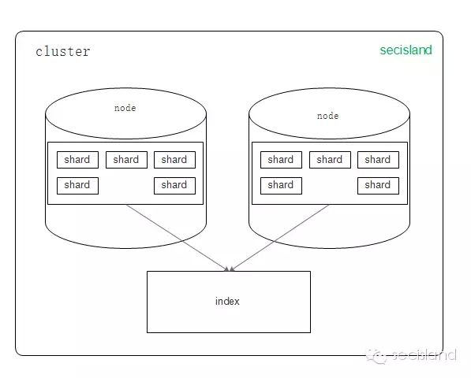

基础知识
================================================================================
### 1.索引词（term）
在Elasticsearch中 **索引词（term）是一个能够被索引的精确值**。foo、Foo、FOO几个单词是不同的
索引词。**索引词（term）是可以通过term查询进行准确的搜索**。

### 2.文本（text）
文本是一段普通的非结构化文字。通常，**文本会被分析成一个个的索引词**，存储在Elasticsearch的索引
库中。

### 3.分析（analysis）
**分析是将文本转换为索引词的过程，分析的结果依赖于分词器**。

### 4.集群（cluster）
集群由一个或多个节点组成，对外提供服务，**对外提供索引和搜索功能**。在所有节点，一个集群有一个唯一的
名称 **默认为“Elasticsearch”**。此名称是很重要的，因为 **每个节点只能是集群的一部分，当该节点被设
置为相同的集群名称时，就会自动加入集群**。当需要有多个集群的时候，要确保每个集群的名称不能重复，否则，
节点可能会加入错误的集群。请注意，**一个节点只能加入一个集群**。此外，你还可以拥有多个独立的集群，每
个集群都有其不同的集群名称。

### 5.节点（node）
一个节点是一个逻辑上独立的服务，它是集群的一部分，可以存储数据，并参与集群的索引和搜索功能。**就像
集群一样，节点也有唯一的名字，在启动的时候分配**。如果不想要默认名称，你可以定义任何你想要的节点名。
这个名字在管理中很重要，**在网络中Elasticsearch集群通过节点名称进行管理和通信**。一个节点可以被
配置加入一个特定的集群。**默认情况下，每个节点会加入名为Elasticsearch的集群中**，这意味着如果你
在网络上启动多个节点，如果网络畅通，他们能彼此发现并自动加入一个名为Elasticsearch的集群中。在一个
集群中，你可以拥有多个你想要的节点。**当网络没有集群运行的时候，只要启动任何一个节点，这个节点会默
认生成一个新的集群，这个集群会有一个节点**。

### 6.路由（routing）
**当存储一个文档的时候，它会存储在唯一的主分片中，具休哪个分片是通过散列值进行选择**。默认情况下，
这个值是由 **文档的ID** 生成。如果文档有一个指定的父文档，则从父文档ID中生成，该值可以在存储文档
的时候进行修改。

### 7.分片（shard）
**分片是单个Lucene实例**，这是Elasticsearch管理的比较底层的功能。**索引是指向主分片和副本分片
的逻辑空间**。对于使用，**只需要指定分片的数量**，其他不需要做过多的事情。**在开发使用的过程中，
我们对应的对象都是索引，Elasticsearch会自动重审集群中所有的分片，当发生故障的时候，Elasticsearch
会把分片移动到不同的节点或者添加新的节点**。

### 8.主分片（primary shard）
**每个文档都存储在一个分片中，当你存储一个文档的时候，系统会首先存储在主分片中，然后会复制到不同的副
本中。默认情况下，一个索引有5个主分片。你可以事先制定分片的数量，当分片一旦建立，则分片的数量不能修改**。

### 9.副本分片（replica shard）
每一个分片有 **零个或多个** 副本。副本主要是 **主分片的复制**，其中有两个目的：
+ **增加高可用性**：当主分片失败的时候，可以从副本分片中选择一个作为主分片。
+ **提高性能**：当查询的时候可以到主分片或者副本分片中进行查询。默认情况下，一个主分片配有一个副本，
但 **副本的数量可以在后面动态地配置增加。副本分片必须部署在不同的节点上，不能部署在和主分片相同的
节点上**。

ddd
